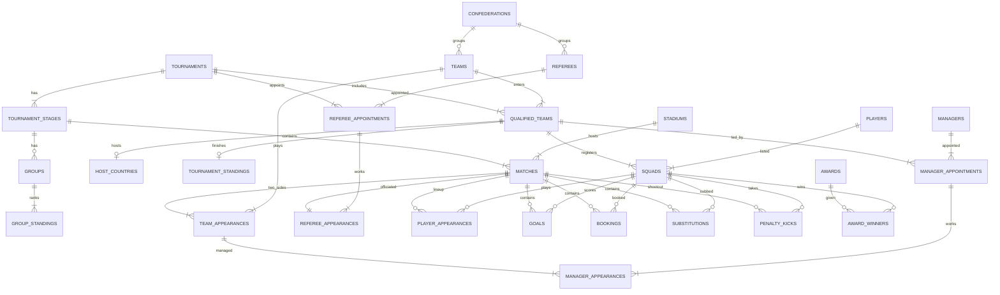

# Pitch to Postgres: Designing and Querying a Relational Database for FIFA World Cup Data

## Milestone 0: Dataset Understanding

**Group:** Devanshi Dudhatra (202618027), Pujita Sunapu (202618003), Rahul Saha (202618037). DS604 Introduction to Data Management.

*Generated by `src/profile_data.py`. Every figure below is computed from the CSV files in `data/`; rerun the script to regenerate.*

**Data source and licence.** Joshua C. Fjelstul, *The Fjelstul World Cup Database*, <https://github.com/jfjelstul/worldcup>, licensed under [CC-BY-SA 4.0](https://creativecommons.org/licenses/by-sa/4.0/). **Modifications:** none to the data values. The 27 CSV files were moved into `data/` unchanged. This report adds derived statistics. Any cleaning applied when loading the database is documented in Milestone 3.

## Contents

1. [Coverage](#1-real-coverage)
2. [Tables](#2-tables)
3. [Relationship map](#3-relationship-map)
4. [Data quality findings](#4-data-quality-findings)
5. [Key insights](#5-key-insights)
6. [Insights framework](#6-insights-framework)

## 1. Real coverage

The files are dated July 2022, but they contain **21 men's World Cup final tournaments, 1930 to 2018** (1930-07-13 to 2018-07-15). The 2022 Qatar tournament (Nov-Dec 2022) is **not** included, and neither are women's tournaments or qualifiers. There was no tournament in 1942 or 1946 (Second World War).

| Measure | Value |
|---|---|
| Tournaments | 21 |
| Matches | 900 |
| Goals (incl. own goals) | 2548 (52 own goals) |
| Teams (incl. historical) | 84 |
| Players named in squads | 7907 |
| Players with a recorded appearance (1970+) | 4627 |
| Different goal scorers | 1297 |
| Referees | 380 |
| Managers | 357 |
| Stadiums | 185 in 17 countries |
| Host nations (distinct) | 18 |
| Card events | 2466 |
| Substitutions (players coming on) | 3232 |
| Penalty shoot-outs / kicks | 30 / 279 |

**Year range of each event table** (several start late, which limits trend analysis):

| Table | Years covered |
|---|---|
| goals | 1930-2018 (21 of 21 tournaments) |
| bookings | 1970-2018 (13 of 21 tournaments) |
| substitutions | 1970-2018 (13 of 21 tournaments) |
| player_appearances | 1970-2018 (13 of 21 tournaments) |
| penalty_kicks | 1982-2018 (10 of 21 tournaments) |
| manager_appearances | 1930-2018 (21 of 21 tournaments) |
| referee_appearances | 1930-2018 (21 of 21 tournaments) |
| group_standings | 1930-2018 (19 of 21 tournaments) |

**Matches per tournament:** 1930: 18, 1934: 17, 1938: 18, 1950: 22, 1954: 26, 1958: 35, 1962: 32, 1966: 32, 1970: 32, 1974: 38, 1978: 38, 1982: 52, 1986: 52, 1990: 52, 1994: 52, 1998: 64, 2002: 64, 2006: 64, 2010: 64, 2014: 64, 2018: 64.

## 2. Tables

The 27 tables group into eight themes. Every file has a `key_id` column, which is only the row number and is unique in every file. Many tables repeat descriptive columns from their parent tables (for example `team_name` and `tournament_name`). 40 of these copies were checked against the master tables, with 0 differences found, so the normalised schema can safely drop them.

### Theme: Reference

#### `confederations` (6 rows, 5 columns)

- **Purpose:** The six continental football confederations.
- **Grain:** One confederation.
- **Primary key candidate:** (confederation_id): unique = True, nulls = False. Fully duplicated rows (ignoring key_id): 0.
- **Foreign key candidates:** none (top-level table).

| Column | Type | Meaning | Distinct | Nulls | 'not available/applicable' | Example |
|---|---|---|---|---|---|---|
| key_id | integer | Row number in the source file (1..n). Not a business key. | 6 | 0 | 0 | 1 |
| confederation_id | text id | Confederation identifier, e.g. CF-1. | 6 | 0 | 0 | CF-1 |
| confederation_name | text | Confederation full name. | 6 | 0 | 0 | Asian Football Confederation |
| confederation_code | text | Confederation code, e.g. UEFA. | 6 | 0 | 0 | AFC |
| confederation_wikipedia_link | text | Wikipedia URL of the confederation. | 6 | 0 | 0 | https://en.wikipedia.org/wiki/Asian_Foot |

Sample rows:

```text
key_id,confederation_id,confederation_name,confederation_code,confederation_wikipedia_link
1,CF-1,Asian Football Confederation,AFC,https://en.wikipedia.org/wiki/Asian_Football_Confederation
2,CF-2,Confederation of African Football,CAF,https://en.wikipedia.org/wiki/Confederation_of_African_Football
3,CF-3,"Confederation of North, Central American and Caribbean Association Football",CONCACAF,https://en.wikipedia.org/wiki/CONCACAF
```

#### `teams` (84 rows, 11 columns)

- **Purpose:** Every national team that has played at a men's World Cup, including teams that no longer exist.
- **Grain:** One national team (historical teams such as West Germany or the Soviet Union are separate rows).
- **Primary key candidate:** (team_id): unique = True, nulls = False. Fully duplicated rows (ignoring key_id): 0.
- **Foreign key candidates (verified):**
  - (confederation_id) -> `confederations`(confederation_id): 0 orphan values; 1 : 1..N (max 39 rows per parent)

| Column | Type | Meaning | Distinct | Nulls | 'not available/applicable' | Example |
|---|---|---|---|---|---|---|
| key_id | integer | Row number in the source file (1..n). Not a business key. | 84 | 0 | 0 | 1 |
| team_id | text id | Team identifier, e.g. T-03. | 84 | 0 | 0 | T-01 |
| team_name | text | Team name (copy of teams). | 84 | 0 | 0 | Algeria |
| team_code | text | Three-letter team code (copy of teams). | 83 | 0 | 0 | DZA |
| federation_name | text | National football federation. | 83 | 0 | 0 | Algerian Football Federation |
| region_name | text | Geographic region (e.g. Europe, Middle East). | 11 | 0 | 0 | Africa |
| confederation_id | text id | Confederation identifier, e.g. CF-1. | 6 | 0 | 0 | CF-2 |
| confederation_name | text | Confederation full name. | 6 | 0 | 0 | Confederation of African Football |
| confederation_code | text | Confederation code, e.g. UEFA. | 6 | 0 | 0 | CAF |
| team_wikipedia_link | text | Wikipedia URL of the team. | 83 | 0 | 0 | https://en.wikipedia.org/wiki/Algeria_na |
| federation_wikipedia_link | text | Wikipedia URL of the federation. | 82 | 0 | 0 | https://en.wikipedia.org/wiki/Algerian_F |

Sample rows:

```text
key_id,team_id,team_name,team_code,federation_name,region_name,confederation_id,confederation_name,confederation_code,team_wikipedia_link,federation_wikipedia_link
1,T-01,Algeria,DZA,Algerian Football Federation,Africa,CF-2,Confederation of African Football,CAF,https://en.wikipedia.org/wiki/Algeria_national_football_team,https://en.wikipedia.org/wiki/Algerian_Football_Federation
2,T-02,Angola,AGO,Angolan Football Federation,Africa,CF-2,Confederation of African Football,CAF,https://en.wikipedia.org/wiki/Angola_national_football_team,https://en.wikipedia.org/wiki/Angolan_Football_Federation
3,T-03,Argentina,ARG,Argentine Football Association,South America,CF-4,South American Football Confederation,CONMEBOL,https://en.wikipedia.org/wiki/Argentina_national_football_team,https://en.wikipedia.org/wiki/Argentine_Football_Association
```

#### `stadiums` (185 rows, 8 columns)

- **Purpose:** Every stadium that hosted a World Cup match.
- **Grain:** One stadium.
- **Primary key candidate:** (stadium_id): unique = True, nulls = False. Fully duplicated rows (ignoring key_id): 0.
- **Foreign key candidates:** none (top-level table).

| Column | Type | Meaning | Distinct | Nulls | 'not available/applicable' | Example |
|---|---|---|---|---|---|---|
| key_id | integer | Row number in the source file (1..n). Not a business key. | 185 | 0 | 0 | 1 |
| stadium_id | text id | Stadium identifier, e.g. S-001. | 185 | 0 | 0 | S-001 |
| stadium_name | text | Stadium name. | 184 | 0 | 0 | Estadio José Amalfitani |
| city_name | text | City of the stadium. | 160 | 0 | 0 | Buenos Aires |
| country_name | text | Country of the stadium. | 17 | 0 | 0 | Argentina |
| stadium_capacity | integer | Stadium capacity (single value; not attendance). | 62 | 0 | 0 | 49000 |
| stadium_wikipedia_link | text | Wikipedia URL of the stadium. | 185 | 0 | 0 | https://en.wikipedia.org/wiki/José_Amalf |
| city_wikipedia_link | text | Wikipedia URL of the city. | 160 | 0 | 0 | https://en.wikipedia.org/wiki/Buenos_Air |

Sample rows:

```text
key_id,stadium_id,stadium_name,city_name,country_name,stadium_capacity,stadium_wikipedia_link,city_wikipedia_link
1,S-001,Estadio José Amalfitani,Buenos Aires,Argentina,49000,https://en.wikipedia.org/wiki/José_Amalfitani_Stadium,https://en.wikipedia.org/wiki/Buenos_Aires
2,S-002,Estadio Monumental,Buenos Aires,Argentina,75000,https://en.wikipedia.org/wiki/Estadio_Monumental_Antonio_Vespucio_Liberti,https://en.wikipedia.org/wiki/Buenos_Aires
3,S-003,Estadio Chateau Carreras,Córdoba,Argentina,47000,https://en.wikipedia.org/wiki/Estadio_Mario_Alberto_Kempes,"https://en.wikipedia.org/wiki/Córdoba,_Argentina"
```

#### `awards` (8 rows, 5 columns)

- **Purpose:** The individual awards FIFA gives at a World Cup.
- **Grain:** One award type.
- **Primary key candidate:** (award_id): unique = True, nulls = False. Fully duplicated rows (ignoring key_id): 0.
- **Foreign key candidates:** none (top-level table).

| Column | Type | Meaning | Distinct | Nulls | 'not available/applicable' | Example |
|---|---|---|---|---|---|---|
| key_id | integer | Row number in the source file (1..n). Not a business key. | 8 | 0 | 0 | 1 |
| award_id | text id | Award identifier, e.g. A-1. | 8 | 0 | 0 | A-1 |
| award_name | text | Award name. | 8 | 0 | 0 | Golden Ball |
| award_description | text | What the award recognises. | 8 | 0 | 0 | best player |
| year_introduced | integer | First tournament year the award applies to (some retroactively). | 4 | 0 | 0 | 1978 |

Sample rows:

```text
key_id,award_id,award_name,award_description,year_introduced
1,A-1,Golden Ball,best player,1978
2,A-2,Silver Ball,second best player,1978
3,A-3,Bronze Ball,third best player,1978
```

### Theme: People

#### `players` (7,907 rows, 12 columns)

- **Purpose:** Every player named in a World Cup squad.
- **Grain:** One player (a person), across all tournaments.
- **Primary key candidate:** (player_id): unique = True, nulls = False. Fully duplicated rows (ignoring key_id): 0.
- **Foreign key candidates:** none (top-level table).

| Column | Type | Meaning | Distinct | Nulls | 'not available/applicable' | Example |
|---|---|---|---|---|---|---|
| key_id | integer | Row number in the source file (1..n). Not a business key. | 7907 | 0 | 0 | 1 |
| player_id | text id | Player identifier, e.g. P-04418. | 7907 | 0 | 0 | P-05074 |
| family_name | text | Family name. | 6440 | 0 | 0 | A'Court |
| given_name | text | Given name; 'not available' for players known by one name. | 2909 | 0 | 371 | Alan |
| birth_date | date | Date of birth (YYYY-MM-DD); 'not available' if unknown. | 6826 | 1 | 77 | 1934-09-30 |
| goal_keeper | flag 0/1 | 1 if the player was ever listed as goalkeeper. | 2 | 0 | 0 | 0 |
| defender | flag 0/1 | 1 if ever listed as defender. | 2 | 0 | 0 | 0 |
| midfielder | flag 0/1 | 1 if ever listed as midfielder. | 2 | 0 | 0 | 0 |
| forward | flag 0/1 | 1 if ever listed as forward. | 2 | 0 | 0 | 1 |
| count_tournaments | integer | Number of tournaments the player was in a squad for. | 5 | 0 | 0 | 1 |
| list_tournaments | text | Comma-separated list of those years (derived, non-atomic). | 126 | 0 | 0 | 1958 |
| player_wikipedia_link | text | Wikipedia URL. | 7901 | 0 | 7 | https://en.wikipedia.org/wiki/Alan_A%27C |

Sample rows:

```text
key_id,player_id,family_name,given_name,birth_date,goal_keeper,defender,midfielder,forward,count_tournaments,list_tournaments,player_wikipedia_link
1,P-05074,A'Court,Alan,1934-09-30,0,0,0,1,1,1958,https://en.wikipedia.org/wiki/Alan_A%27Court
2,P-00942,Abadzhiev,Stefan,1934-07-03,0,0,0,1,1,1966,https://en.wikipedia.org/wiki/Stefan_Abadzhiev
3,P-03051,Abalo,Jean-Paul,1975-06-26,0,1,0,0,1,2006,https://en.wikipedia.org/wiki/Jean-Paul_Abalo
```

#### `managers` (357 rows, 6 columns)

- **Purpose:** Every head coach who managed a team at a World Cup.
- **Grain:** One manager (a person).
- **Primary key candidate:** (manager_id): unique = True, nulls = False. Fully duplicated rows (ignoring key_id): 0.
- **Foreign key candidates:** none (top-level table).

| Column | Type | Meaning | Distinct | Nulls | 'not available/applicable' | Example |
|---|---|---|---|---|---|---|
| key_id | integer | Row number in the source file (1..n). Not a business key. | 357 | 0 | 0 | 1 |
| manager_id | text id | Manager identifier, e.g. M-001. | 357 | 0 | 0 | M-001 |
| family_name | text | Family name. | 349 | 0 | 0 | Acosta |
| given_name | text | Given name; 'not available' for players known by one name. | 287 | 0 | 5 | Nelson |
| country_name | text | Manager's nationality. | 69 | 0 | 0 | Uruguay |
| manager_wikipedia_link | text | Wikipedia URL. | 357 | 0 | 0 | https://en.wikipedia.org/wiki/Nelson_Aco |

Sample rows:

```text
key_id,manager_id,family_name,given_name,country_name,manager_wikipedia_link
1,M-001,Acosta,Nelson,Uruguay,https://en.wikipedia.org/wiki/Nelson_Acosta
2,M-002,Adshead,John,England,https://en.wikipedia.org/wiki/John_Adshead
3,M-003,Advocaat,Dick,Netherlands,https://en.wikipedia.org/wiki/Dick_Advocaat
```

#### `referees` (380 rows, 9 columns)

- **Purpose:** Every referee appointed to a World Cup.
- **Grain:** One referee (a person).
- **Primary key candidate:** (referee_id): unique = True, nulls = False. Fully duplicated rows (ignoring key_id): 0.
- **Foreign key candidates (verified):**
  - (confederation_id) -> `confederations`(confederation_id): 0 orphan values; 1 : 1..N (max 214 rows per parent)

| Column | Type | Meaning | Distinct | Nulls | 'not available/applicable' | Example |
|---|---|---|---|---|---|---|
| key_id | integer | Row number in the source file (1..n). Not a business key. | 380 | 0 | 0 | 1 |
| referee_id | text id | Referee identifier, e.g. R-001. | 380 | 0 | 0 | R-001 |
| family_name | text | Family name. | 375 | 0 | 0 | Abdel-Fatah |
| given_name | text | Given name; 'not available' for players known by one name. | 314 | 0 | 0 | Essam |
| country_name | text | Referee's nationality. | 84 | 0 | 0 | Egypt |
| confederation_id | text id | Confederation identifier, e.g. CF-1. | 6 | 0 | 0 | CF-2 |
| confederation_name | text | Confederation full name. | 6 | 0 | 0 | Confederation of African Football |
| confederation_code | text | Confederation code, e.g. UEFA. | 6 | 0 | 0 | CAF |
| referee_wikipedia_link | text | Wikipedia URL or 'not available'. | 294 | 0 | 87 | https://en.wikipedia.org/wiki/Essam_Abd_ |

Sample rows:

```text
key_id,referee_id,family_name,given_name,country_name,confederation_id,confederation_name,confederation_code,referee_wikipedia_link
1,R-001,Abdel-Fatah,Essam,Egypt,CF-2,Confederation of African Football,CAF,https://en.wikipedia.org/wiki/Essam_Abd_El_Fatah
2,R-002,Adair,John,Northern Ireland,CF-6,Union of European Football Associations,UEFA,not available
3,R-003,Agnolin,Luigi,Italy,CF-6,Union of European Football Associations,UEFA,https://en.wikipedia.org/wiki/Luigi_Agnolin
```

### Theme: Tournament structure

#### `tournaments` (21 rows, 18 columns)

- **Purpose:** Each edition of the men's FIFA World Cup, with host, winner and format flags.
- **Grain:** One tournament (edition).
- **Primary key candidate:** (tournament_id): unique = True, nulls = False. Fully duplicated rows (ignoring key_id): 0.
- **Foreign key candidates:** none (top-level table).

| Column | Type | Meaning | Distinct | Nulls | 'not available/applicable' | Example |
|---|---|---|---|---|---|---|
| key_id | integer | Row number in the source file (1..n). Not a business key. | 21 | 0 | 0 | 1 |
| tournament_id | text id | Tournament identifier, e.g. WC-1930. | 21 | 0 | 0 | WC-1930 |
| tournament_name | text | Tournament name, e.g. 1930 FIFA World Cup (copy of tournaments). | 21 | 0 | 0 | 1930 FIFA World Cup |
| year | integer | Year of the tournament. | 21 | 0 | 0 | 1930 |
| start_date | date | Start date (YYYY-MM-DD). | 21 | 0 | 0 | 1930-07-13 |
| end_date | date | End date (YYYY-MM-DD). | 21 | 0 | 0 | 1930-07-30 |
| host_country | text | Host country as text ('Korea, Japan' for 2002); use host_countries instead. | 17 | 0 | 0 | Uruguay |
| winner | text | Winning team as text (not an id); use tournament_standings position 1 instead. | 9 | 0 | 0 | Uruguay |
| host_won | flag 0/1 | 1 if a host nation won. | 2 | 0 | 0 | 1 |
| count_teams | integer | Number of teams that took part. | 5 | 0 | 0 | 13 |
| group_stage | flag 0/1 | 1 if the tournament had a (first) group stage. | 2 | 0 | 0 | 1 |
| second_group_stage | flag 0/1 | 1 if the tournament had a second group stage. | 2 | 0 | 0 | 0 |
| final_round | flag 0/1 | 1 if the tournament ended in a final round-robin group (1950). | 2 | 0 | 0 | 0 |
| round_of_16 | flag 0/1 | 1 if the tournament had a round of 16. | 2 | 0 | 0 | 0 |
| quarter_finals | flag 0/1 | 1 if it had quarter-finals. | 2 | 0 | 0 | 0 |
| semi_finals | flag 0/1 | 1 if it had semi-finals. | 2 | 0 | 0 | 1 |
| third_place_match | flag 0/1 | 1 if it had a third-place match. | 2 | 0 | 0 | 0 |
| final | flag 0/1 | 1 if it had a single final match. | 2 | 0 | 0 | 1 |

Sample rows:

```text
key_id,tournament_id,tournament_name,year,start_date,end_date,host_country,winner,host_won,count_teams,group_stage,second_group_stage,final_round,round_of_16,quarter_finals,semi_finals,third_place_match,final
1,WC-1930,1930 FIFA World Cup,1930,1930-07-13,1930-07-30,Uruguay,Uruguay,1,13,1,0,0,0,0,1,0,1
2,WC-1934,1934 FIFA World Cup,1934,1934-05-27,1934-06-10,Italy,Italy,1,16,0,0,0,1,1,1,1,1
3,WC-1938,1938 FIFA World Cup,1938,1938-06-04,1938-06-19,France,Italy,0,15,0,0,0,1,1,1,1,1
```

#### `tournament_stages` (107 rows, 16 columns)

- **Purpose:** The stages (group stage, round of 16, final, ...) of each tournament with dates and match counts.
- **Grain:** One stage of one tournament.
- **Primary key candidate:** (tournament_id, stage_number): unique = True, nulls = False. Fully duplicated rows (ignoring key_id): 0.
- **Foreign key candidates (verified):**
  - (tournament_id) -> `tournaments`(tournament_id): 0 orphan values; 1 : 1..N (max 6 rows per parent)

| Column | Type | Meaning | Distinct | Nulls | 'not available/applicable' | Example |
|---|---|---|---|---|---|---|
| key_id | integer | Row number in the source file (1..n). Not a business key. | 107 | 0 | 0 | 1 |
| tournament_id | text id | Tournament identifier, e.g. WC-1930. | 21 | 0 | 0 | WC-1930 |
| tournament_name | text | Tournament name, e.g. 1930 FIFA World Cup (copy of tournaments). | 21 | 0 | 0 | 1930 FIFA World Cup |
| stage_number | integer | Order of the stage within the tournament (1 = first). | 6 | 0 | 0 | 1 |
| stage_name | text | Stage name, e.g. group stage, round of 16, final. | 8 | 0 | 0 | group stage |
| group_stage | flag 0/1 | 1 if the stage is a group (round-robin) stage. | 2 | 0 | 0 | 1 |
| knockout_stage | flag 0/1 | 1 if the stage is a knockout stage. | 2 | 0 | 0 | 0 |
| unbalanced_groups | flag 0/1 | 1 if groups in this stage had different numbers of teams. | 2 | 0 | 0 | 1 |
| start_date | date | Start date (YYYY-MM-DD). | 106 | 0 | 0 | 1930-07-13 |
| end_date | date | End date (YYYY-MM-DD). | 106 | 0 | 0 | 1930-07-22 |
| count_matches | integer | Matches actually played in the stage (incl. replays and play-offs). | 15 | 0 | 0 | 15 |
| count_teams | integer | Teams that took part in the stage. | 8 | 0 | 0 | 13 |
| count_scheduled | integer | Matches scheduled in the stage. | 11 | 0 | 0 | 15 |
| count_replays | integer | Replays played in the stage. | 3 | 0 | 0 | 0 |
| count_playoffs | integer | Group tie-break play-off matches in the stage. | 3 | 0 | 0 | 0 |
| count_walkovers | integer | Matches awarded without being played. | 2 | 0 | 0 | 0 |

Sample rows:

```text
key_id,tournament_id,tournament_name,stage_number,stage_name,group_stage,knockout_stage,unbalanced_groups,start_date,end_date,count_matches,count_teams,count_scheduled,count_replays,count_playoffs,count_walkovers
1,WC-1930,1930 FIFA World Cup,1,group stage,1,0,1,1930-07-13,1930-07-22,15,13,15,0,0,0
2,WC-1930,1930 FIFA World Cup,2,semi-finals,0,1,0,1930-07-26,1930-07-27,2,4,2,0,0,0
3,WC-1930,1930 FIFA World Cup,3,final,0,1,0,1930-07-30,1930-07-30,1,2,1,0,0,0
```

#### `groups` (117 rows, 7 columns)

- **Purpose:** The groups inside each group stage.
- **Grain:** One group in one group stage of one tournament.
- **Primary key candidate:** (tournament_id, stage_number, group_name): unique = True, nulls = False. Fully duplicated rows (ignoring key_id): 0.
- **Foreign key candidates (verified):**
  - (tournament_id) -> `tournaments`(tournament_id): 0 orphan values; 1 : 0..N (max 10 rows per parent)
  - (tournament_id, stage_number) -> `tournament_stages`(tournament_id, stage_number): 0 orphan values; 1 : 0..N (max 8 rows per parent)

| Column | Type | Meaning | Distinct | Nulls | 'not available/applicable' | Example |
|---|---|---|---|---|---|---|
| key_id | integer | Row number in the source file (1..n). Not a business key. | 117 | 0 | 0 | 1 |
| tournament_id | text id | Tournament identifier, e.g. WC-1930. | 19 | 0 | 0 | WC-1930 |
| tournament_name | text | Tournament name, e.g. 1930 FIFA World Cup (copy of tournaments). | 19 | 0 | 0 | 1930 FIFA World Cup |
| stage_number | integer | Order of the stage within the tournament (1 = first). | 2 | 0 | 0 | 1 |
| stage_name | text | Stage name, e.g. group stage, round of 16, final. | 5 | 0 | 0 | group stage |
| group_name | text | Group name, e.g. Group 1; 'not applicable' outside group stages. | 14 | 0 | 0 | Group 1 |
| count_teams | integer | Teams in the group. | 3 | 0 | 0 | 4 |

Sample rows:

```text
key_id,tournament_id,tournament_name,stage_number,stage_name,group_name,count_teams
1,WC-1930,1930 FIFA World Cup,1,group stage,Group 1,4
2,WC-1930,1930 FIFA World Cup,1,group stage,Group 2,3
3,WC-1930,1930 FIFA World Cup,1,group stage,Group 3,3
```

#### `host_countries` (22 rows, 7 columns)

- **Purpose:** Host nation(s) of each tournament and how far they went.
- **Grain:** One host team in one tournament (2002 has two hosts).
- **Primary key candidate:** (tournament_id, team_id): unique = True, nulls = False. Fully duplicated rows (ignoring key_id): 0.
- **Foreign key candidates (verified):**
  - (tournament_id) -> `tournaments`(tournament_id): 0 orphan values; 1 : 1..N (max 2 rows per parent)
  - (team_id) -> `teams`(team_id): 0 orphan values; 1 : 0..N (max 2 rows per parent)
  - (tournament_id, team_id) -> `qualified_teams`(tournament_id, team_id): 0 orphan values; 1 : 0..1 (max 1 rows per parent)

| Column | Type | Meaning | Distinct | Nulls | 'not available/applicable' | Example |
|---|---|---|---|---|---|---|
| key_id | integer | Row number in the source file (1..n). Not a business key. | 22 | 0 | 0 | 1 |
| tournament_id | text id | Tournament identifier, e.g. WC-1930. | 21 | 0 | 0 | WC-1930 |
| tournament_name | text | Tournament name, e.g. 1930 FIFA World Cup (copy of tournaments). | 21 | 0 | 0 | 1930 FIFA World Cup |
| team_id | text id | Team identifier, e.g. T-03. | 18 | 0 | 0 | T-80 |
| team_name | text | Team name (copy of teams). | 18 | 0 | 0 | Uruguay |
| team_code | text | Three-letter team code (copy of teams). | 17 | 0 | 0 | URY |
| performance | text | Host's finishing label (inconsistent spelling, see data quality). | 9 | 0 | 0 | champions |

Sample rows:

```text
key_id,tournament_id,tournament_name,team_id,team_name,team_code,performance
1,WC-1930,1930 FIFA World Cup,T-80,Uruguay,URY,champions
2,WC-1934,1934 FIFA World Cup,T-39,Italy,ITA,champions
3,WC-1938,1938 FIFA World Cup,T-28,France,FRA,quater-finals
```

### Theme: Participation

#### `qualified_teams` (457 rows, 8 columns)

- **Purpose:** Which teams took part in each tournament, matches played and stage reached.
- **Grain:** One team in one tournament.
- **Primary key candidate:** (tournament_id, team_id): unique = True, nulls = False. Fully duplicated rows (ignoring key_id): 0.
- **Foreign key candidates (verified):**
  - (tournament_id) -> `tournaments`(tournament_id): 0 orphan values; 1 : 1..N (max 32 rows per parent)
  - (team_id) -> `teams`(team_id): 0 orphan values; 1 : 1..N (max 21 rows per parent)

| Column | Type | Meaning | Distinct | Nulls | 'not available/applicable' | Example |
|---|---|---|---|---|---|---|
| key_id | integer | Row number in the source file (1..n). Not a business key. | 457 | 0 | 0 | 1 |
| tournament_id | text id | Tournament identifier, e.g. WC-1930. | 21 | 0 | 0 | WC-1930 |
| tournament_name | text | Tournament name, e.g. 1930 FIFA World Cup (copy of tournaments). | 21 | 0 | 0 | 1930 FIFA World Cup |
| team_id | text id | Team identifier, e.g. T-03. | 84 | 0 | 0 | T-03 |
| team_name | text | Team name (copy of teams). | 84 | 0 | 0 | Argentina |
| team_code | text | Three-letter team code (copy of teams). | 83 | 0 | 0 | ARG |
| count_matches | integer | Matches the team played in the tournament. | 7 | 0 | 0 | 5 |
| performance | text | Furthest stage reached; 'final' covers both winner and runner-up. | 8 | 0 | 0 | final |

Sample rows:

```text
key_id,tournament_id,tournament_name,team_id,team_name,team_code,count_matches,performance
1,WC-1930,1930 FIFA World Cup,T-03,Argentina,ARG,5,final
2,WC-1930,1930 FIFA World Cup,T-06,Belgium,BEL,2,group stage
3,WC-1930,1930 FIFA World Cup,T-07,Bolivia,BOL,2,group stage
```

#### `squads` (10,142 rows, 12 columns)

- **Purpose:** The registered squad of every team at every tournament.
- **Grain:** One player in one team's squad at one tournament.
- **Primary key candidate:** (tournament_id, team_id, player_id): unique = True, nulls = False. Fully duplicated rows (ignoring key_id): 0.
- **Foreign key candidates (verified):**
  - (player_id) -> `players`(player_id): 0 orphan values; 1 : 1..N (max 5 rows per parent)
  - (tournament_id, team_id) -> `qualified_teams`(tournament_id, team_id): 0 orphan values; 1 : 1..N (max 24 rows per parent)

| Column | Type | Meaning | Distinct | Nulls | 'not available/applicable' | Example |
|---|---|---|---|---|---|---|
| key_id | integer | Row number in the source file (1..n). Not a business key. | 10142 | 0 | 0 | 1 |
| tournament_id | text id | Tournament identifier, e.g. WC-1930. | 21 | 0 | 0 | WC-1930 |
| tournament_name | text | Tournament name, e.g. 1930 FIFA World Cup (copy of tournaments). | 21 | 0 | 0 | 1930 FIFA World Cup |
| team_id | text id | Team identifier, e.g. T-03. | 84 | 0 | 0 | T-03 |
| team_name | text | Team name (copy of teams). | 84 | 0 | 0 | Argentina |
| team_code | text | Three-letter team code (copy of teams). | 83 | 0 | 0 | ARG |
| player_id | text id | Player identifier, e.g. P-04418. | 7907 | 0 | 0 | P-01578 |
| family_name | text | Family name. | 6440 | 0 | 0 | Bossio |
| given_name | text | Given name; 'not available' for players known by one name. | 2909 | 0 | 508 | Ángel |
| shirt_number | integer | Shirt number; 0 means unknown. | 24 | 0 | 0 | 0 |
| position_name | text | Position in the squad list (4 values). | 4 | 0 | 0 | goal keeper |
| position_code | text | Playing position code. | 4 | 0 | 0 | GK |

Sample rows:

```text
key_id,tournament_id,tournament_name,team_id,team_name,team_code,player_id,family_name,given_name,shirt_number,position_name,position_code
1,WC-1930,1930 FIFA World Cup,T-03,Argentina,ARG,P-01578,Bossio,Ángel,0,goal keeper,GK
2,WC-1930,1930 FIFA World Cup,T-03,Argentina,ARG,P-02109,Botasso,Juan,0,goal keeper,GK
3,WC-1930,1930 FIFA World Cup,T-03,Argentina,ARG,P-06974,Cherro,Roberto,0,forward,FW
```

#### `manager_appointments` (469 rows, 10 columns)

- **Purpose:** Which manager(s) led each team at each tournament.
- **Grain:** One manager appointed to one team at one tournament.
- **Primary key candidate:** (tournament_id, team_id, manager_id): unique = True, nulls = False. Fully duplicated rows (ignoring key_id): 0.
- **Foreign key candidates (verified):**
  - (manager_id) -> `managers`(manager_id): 0 orphan values; 1 : 1..N (max 6 rows per parent)
  - (tournament_id, team_id) -> `qualified_teams`(tournament_id, team_id): 0 orphan values; 1 : 1..N (max 2 rows per parent)

| Column | Type | Meaning | Distinct | Nulls | 'not available/applicable' | Example |
|---|---|---|---|---|---|---|
| key_id | integer | Row number in the source file (1..n). Not a business key. | 469 | 0 | 0 | 1 |
| tournament_id | text id | Tournament identifier, e.g. WC-1930. | 21 | 0 | 0 | WC-1930 |
| tournament_name | text | Tournament name, e.g. 1930 FIFA World Cup (copy of tournaments). | 21 | 0 | 0 | 1930 FIFA World Cup |
| team_id | text id | Team identifier, e.g. T-03. | 84 | 0 | 0 | T-54 |
| team_name | text | Team name (copy of teams). | 84 | 0 | 0 | Peru |
| team_code | text | Three-letter team code (copy of teams). | 83 | 0 | 0 | PER |
| manager_id | text id | Manager identifier, e.g. M-001. | 357 | 0 | 0 | M-041 |
| family_name | text | Family name. | 349 | 0 | 0 | Bru |
| given_name | text | Given name; 'not available' for players known by one name. | 287 | 0 | 5 | Francisco |
| country_name | text | Manager's nationality. | 69 | 0 | 0 | Spain |

Sample rows:

```text
key_id,tournament_id,tournament_name,team_id,team_name,team_code,manager_id,family_name,given_name,country_name
1,WC-1930,1930 FIFA World Cup,T-54,Peru,PER,M-041,Bru,Francisco,Spain
2,WC-1930,1930 FIFA World Cup,T-28,France,FRA,M-054,Caudron,Raoul,France
3,WC-1930,1930 FIFA World Cup,T-09,Brazil,BRA,M-067,de Carvalho Rodrigues,Píndaro,Brazil
```

#### `referee_appointments` (511 rows, 10 columns)

- **Purpose:** Which referees were appointed to each tournament.
- **Grain:** One referee appointed to one tournament.
- **Primary key candidate:** (tournament_id, referee_id): unique = True, nulls = False. Fully duplicated rows (ignoring key_id): 0.
- **Foreign key candidates (verified):**
  - (tournament_id) -> `tournaments`(tournament_id): 0 orphan values; 1 : 1..N (max 41 rows per parent)
  - (referee_id) -> `referees`(referee_id): 0 orphan values; 1 : 1..N (max 3 rows per parent)
  - (confederation_id) -> `confederations`(confederation_id): 0 orphan values; 1 : 1..N (max 295 rows per parent)

| Column | Type | Meaning | Distinct | Nulls | 'not available/applicable' | Example |
|---|---|---|---|---|---|---|
| key_id | integer | Row number in the source file (1..n). Not a business key. | 511 | 0 | 0 | 1 |
| tournament_id | text id | Tournament identifier, e.g. WC-1930. | 21 | 0 | 0 | WC-1930 |
| tournament_name | text | Tournament name, e.g. 1930 FIFA World Cup (copy of tournaments). | 21 | 0 | 0 | 1930 FIFA World Cup |
| referee_id | text id | Referee identifier, e.g. R-001. | 380 | 0 | 0 | R-031 |
| family_name | text | Family name. | 375 | 0 | 0 | Balvay |
| given_name | text | Given name; 'not available' for players known by one name. | 314 | 0 | 0 | Thomas |
| country_name | text | Referee's nationality. | 84 | 0 | 0 | France |
| confederation_id | text id | Confederation identifier, e.g. CF-1. | 6 | 0 | 0 | CF-6 |
| confederation_name | text | Confederation full name. | 6 | 0 | 0 | Union of European Football Associations |
| confederation_code | text | Confederation code, e.g. UEFA. | 6 | 0 | 0 | UEFA |

Sample rows:

```text
key_id,tournament_id,tournament_name,referee_id,family_name,given_name,country_name,confederation_id,confederation_name,confederation_code
1,WC-1930,1930 FIFA World Cup,R-031,Balvay,Thomas,France,CF-6,Union of European Football Associations,UEFA
2,WC-1930,1930 FIFA World Cup,R-070,Christophe,Henri,Belgium,CF-6,Union of European Football Associations,UEFA
3,WC-1930,1930 FIFA World Cup,R-092,de Almeida Rêgo,Gilberto,Brazil,CF-4,South American Football Confederation,CONMEBOL
```

### Theme: Matches

#### `matches` (900 rows, 37 columns)

- **Purpose:** Every match played, with stage, venue, teams, score, extra time and penalty shoot-out outcome.
- **Grain:** One match (replays are separate matches).
- **Primary key candidate:** (match_id): unique = True, nulls = False. Fully duplicated rows (ignoring key_id): 0.
- **Foreign key candidates (verified):**
  - (tournament_id) -> `tournaments`(tournament_id): 0 orphan values; 1 : 1..N (max 64 rows per parent)
  - (stadium_id) -> `stadiums`(stadium_id): 0 orphan values; 1 : 1..N (max 19 rows per parent)
  - (home_team_id) -> `teams`(team_id): 0 orphan values; 1 : 0..N (max 83 rows per parent)
  - (away_team_id) -> `teams`(team_id): 0 orphan values; 1 : 1..N (max 39 rows per parent)
  - (tournament_id, stage_name) -> `tournament_stages`(tournament_id, stage_name): 0 orphan values; 1 : 1..N (max 48 rows per parent)
  - (tournament_id, home_team_id) -> `qualified_teams`(tournament_id, team_id): 0 orphan values; 1 : 0..N (max 7 rows per parent)
  - (tournament_id, away_team_id) -> `qualified_teams`(tournament_id, team_id): 0 orphan values; 1 : 0..N (max 7 rows per parent)

| Column | Type | Meaning | Distinct | Nulls | 'not available/applicable' | Example |
|---|---|---|---|---|---|---|
| key_id | integer | Row number in the source file (1..n). Not a business key. | 900 | 0 | 0 | 1 |
| tournament_id | text id | Tournament identifier, e.g. WC-1930. | 21 | 0 | 0 | WC-1930 |
| tournament_name | text | Tournament name, e.g. 1930 FIFA World Cup (copy of tournaments). | 21 | 0 | 0 | 1930 FIFA World Cup |
| match_id | text id | Match identifier, e.g. M-1930-01. | 900 | 0 | 0 | M-1930-01 |
| match_name | text | Match label 'Home v Away' (copy of matches). | 711 | 0 | 0 | France v Mexico |
| stage_name | text | Stage name, e.g. group stage, round of 16, final. | 8 | 0 | 0 | group stage |
| group_name | text | Group name, e.g. Group 1; 'not applicable' outside group stages. | 15 | 0 | 236 | Group 1 |
| group_stage | flag 0/1 | 1 if the stage is a group (round-robin) stage. | 2 | 0 | 0 | 1 |
| knockout_stage | flag 0/1 | 1 if the stage is a knockout stage. | 2 | 0 | 0 | 0 |
| replayed | flag 0/1 | 1 if this match was drawn and had to be replayed. | 2 | 0 | 0 | 0 |
| replay | flag 0/1 | 1 if this match is the replay of a drawn match. | 2 | 0 | 0 | 0 |
| match_date | date | Match date (YYYY-MM-DD). | 355 | 0 | 0 | 1930-07-13 |
| match_time | time | Local kick-off time (HH:MM). | 35 | 0 | 0 | 15:00 |
| stadium_id | text id | Stadium identifier, e.g. S-001. | 185 | 0 | 0 | S-185 |
| stadium_name | text | Stadium name. | 184 | 0 | 0 | Estadio Pocitos |
| city_name | text | City of the stadium. | 160 | 0 | 0 | Montevideo |
| country_name | text | Country of the stadium. | 17 | 0 | 0 | Uruguay |
| home_team_id | text id | Home team id. | 80 | 0 | 0 | T-28 |
| home_team_name | text | Home team name. | 80 | 0 | 0 | France |
| home_team_code | text | Home team code. | 79 | 0 | 0 | FRA |
| away_team_id | text id | Away team id. | 84 | 0 | 0 | T-44 |
| away_team_name | text | Away team name. | 84 | 0 | 0 | Mexico |
| away_team_code | text | Away team code. | 83 | 0 | 0 | MEX |
| score | text | Score as text 'h–a' (en dash; one row uses a hyphen). | 47 | 0 | 0 | 4–1 |
| home_team_score | integer | Goals scored by the home team (incl. extra time). | 11 | 0 | 0 | 4 |
| away_team_score | integer | Goals scored by the away team (incl. extra time). | 7 | 0 | 0 | 1 |
| home_team_score_margin | integer | Home score minus away score. | 16 | 0 | 0 | 3 |
| away_team_score_margin | integer | Away score minus home score. | 16 | 0 | 0 | -3 |
| extra_time | flag 0/1 | 1 if the match went to extra time. | 2 | 0 | 0 | 0 |
| penalty_shootout | flag 0/1 | 1 if the match was decided by a penalty shoot-out. | 2 | 0 | 0 | 0 |
| score_penalties | text | Shoot-out score as text; '0-0' when there was no shoot-out. | 13 | 0 | 0 | 0-0 |
| home_team_score_penalties | integer | Home shoot-out goals; 0 when there was no shoot-out. | 6 | 0 | 0 | 0 |
| away_team_score_penalties | integer | Away shoot-out goals; 0 when there was no shoot-out. | 6 | 0 | 0 | 0 |
| result | text | Outcome label. NOTE: shoot-out winners are recorded as wins even though the score is level. | 3 | 0 | 0 | home team win |
| home_team_win | flag 0/1 | 1 if the result label is a home win (includes shoot-out wins). | 2 | 0 | 0 | 1 |
| away_team_win | flag 0/1 | 1 if the result label is an away win (includes shoot-out wins). | 2 | 0 | 0 | 0 |
| draw | flag 0/1 | 1 if the result label is a draw (shoot-out matches are NOT draws here). | 2 | 0 | 0 | 0 |

Sample rows:

```text
key_id,tournament_id,tournament_name,match_id,match_name,stage_name,group_name,group_stage,knockout_stage,replayed,replay,match_date,match_time,stadium_id,stadium_name,city_name,country_name,home_team_id,home_team_name,home_team_code,away_team_id,away_team_name,away_team_code,score,home_team_score,away_team_score,home_team_score_margin,away_team_score_margin,extra_time,penalty_shootout,score_penalties,home_team_score_penalties,away_team_score_penalties,result,home_team_win,away_team_win,draw
1,WC-1930,1930 FIFA World Cup,M-1930-01,France v Mexico,group stage,Group 1,1,0,0,0,1930-07-13,15:00,S-185,Estadio Pocitos,Montevideo,Uruguay,T-28,France,FRA,T-44,Mexico,MEX,4–1,4,1,3,-3,0,0,0-0,0,0,home team win,1,0,0
2,WC-1930,1930 FIFA World Cup,M-1930-02,United States v Belgium,group stage,Group 4,1,0,0,0,1930-07-13,15:00,S-184,Estadio Gran Parque Central,Montevideo,Uruguay,T-79,United States,USA,T-06,Belgium,BEL,3–0,3,0,3,-3,0,0,0-0,0,0,home team win,1,0,0
3,WC-1930,1930 FIFA World Cup,M-1930-03,Yugoslavia v Brazil,group stage,Group 2,1,0,0,0,1930-07-14,12:45,S-184,Estadio Gran Parque Central,Montevideo,Uruguay,T-83,Yugoslavia,YUG,T-09,Brazil,BRA,2–1,2,1,1,-1,0,0,0-0,0,0,home team win,1,0,0
```

#### `team_appearances` (1,800 rows, 36 columns)

- **Purpose:** Each match seen from one team's side (goals for/against, result). Two rows per match.
- **Grain:** One team in one match.
- **Primary key candidate:** (match_id, team_id): unique = True, nulls = False. Fully duplicated rows (ignoring key_id): 0.
- **Foreign key candidates (verified):**
  - (match_id) -> `matches`(match_id): 0 orphan values; 1 : 1..N (max 2 rows per parent)
  - (team_id) -> `teams`(team_id): 0 orphan values; 1 : 1..N (max 109 rows per parent)
  - (opponent_id) -> `teams`(team_id): 0 orphan values; 1 : 1..N (max 109 rows per parent)
  - (stadium_id) -> `stadiums`(stadium_id): 0 orphan values; 1 : 1..N (max 38 rows per parent)
  - (tournament_id, team_id) -> `qualified_teams`(tournament_id, team_id): 0 orphan values; 1 : 1..N (max 7 rows per parent)

| Column | Type | Meaning | Distinct | Nulls | 'not available/applicable' | Example |
|---|---|---|---|---|---|---|
| key_id | integer | Row number in the source file (1..n). Not a business key. | 1800 | 0 | 0 | 1 |
| tournament_id | text id | Tournament identifier, e.g. WC-1930. | 21 | 0 | 0 | WC-1930 |
| tournament_name | text | Tournament name, e.g. 1930 FIFA World Cup (copy of tournaments). | 21 | 0 | 0 | 1930 FIFA World Cup |
| match_id | text id | Match identifier, e.g. M-1930-01. | 900 | 0 | 0 | M-1930-01 |
| match_name | text | Match label 'Home v Away' (copy of matches). | 711 | 0 | 0 | France v Mexico |
| stage_name | text | Stage name, e.g. group stage, round of 16, final. | 8 | 0 | 0 | group stage |
| group_name | text | Group name, e.g. Group 1; 'not applicable' outside group stages. | 15 | 0 | 472 | Group 1 |
| group_stage | flag 0/1 | 1 if the stage is a group (round-robin) stage. | 2 | 0 | 0 | 1 |
| knockout_stage | flag 0/1 | 1 if the stage is a knockout stage. | 2 | 0 | 0 | 0 |
| replayed | flag 0/1 | 1 if this match was drawn and had to be replayed. | 2 | 0 | 0 | 0 |
| replay | flag 0/1 | 1 if this match is the replay of a drawn match. | 2 | 0 | 0 | 0 |
| match_date | date | Match date (YYYY-MM-DD). | 355 | 0 | 0 | 1930-07-13 |
| match_time | time | Local kick-off time (HH:MM). | 35 | 0 | 0 | 15:00 |
| stadium_id | text id | Stadium identifier, e.g. S-001. | 185 | 0 | 0 | S-185 |
| stadium_name | text | Stadium name. | 184 | 0 | 0 | Estadio Pocitos |
| city_name | text | City of the stadium. | 160 | 0 | 0 | Montevideo |
| country_name | text | Country of the stadium. | 17 | 0 | 0 | Uruguay |
| team_id | text id | Team identifier, e.g. T-03. | 84 | 0 | 0 | T-28 |
| team_name | text | Team name (copy of teams). | 84 | 0 | 0 | France |
| team_code | text | Three-letter team code (copy of teams). | 83 | 0 | 0 | FRA |
| opponent_id | text id | Opponent team id. | 84 | 0 | 0 | T-44 |
| opponent_name | text | Opponent team name. | 84 | 0 | 0 | Mexico |
| opponent_code | text | Opponent team code. | 83 | 0 | 0 | MEX |
| home_team | flag 0/1 | 1 if the row's team was the designated home side. | 2 | 0 | 0 | 1 |
| away_team | flag 0/1 | 1 if the row's team was the designated away side. | 2 | 0 | 0 | 0 |
| goals_for | integer | Goals scored by the team. | 11 | 0 | 0 | 4 |
| goals_against | integer | Goals conceded by the team. | 11 | 0 | 0 | 1 |
| goal_differential | integer | Goals for minus goals against. | 19 | 0 | 0 | 3 |
| extra_time | flag 0/1 | 1 if the match went to extra time. | 2 | 0 | 0 | 0 |
| penalty_shootout | flag 0/1 | 1 if the match was decided by a penalty shoot-out. | 2 | 0 | 0 | 0 |
| penalties_for | integer | Shoot-out goals scored by the team. | 6 | 0 | 0 | 0 |
| penalties_against | integer | Shoot-out goals conceded by the team. | 6 | 0 | 0 | 0 |
| result | text | Outcome label. NOTE: shoot-out winners are recorded as wins even though the score is level. | 3 | 0 | 0 | win |
| win | flag 0/1 | 1 if the result label is a win (includes shoot-out wins). | 2 | 0 | 0 | 1 |
| lose | flag 0/1 | 1 if the result label is a loss (includes shoot-out losses). | 2 | 0 | 0 | 0 |
| draw | flag 0/1 | 1 if the result label is a draw (shoot-out matches are NOT draws here). | 2 | 0 | 0 | 0 |

Sample rows:

```text
key_id,tournament_id,tournament_name,match_id,match_name,stage_name,group_name,group_stage,knockout_stage,replayed,replay,match_date,match_time,stadium_id,stadium_name,city_name,country_name,team_id,team_name,team_code,opponent_id,opponent_name,opponent_code,home_team,away_team,goals_for,goals_against,goal_differential,extra_time,penalty_shootout,penalties_for,penalties_against,result,win,lose,draw
1,WC-1930,1930 FIFA World Cup,M-1930-01,France v Mexico,group stage,Group 1,1,0,0,0,1930-07-13,15:00,S-185,Estadio Pocitos,Montevideo,Uruguay,T-28,France,FRA,T-44,Mexico,MEX,1,0,4,1,3,0,0,0,0,win,1,0,0
2,WC-1930,1930 FIFA World Cup,M-1930-01,France v Mexico,group stage,Group 1,1,0,0,0,1930-07-13,15:00,S-185,Estadio Pocitos,Montevideo,Uruguay,T-44,Mexico,MEX,T-28,France,FRA,0,1,1,4,-3,0,0,0,0,lose,0,1,0
3,WC-1930,1930 FIFA World Cup,M-1930-02,United States v Belgium,group stage,Group 4,1,0,0,0,1930-07-13,15:00,S-184,Estadio Gran Parque Central,Montevideo,Uruguay,T-79,United States,USA,T-06,Belgium,BEL,1,0,3,0,3,0,0,0,0,win,1,0,0
```

### Theme: Match events

#### `player_appearances` (18,623 rows, 22 columns)

- **Purpose:** Line-ups: every player who started or came on in a match (1970 onwards).
- **Grain:** One player appearing in one match.
- **Primary key candidate:** (match_id, player_id): unique = True, nulls = False. Fully duplicated rows (ignoring key_id): 0.
- **Foreign key candidates (verified):**
  - (match_id) -> `matches`(match_id): 0 orphan values; 1 : 0..N (max 30 rows per parent)
  - (team_id) -> `teams`(team_id): 0 orphan values; 1 : 0..N (max 1001 rows per parent)
  - (player_id) -> `players`(player_id): 0 orphan values; 1 : 0..N (max 25 rows per parent)
  - (tournament_id, team_id, player_id) -> `squads`(tournament_id, team_id, player_id): 0 orphan values; 1 : 0..N (max 7 rows per parent)

| Column | Type | Meaning | Distinct | Nulls | 'not available/applicable' | Example |
|---|---|---|---|---|---|---|
| key_id | integer | Row number in the source file (1..n). Not a business key. | 18623 | 0 | 0 | 1 |
| tournament_id | text id | Tournament identifier, e.g. WC-1930. | 13 | 0 | 0 | WC-1970 |
| tournament_name | text | Tournament name, e.g. 1930 FIFA World Cup (copy of tournaments). | 13 | 0 | 0 | 1970 FIFA World Cup |
| match_id | text id | Match identifier, e.g. M-1930-01. | 700 | 0 | 0 | M-1970-01 |
| match_name | text | Match label 'Home v Away' (copy of matches). | 599 | 0 | 0 | Mexico v Soviet Union |
| match_date | date | Match date (YYYY-MM-DD). | 279 | 0 | 0 | 1970-05-31 |
| stage_name | text | Stage name, e.g. group stage, round of 16, final. | 7 | 0 | 0 | group stage |
| group_name | text | Group name, e.g. Group 1; 'not applicable' outside group stages. | 15 | 0 | 4271 | Group 1 |
| team_id | text id | Team identifier, e.g. T-03. | 81 | 0 | 0 | T-44 |
| team_name | text | Team name (copy of teams). | 81 | 0 | 0 | Mexico |
| team_code | text | Three-letter team code (copy of teams). | 80 | 0 | 0 | MEX |
| home_team | flag 0/1 | 1 if the row's team was the designated home side. | 2 | 0 | 0 | 1 |
| away_team | flag 0/1 | 1 if the row's team was the designated away side. | 2 | 0 | 0 | 0 |
| player_id | text id | Player identifier, e.g. P-04418. | 4627 | 0 | 0 | P-02951 |
| family_name | text | Family name. | 3983 | 0 | 0 | Calderón |
| given_name | text | Given name; 'not available' for players known by one name. | 2110 | 0 | 1063 | Ignacio |
| shirt_number | integer | Shirt number; 0 means unknown. | 23 | 0 | 0 | 1 |
| position_name | text | Position played in the match (21 detailed values). | 21 | 0 | 0 | goal keeper |
| position_code | text | Playing position code. | 21 | 0 | 0 | GK |
| starter | flag 0/1 | 1 if the player started the match. | 2 | 0 | 0 | 1 |
| substitute | flag 0/1 | 1 if the player came on as a substitute. | 2 | 0 | 0 | 0 |
| captain | flag 0/1 | 1 if the player captained the team. | 2 | 0 | 0 | 0 |

Sample rows:

```text
key_id,tournament_id,tournament_name,match_id,match_name,match_date,stage_name,group_name,team_id,team_name,team_code,home_team,away_team,player_id,family_name,given_name,shirt_number,position_name,position_code,starter,substitute,captain
1,WC-1970,1970 FIFA World Cup,M-1970-01,Mexico v Soviet Union,1970-05-31,group stage,Group 1,T-44,Mexico,MEX,1,0,P-02951,Calderón,Ignacio,1,goal keeper,GK,1,0,0
2,WC-1970,1970 FIFA World Cup,M-1970-01,Mexico v Soviet Union,1970-05-31,group stage,Group 1,T-44,Mexico,MEX,1,0,P-09033,Peña,Gustavo,3,defender,DF,1,0,1
3,WC-1970,1970 FIFA World Cup,M-1970-01,Mexico v Soviet Union,1970-05-31,group stage,Group 1,T-44,Mexico,MEX,1,0,P-02770,Pérez,Mario,5,defender,DF,1,0,0
```

#### `goals` (2,548 rows, 27 columns)

- **Purpose:** Every goal scored, with scorer, minute, own-goal and penalty flags.
- **Grain:** One goal.
- **Primary key candidate:** (goal_id): unique = True, nulls = False. Fully duplicated rows (ignoring key_id): 0.
- **Foreign key candidates (verified):**
  - (match_id) -> `matches`(match_id): 0 orphan values; 1 : 0..N (max 12 rows per parent)
  - (team_id) -> `teams`(team_id): 0 orphan values; 1 : 0..N (max 229 rows per parent)
  - (player_team_id) -> `teams`(team_id): 0 orphan values; 1 : 0..N (max 230 rows per parent)
  - (player_id) -> `players`(player_id): 0 orphan values; 1 : 0..N (max 16 rows per parent)
  - (tournament_id, player_team_id, player_id) -> `squads`(tournament_id, team_id, player_id): 0 orphan values; 1 : 0..N (max 13 rows per parent)
  - (match_id, team_id) -> `team_appearances`(match_id, team_id): 0 orphan values; 1 : 0..N (max 10 rows per parent)

| Column | Type | Meaning | Distinct | Nulls | 'not available/applicable' | Example |
|---|---|---|---|---|---|---|
| key_id | integer | Row number in the source file (1..n). Not a business key. | 2548 | 0 | 0 | 1 |
| goal_id | text id | Goal identifier, e.g. G-0001. | 2548 | 0 | 0 | G-0001 |
| tournament_id | text id | Tournament identifier, e.g. WC-1930. | 21 | 0 | 0 | WC-1930 |
| tournament_name | text | Tournament name, e.g. 1930 FIFA World Cup (copy of tournaments). | 21 | 0 | 0 | 1930 FIFA World Cup |
| match_id | text id | Match identifier, e.g. M-1930-01. | 829 | 0 | 0 | M-1930-01 |
| match_name | text | Match label 'Home v Away' (copy of matches). | 665 | 0 | 0 | France v Mexico |
| match_date | date | Match date (YYYY-MM-DD). | 349 | 0 | 0 | 1930-07-13 |
| stage_name | text | Stage name, e.g. group stage, round of 16, final. | 8 | 0 | 0 | group stage |
| group_name | text | Group name, e.g. Group 1; 'not applicable' outside group stages. | 15 | 0 | 766 | Group 1 |
| team_id | text id | Team identifier, e.g. T-03. | 79 | 0 | 0 | T-28 |
| team_name | text | Team name (copy of teams). | 79 | 0 | 0 | France |
| team_code | text | Three-letter team code (copy of teams). | 78 | 0 | 0 | FRA |
| home_team | flag 0/1 | 1 if the row's team was the designated home side. | 2 | 0 | 0 | 1 |
| away_team | flag 0/1 | 1 if the row's team was the designated away side. | 2 | 0 | 0 | 0 |
| player_id | text id | Player identifier, e.g. P-04418. | 1340 | 0 | 0 | P-09831 |
| family_name | text | Family name. | 1268 | 0 | 0 | Laurent |
| given_name | text | Given name; 'not available' for players known by one name. | 810 | 0 | 255 | Lucien |
| shirt_number | integer | Shirt number; 0 means unknown. | 24 | 0 | 0 | 0 |
| player_team_id | text id | Team the scorer plays for (differs from team_id for own goals). | 80 | 0 | 0 | T-28 |
| player_team_name | text | Name of the scorer's team. | 80 | 0 | 0 | France |
| player_team_code | text | Code of the scorer's team. | 79 | 0 | 0 | FRA |
| minute_label | text | Minute as displayed, e.g. 90'+3'. | 128 | 0 | 0 | 19' |
| minute_regulation | integer | Minute of play within regulation or extra time (1-120). | 116 | 0 | 0 | 19 |
| minute_stoppage | integer | Added (stoppage-time) minute; 0 if none. | 8 | 0 | 0 | 0 |
| match_period | text | Period: first half, second half, extra time halves, with or without stoppage time. | 7 | 0 | 0 | first half |
| own_goal | flag 0/1 | 1 if an own goal (credited to team_id, scored by a player of player_team_id). | 2 | 0 | 0 | 0 |
| penalty | flag 0/1 | 1 if scored from an in-match penalty kick. | 2 | 0 | 0 | 0 |

Sample rows:

```text
key_id,goal_id,tournament_id,tournament_name,match_id,match_name,match_date,stage_name,group_name,team_id,team_name,team_code,home_team,away_team,player_id,family_name,given_name,shirt_number,player_team_id,player_team_name,player_team_code,minute_label,minute_regulation,minute_stoppage,match_period,own_goal,penalty
1,G-0001,WC-1930,1930 FIFA World Cup,M-1930-01,France v Mexico,1930-07-13,group stage,Group 1,T-28,France,FRA,1,0,P-09831,Laurent,Lucien,0,T-28,France,FRA,19',19,0,first half,0,0
2,G-0002,WC-1930,1930 FIFA World Cup,M-1930-01,France v Mexico,1930-07-13,group stage,Group 1,T-28,France,FRA,1,0,P-05670,Langiller,Marcel,0,T-28,France,FRA,40',40,0,first half,0,0
3,G-0003,WC-1930,1930 FIFA World Cup,M-1930-01,France v Mexico,1930-07-13,group stage,Group 1,T-28,France,FRA,1,0,P-07295,Maschinot,André,0,T-28,France,FRA,43',43,0,first half,0,0
```

#### `bookings` (2,466 rows, 26 columns)

- **Purpose:** Every yellow and red card (1970 onwards, when cards were introduced).
- **Grain:** One card event shown to one player.
- **Primary key candidate:** (booking_id): unique = True, nulls = False. Fully duplicated rows (ignoring key_id): 0.
- **Foreign key candidates (verified):**
  - (match_id) -> `matches`(match_id): 0 orphan values; 1 : 0..N (max 16 rows per parent)
  - (team_id) -> `teams`(team_id): 0 orphan values; 1 : 0..N (max 123 rows per parent)
  - (player_id) -> `players`(player_id): 0 orphan values; 1 : 0..N (max 7 rows per parent)
  - (tournament_id, team_id, player_id) -> `squads`(tournament_id, team_id, player_id): 0 orphan values; 1 : 0..N (max 4 rows per parent)

| Column | Type | Meaning | Distinct | Nulls | 'not available/applicable' | Example |
|---|---|---|---|---|---|---|
| key_id | integer | Row number in the source file (1..n). Not a business key. | 2466 | 0 | 0 | 1 |
| booking_id | text id | Booking identifier, e.g. B-0001. | 2466 | 0 | 0 | B-0001 |
| tournament_id | text id | Tournament identifier, e.g. WC-1930. | 13 | 0 | 0 | WC-1970 |
| tournament_name | text | Tournament name, e.g. 1930 FIFA World Cup (copy of tournaments). | 13 | 0 | 0 | 1970 FIFA World Cup |
| match_id | text id | Match identifier, e.g. M-1930-01. | 640 | 0 | 0 | M-1970-01 |
| match_name | text | Match label 'Home v Away' (copy of matches). | 553 | 0 | 0 | Mexico v Soviet Union |
| match_date | date | Match date (YYYY-MM-DD). | 275 | 0 | 0 | 1970-05-31 |
| stage_name | text | Stage name, e.g. group stage, round of 16, final. | 7 | 0 | 0 | group stage |
| group_name | text | Group name, e.g. Group 1; 'not applicable' outside group stages. | 15 | 0 | 695 | Group 1 |
| team_id | text id | Team identifier, e.g. T-03. | 81 | 0 | 0 | T-69 |
| team_name | text | Team name (copy of teams). | 81 | 0 | 0 | Soviet Union |
| team_code | text | Three-letter team code (copy of teams). | 80 | 0 | 0 | SUN |
| home_team | flag 0/1 | 1 if the row's team was the designated home side. | 2 | 0 | 0 | 0 |
| away_team | flag 0/1 | 1 if the row's team was the designated away side. | 2 | 0 | 0 | 1 |
| player_id | text id | Player identifier, e.g. P-04418. | 1672 | 0 | 0 | P-07448 |
| family_name | text | Family name. | 1529 | 0 | 0 | Asatiani |
| given_name | text | Given name; 'not available' for players known by one name. | 1007 | 0 | 117 | Kakhi |
| shirt_number | integer | Shirt number; 0 means unknown. | 23 | 0 | 0 | 11 |
| minute_label | text | Minute as displayed, e.g. 90'+3'. | 131 | 0 | 0 | 30' |
| minute_regulation | integer | Minute of play within regulation or extra time (1-120). | 116 | 0 | 0 | 30 |
| minute_stoppage | integer | Added (stoppage-time) minute; 0 if none. | 9 | 0 | 0 | 0 |
| match_period | text | Period: first half, second half, extra time halves, with or without stoppage time. | 8 | 0 | 0 | first half |
| yellow_card | flag 0/1 | 1 if a yellow card was shown. | 2 | 0 | 0 | 1 |
| red_card | flag 0/1 | 1 if a straight red card was shown. | 2 | 0 | 0 | 0 |
| second_yellow_card | flag 0/1 | 1 if a second yellow card (leading to a red). | 2 | 0 | 0 | 0 |
| sending_off | flag 0/1 | 1 if the player was sent off. | 2 | 0 | 0 | 0 |

Sample rows:

```text
key_id,booking_id,tournament_id,tournament_name,match_id,match_name,match_date,stage_name,group_name,team_id,team_name,team_code,home_team,away_team,player_id,family_name,given_name,shirt_number,minute_label,minute_regulation,minute_stoppage,match_period,yellow_card,red_card,second_yellow_card,sending_off
1,B-0001,WC-1970,1970 FIFA World Cup,M-1970-01,Mexico v Soviet Union,1970-05-31,group stage,Group 1,T-69,Soviet Union,SUN,0,1,P-07448,Asatiani,Kakhi,11,30',30,0,first half,1,0,0,0
2,B-0002,WC-1970,1970 FIFA World Cup,M-1970-01,Mexico v Soviet Union,1970-05-31,group stage,Group 1,T-69,Soviet Union,SUN,0,1,P-07350,Nodia,Givi,19,31',31,0,first half,1,0,0,0
3,B-0003,WC-1970,1970 FIFA World Cup,M-1970-01,Mexico v Soviet Union,1970-05-31,group stage,Group 1,T-69,Soviet Union,SUN,0,1,P-00603,Lovchev,Evgeny,6,34',34,0,first half,1,0,0,0
```

#### `substitutions` (6,464 rows, 24 columns)

- **Purpose:** Every substitution, stored as two rows: the player going off and the player coming on (1970 onwards).
- **Grain:** One player going off or coming on in one substitution.
- **Primary key candidate:** (substitution_id): unique = True, nulls = False. Fully duplicated rows (ignoring key_id): 0.
- **Foreign key candidates (verified):**
  - (match_id) -> `matches`(match_id): 0 orphan values; 1 : 0..N (max 16 rows per parent)
  - (team_id) -> `teams`(team_id): 0 orphan values; 1 : 0..N (max 308 rows per parent)
  - (player_id) -> `players`(player_id): 0 orphan values; 1 : 0..N (max 18 rows per parent)
  - (tournament_id, team_id, player_id) -> `squads`(tournament_id, team_id, player_id): 0 orphan values; 1 : 0..N (max 7 rows per parent)

| Column | Type | Meaning | Distinct | Nulls | 'not available/applicable' | Example |
|---|---|---|---|---|---|---|
| key_id | integer | Row number in the source file (1..n). Not a business key. | 6464 | 0 | 0 | 1 |
| substitution_id | text id | Substitution row identifier, e.g. S-0001. | 6464 | 0 | 0 | S-0001 |
| tournament_id | text id | Tournament identifier, e.g. WC-1930. | 13 | 0 | 0 | WC-1970 |
| tournament_name | text | Tournament name, e.g. 1930 FIFA World Cup (copy of tournaments). | 13 | 0 | 0 | 1970 FIFA World Cup |
| match_id | text id | Match identifier, e.g. M-1930-01. | 697 | 0 | 0 | M-1970-01 |
| match_name | text | Match label 'Home v Away' (copy of matches). | 597 | 0 | 0 | Mexico v Soviet Union |
| match_date | date | Match date (YYYY-MM-DD). | 278 | 0 | 0 | 1970-05-31 |
| stage_name | text | Stage name, e.g. group stage, round of 16, final. | 7 | 0 | 0 | group stage |
| group_name | text | Group name, e.g. Group 1; 'not applicable' outside group stages. | 15 | 0 | 1502 | Group 1 |
| team_id | text id | Team identifier, e.g. T-03. | 81 | 0 | 0 | T-69 |
| team_name | text | Team name (copy of teams). | 81 | 0 | 0 | Soviet Union |
| team_code | text | Three-letter team code (copy of teams). | 80 | 0 | 0 | SUN |
| home_team | flag 0/1 | 1 if the row's team was the designated home side. | 2 | 0 | 0 | 0 |
| away_team | flag 0/1 | 1 if the row's team was the designated away side. | 2 | 0 | 0 | 1 |
| player_id | text id | Player identifier, e.g. P-04418. | 3023 | 0 | 0 | P-04344 |
| family_name | text | Family name. | 2682 | 0 | 0 | Serebryanikov |
| given_name | text | Given name; 'not available' for players known by one name. | 1563 | 0 | 389 | Viktor |
| shirt_number | integer | Shirt number; 0 means unknown. | 23 | 0 | 0 | 15 |
| minute_label | text | Minute as displayed, e.g. 90'+3'. | 122 | 0 | 0 | 46' |
| minute_regulation | integer | Minute of play within regulation or extra time (1-120). | 110 | 0 | 0 | 46 |
| minute_stoppage | integer | Added (stoppage-time) minute; 0 if none. | 7 | 0 | 0 | 0 |
| match_period | text | Period: first half, second half, extra time halves, with or without stoppage time. | 8 | 0 | 0 | second half |
| going_off | flag 0/1 | 1 if this row is the player leaving the pitch. | 2 | 0 | 0 | 1 |
| coming_on | flag 0/1 | 1 if this row is the player entering the pitch. | 2 | 0 | 0 | 0 |

Sample rows:

```text
key_id,substitution_id,tournament_id,tournament_name,match_id,match_name,match_date,stage_name,group_name,team_id,team_name,team_code,home_team,away_team,player_id,family_name,given_name,shirt_number,minute_label,minute_regulation,minute_stoppage,match_period,going_off,coming_on
1,S-0001,WC-1970,1970 FIFA World Cup,M-1970-01,Mexico v Soviet Union,1970-05-31,group stage,Group 1,T-69,Soviet Union,SUN,0,1,P-04344,Serebryanikov,Viktor,15,46',46,0,second half,1,0
2,S-0002,WC-1970,1970 FIFA World Cup,M-1970-01,Mexico v Soviet Union,1970-05-31,group stage,Group 1,T-69,Soviet Union,SUN,0,1,P-07073,Puzach,Anatoliy,20,46',46,0,second half,0,1
3,S-0003,WC-1970,1970 FIFA World Cup,M-1970-01,Mexico v Soviet Union,1970-05-31,group stage,Group 1,T-69,Soviet Union,SUN,0,1,P-07350,Nodia,Givi,19,66',66,0,second half,1,0
```

#### `penalty_kicks` (279 rows, 19 columns)

- **Purpose:** Every kick taken in a penalty shoot-out (shoot-outs began in 1982). In-match penalties are NOT here; they appear only as goals.
- **Grain:** One shoot-out kick.
- **Primary key candidate:** (penalty_kick_id): unique = True, nulls = False. Fully duplicated rows (ignoring key_id): 0.
- **Foreign key candidates (verified):**
  - (match_id) -> `matches`(match_id): 0 orphan values; 1 : 0..N (max 12 rows per parent)
  - (team_id) -> `teams`(team_id): 0 orphan values; 1 : 0..N (max 22 rows per parent)
  - (player_id) -> `players`(player_id): 0 orphan values; 1 : 0..N (max 3 rows per parent)
  - (tournament_id, team_id, player_id) -> `squads`(tournament_id, team_id, player_id): 0 orphan values; 1 : 0..N (max 2 rows per parent)

| Column | Type | Meaning | Distinct | Nulls | 'not available/applicable' | Example |
|---|---|---|---|---|---|---|
| key_id | integer | Row number in the source file (1..n). Not a business key. | 279 | 0 | 0 | 1 |
| penalty_kick_id | text id | Shoot-out kick identifier, e.g. PK-001. | 279 | 0 | 0 | PK-001 |
| tournament_id | text id | Tournament identifier, e.g. WC-1930. | 10 | 0 | 0 | WC-1982 |
| tournament_name | text | Tournament name, e.g. 1930 FIFA World Cup (copy of tournaments). | 10 | 0 | 0 | 1982 FIFA World Cup |
| match_id | text id | Match identifier, e.g. M-1930-01. | 30 | 0 | 0 | M-1982-50 |
| match_name | text | Match label 'Home v Away' (copy of matches). | 29 | 0 | 0 | West Germany v France |
| match_date | date | Match date (YYYY-MM-DD). | 28 | 0 | 0 | 1982-07-08 |
| stage_name | text | Stage name, e.g. group stage, round of 16, final. | 4 | 0 | 0 | semi-finals |
| group_name | text | Group name, e.g. Group 1; 'not applicable' outside group stages. | 1 | 0 | 279 | not applicable |
| team_id | text id | Team identifier, e.g. T-03. | 31 | 0 | 0 | T-82 |
| team_name | text | Team name (copy of teams). | 31 | 0 | 0 | West Germany |
| team_code | text | Three-letter team code (copy of teams). | 30 | 0 | 0 | DEU |
| home_team | flag 0/1 | 1 if the row's team was the designated home side. | 2 | 0 | 0 | 1 |
| away_team | flag 0/1 | 1 if the row's team was the designated away side. | 2 | 0 | 0 | 0 |
| player_id | text id | Player identifier, e.g. P-04418. | 247 | 0 | 0 | P-02728 |
| family_name | text | Family name. | 244 | 0 | 0 | Kaltz |
| given_name | text | Given name; 'not available' for players known by one name. | 187 | 0 | 24 | Manfred |
| shirt_number | integer | Shirt number; 0 means unknown. | 22 | 0 | 0 | 20 |
| converted | flag 0/1 | 1 if the shoot-out kick was scored. | 2 | 0 | 0 | 1 |

Sample rows:

```text
key_id,penalty_kick_id,tournament_id,tournament_name,match_id,match_name,match_date,stage_name,group_name,team_id,team_name,team_code,home_team,away_team,player_id,family_name,given_name,shirt_number,converted
1,PK-001,WC-1982,1982 FIFA World Cup,M-1982-50,West Germany v France,1982-07-08,semi-finals,not applicable,T-82,West Germany,DEU,1,0,P-02728,Kaltz,Manfred,20,1
2,PK-002,WC-1982,1982 FIFA World Cup,M-1982-50,West Germany v France,1982-07-08,semi-finals,not applicable,T-82,West Germany,DEU,1,0,P-02216,Breitner,Paul,3,1
3,PK-003,WC-1982,1982 FIFA World Cup,M-1982-50,West Germany v France,1982-07-08,semi-finals,not applicable,T-82,West Germany,DEU,1,0,P-09412,Stielike,Uli,15,0
```

#### `manager_appearances` (1,842 rows, 17 columns)

- **Purpose:** Which manager(s) were in charge of each team in each match.
- **Grain:** One manager in charge of one team in one match.
- **Primary key candidate:** (match_id, team_id, manager_id): unique = True, nulls = False. Fully duplicated rows (ignoring key_id): 0.
- **Foreign key candidates (verified):**
  - (match_id) -> `matches`(match_id): 0 orphan values; 1 : 1..N (max 4 rows per parent)
  - (manager_id) -> `managers`(manager_id): 0 orphan values; 1 : 1..N (max 25 rows per parent)
  - (match_id, team_id) -> `team_appearances`(match_id, team_id): 0 orphan values; 1 : 1..N (max 2 rows per parent)
  - (tournament_id, team_id, manager_id) -> `manager_appointments`(tournament_id, team_id, manager_id): 0 orphan values; 1 : 1..N (max 7 rows per parent)

| Column | Type | Meaning | Distinct | Nulls | 'not available/applicable' | Example |
|---|---|---|---|---|---|---|
| key_id | integer | Row number in the source file (1..n). Not a business key. | 1842 | 0 | 0 | 1 |
| tournament_id | text id | Tournament identifier, e.g. WC-1930. | 21 | 0 | 0 | WC-1930 |
| tournament_name | text | Tournament name, e.g. 1930 FIFA World Cup (copy of tournaments). | 21 | 0 | 0 | 1930 FIFA World Cup |
| match_id | text id | Match identifier, e.g. M-1930-01. | 900 | 0 | 0 | M-1930-01 |
| match_name | text | Match label 'Home v Away' (copy of matches). | 711 | 0 | 0 | France v Mexico |
| match_date | date | Match date (YYYY-MM-DD). | 355 | 0 | 0 | 1930-07-13 |
| stage_name | text | Stage name, e.g. group stage, round of 16, final. | 8 | 0 | 0 | group stage |
| group_name | text | Group name, e.g. Group 1; 'not applicable' outside group stages. | 15 | 0 | 485 | Group 1 |
| team_id | text id | Team identifier, e.g. T-03. | 84 | 0 | 0 | T-28 |
| team_name | text | Team name (copy of teams). | 84 | 0 | 0 | France |
| team_code | text | Three-letter team code (copy of teams). | 83 | 0 | 0 | FRA |
| home_team | flag 0/1 | 1 if the row's team was the designated home side. | 2 | 0 | 0 | 1 |
| away_team | flag 0/1 | 1 if the row's team was the designated away side. | 2 | 0 | 0 | 0 |
| manager_id | text id | Manager identifier, e.g. M-001. | 357 | 0 | 0 | M-054 |
| family_name | text | Family name. | 349 | 0 | 0 | Caudron |
| given_name | text | Given name; 'not available' for players known by one name. | 287 | 0 | 20 | Raoul |
| country_name | text | Manager's nationality. | 69 | 0 | 0 | France |

Sample rows:

```text
key_id,tournament_id,tournament_name,match_id,match_name,match_date,stage_name,group_name,team_id,team_name,team_code,home_team,away_team,manager_id,family_name,given_name,country_name
1,WC-1930,1930 FIFA World Cup,M-1930-01,France v Mexico,1930-07-13,group stage,Group 1,T-28,France,FRA,1,0,M-054,Caudron,Raoul,France
2,WC-1930,1930 FIFA World Cup,M-1930-01,France v Mexico,1930-07-13,group stage,Group 1,T-44,Mexico,MEX,0,1,M-175,Luque de Serrallonga,Juan,Mexico
3,WC-1930,1930 FIFA World Cup,M-1930-02,United States v Belgium,1930-07-13,group stage,Group 4,T-79,United States,USA,1,0,M-200,Millar,Robert,Scotland
```

#### `referee_appearances` (900 rows, 15 columns)

- **Purpose:** The referee of each match.
- **Grain:** One referee officiating one match (exactly one per match).
- **Primary key candidate:** (match_id): unique = True, nulls = False. Fully duplicated rows (ignoring key_id): 0.
- **Foreign key candidates (verified):**
  - (match_id) -> `matches`(match_id): 0 orphan values; 1 : 1 (max 1 rows per parent)
  - (referee_id) -> `referees`(referee_id): 0 orphan values; 1 : 1..N (max 11 rows per parent)
  - (tournament_id, referee_id) -> `referee_appointments`(tournament_id, referee_id): 0 orphan values; 1 : 1..N (max 5 rows per parent)
  - (confederation_id) -> `confederations`(confederation_id): 0 orphan values; 1 : 1..N (max 516 rows per parent)

| Column | Type | Meaning | Distinct | Nulls | 'not available/applicable' | Example |
|---|---|---|---|---|---|---|
| key_id | integer | Row number in the source file (1..n). Not a business key. | 900 | 0 | 0 | 1 |
| tournament_id | text id | Tournament identifier, e.g. WC-1930. | 21 | 0 | 0 | WC-1930 |
| tournament_name | text | Tournament name, e.g. 1930 FIFA World Cup (copy of tournaments). | 21 | 0 | 0 | 1930 FIFA World Cup |
| match_id | text id | Match identifier, e.g. M-1930-01. | 900 | 0 | 0 | M-1930-01 |
| match_name | text | Match label 'Home v Away' (copy of matches). | 711 | 0 | 0 | France v Mexico |
| match_date | date | Match date (YYYY-MM-DD). | 355 | 0 | 0 | 1930-07-13 |
| stage_name | text | Stage name, e.g. group stage, round of 16, final. | 8 | 0 | 0 | group stage |
| group_name | text | Group name, e.g. Group 1; 'not applicable' outside group stages. | 15 | 0 | 236 | Group 1 |
| referee_id | text id | Referee identifier, e.g. R-001. | 380 | 0 | 0 | R-195 |
| family_name | text | Family name. | 375 | 0 | 0 | Lombardi |
| given_name | text | Given name; 'not available' for players known by one name. | 314 | 0 | 0 | Domingo |
| country_name | text | Referee's nationality. | 84 | 0 | 0 | Uruguay |
| confederation_id | text id | Confederation identifier, e.g. CF-1. | 6 | 0 | 0 | CF-4 |
| confederation_name | text | Confederation full name. | 6 | 0 | 0 | South American Football Confederation |
| confederation_code | text | Confederation code, e.g. UEFA. | 6 | 0 | 0 | CONMEBOL |

Sample rows:

```text
key_id,tournament_id,tournament_name,match_id,match_name,match_date,stage_name,group_name,referee_id,family_name,given_name,country_name,confederation_id,confederation_name,confederation_code
1,WC-1930,1930 FIFA World Cup,M-1930-01,France v Mexico,1930-07-13,group stage,Group 1,R-195,Lombardi,Domingo,Uruguay,CF-4,South American Football Confederation,CONMEBOL
2,WC-1930,1930 FIFA World Cup,M-1930-02,United States v Belgium,1930-07-13,group stage,Group 4,R-204,Macías,José,Argentina,CF-4,South American Football Confederation,CONMEBOL
3,WC-1930,1930 FIFA World Cup,M-1930-03,Yugoslavia v Brazil,1930-07-14,group stage,Group 2,R-333,Tejada,Aníbal,Uruguay,CF-4,South American Football Confederation,CONMEBOL
```

### Theme: Results

#### `group_standings` (458 rows, 19 columns)

- **Purpose:** Final table of every group (played, won, drawn, lost, goals, points, advanced).
- **Grain:** One team's final line in one group.
- **Primary key candidate:** (tournament_id, stage_number, group_name, position): unique = True, nulls = False. Fully duplicated rows (ignoring key_id): 0.
- **Foreign key candidates (verified):**
  - (tournament_id, stage_number, group_name) -> `groups`(tournament_id, stage_number, group_name): 0 orphan values; 1 : 1..N (max 4 rows per parent)
  - (team_id) -> `teams`(team_id): 0 orphan values; 1 : 0..N (max 23 rows per parent)
  - (tournament_id, team_id) -> `qualified_teams`(tournament_id, team_id): 0 orphan values; 1 : 0..N (max 2 rows per parent)

| Column | Type | Meaning | Distinct | Nulls | 'not available/applicable' | Example |
|---|---|---|---|---|---|---|
| key_id | integer | Row number in the source file (1..n). Not a business key. | 458 | 0 | 0 | 1 |
| tournament_id | text id | Tournament identifier, e.g. WC-1930. | 19 | 0 | 0 | WC-1930 |
| tournament_name | text | Tournament name, e.g. 1930 FIFA World Cup (copy of tournaments). | 19 | 0 | 0 | 1930 FIFA World Cup |
| stage_number | integer | Order of the stage within the tournament (1 = first). | 2 | 0 | 0 | 1 |
| stage_name | text | Stage name, e.g. group stage, round of 16, final. | 5 | 0 | 0 | group stage |
| group_name | text | Group name, e.g. Group 1; 'not applicable' outside group stages. | 14 | 0 | 0 | Group 1 |
| position | integer | Position in the group table. | 4 | 0 | 0 | 1 |
| team_id | text id | Team identifier, e.g. T-03. | 82 | 0 | 0 | T-03 |
| team_name | text | Team name (copy of teams). | 82 | 0 | 0 | Argentina |
| team_code | text | Three-letter team code (copy of teams). | 81 | 0 | 0 | ARG |
| played | integer | Group matches played. | 3 | 0 | 0 | 3 |
| wins | integer | Group matches won. | 4 | 0 | 0 | 3 |
| draws | integer | Group matches drawn. | 4 | 0 | 0 | 0 |
| losses | integer | Group matches lost. | 4 | 0 | 0 | 0 |
| goals_for | integer | Goals scored by the team. | 15 | 0 | 0 | 10 |
| goals_against | integer | Goals conceded by the team. | 16 | 0 | 0 | 4 |
| goal_difference | integer | Goals for minus goals against. | 26 | 0 | 0 | 6 |
| points | integer | Points under the system in force at the time (2 per win to 1990, 3 from 1994). | 9 | 0 | 0 | 6 |
| advanced | flag 0/1 | 1 if the team advanced from the group. | 2 | 0 | 0 | 1 |

Sample rows:

```text
key_id,tournament_id,tournament_name,stage_number,stage_name,group_name,position,team_id,team_name,team_code,played,wins,draws,losses,goals_for,goals_against,goal_difference,points,advanced
1,WC-1930,1930 FIFA World Cup,1,group stage,Group 1,1,T-03,Argentina,ARG,3,3,0,0,10,4,6,6,1
2,WC-1930,1930 FIFA World Cup,1,group stage,Group 1,2,T-13,Chile,CHL,3,2,0,1,5,3,2,4,0
3,WC-1930,1930 FIFA World Cup,1,group stage,Group 1,3,T-28,France,FRA,3,1,0,2,4,3,1,2,0
```

#### `tournament_standings` (84 rows, 7 columns)

- **Purpose:** Final top-four ranking of each tournament.
- **Grain:** One finishing position (1 to 4) in one tournament.
- **Primary key candidate:** (tournament_id, position): unique = True, nulls = False. Fully duplicated rows (ignoring key_id): 0.
- **Foreign key candidates (verified):**
  - (tournament_id) -> `tournaments`(tournament_id): 0 orphan values; 1 : 1..N (max 4 rows per parent)
  - (team_id) -> `teams`(team_id): 0 orphan values; 1 : 0..N (max 11 rows per parent)
  - (tournament_id, team_id) -> `qualified_teams`(tournament_id, team_id): 0 orphan values; 1 : 0..1 (max 1 rows per parent)

| Column | Type | Meaning | Distinct | Nulls | 'not available/applicable' | Example |
|---|---|---|---|---|---|---|
| key_id | integer | Row number in the source file (1..n). Not a business key. | 84 | 0 | 0 | 1 |
| tournament_id | text id | Tournament identifier, e.g. WC-1930. | 21 | 0 | 0 | WC-1930 |
| tournament_name | text | Tournament name, e.g. 1930 FIFA World Cup (copy of tournaments). | 21 | 0 | 0 | 1930 FIFA World Cup |
| position | integer | Final position 1 (winner) to 4. | 4 | 0 | 0 | 1 |
| team_id | text id | Team identifier, e.g. T-03. | 25 | 0 | 0 | T-80 |
| team_name | text | Team name (copy of teams). | 25 | 0 | 0 | Uruguay |
| team_code | text | Three-letter team code (copy of teams). | 24 | 0 | 0 | URY |

Sample rows:

```text
key_id,tournament_id,tournament_name,position,team_id,team_name,team_code
1,WC-1930,1930 FIFA World Cup,1,T-80,Uruguay,URY
2,WC-1930,1930 FIFA World Cup,2,T-03,Argentina,ARG
3,WC-1930,1930 FIFA World Cup,3,T-79,United States,USA
```

### Theme: Awards

#### `award_winners` (132 rows, 12 columns)

- **Purpose:** Winners of each individual award at each tournament (ties produce several rows).
- **Grain:** One player winning one award at one tournament.
- **Primary key candidate:** (tournament_id, award_id, player_id): unique = True, nulls = False. Fully duplicated rows (ignoring key_id): 0.
- **Foreign key candidates (verified):**
  - (award_id) -> `awards`(award_id): 0 orphan values; 1 : 1..N (max 30 rows per parent)
  - (player_id) -> `players`(player_id): 0 orphan values; 1 : 0..N (max 4 rows per parent)
  - (tournament_id, team_id, player_id) -> `squads`(tournament_id, team_id, player_id): 0 orphan values; 1 : 0..N (max 2 rows per parent)

| Column | Type | Meaning | Distinct | Nulls | 'not available/applicable' | Example |
|---|---|---|---|---|---|---|
| key_id | integer | Row number in the source file (1..n). Not a business key. | 132 | 0 | 0 | 1 |
| tournament_id | text id | Tournament identifier, e.g. WC-1930. | 21 | 0 | 0 | WC-1930 |
| tournament_name | text | Tournament name, e.g. 1930 FIFA World Cup (copy of tournaments). | 21 | 0 | 0 | 1930 FIFA World Cup |
| award_id | text id | Award identifier, e.g. A-1. | 8 | 0 | 0 | A-4 |
| award_name | text | Award name, e.g. Golden Ball. | 8 | 0 | 0 | Golden Boot |
| shared | flag 0/1 | 1 if the award was shared by several players (tie). | 2 | 0 | 0 | 0 |
| player_id | text id | Player identifier, e.g. P-04418. | 105 | 0 | 0 | P-04418 |
| family_name | text | Family name. | 104 | 0 | 0 | Stábile |
| given_name | text | Given name; 'not available' for players known by one name. | 87 | 0 | 21 | Guillermo |
| team_id | text id | Team identifier, e.g. T-03. | 30 | 0 | 0 | T-03 |
| team_name | text | Team name (copy of teams). | 30 | 0 | 0 | Argentina |
| team_code | text | Three-letter team code (copy of teams). | 29 | 0 | 0 | ARG |

Sample rows:

```text
key_id,tournament_id,tournament_name,award_id,award_name,shared,player_id,family_name,given_name,team_id,team_name,team_code
1,WC-1930,1930 FIFA World Cup,A-4,Golden Boot,0,P-04418,Stábile,Guillermo,T-03,Argentina,ARG
2,WC-1930,1930 FIFA World Cup,A-5,Silver Boot,0,P-00724,Cea,Pedro,T-80,Uruguay,URY
3,WC-1930,1930 FIFA World Cup,A-6,Bronze Boot,0,P-09215,Patenaude,Bert,T-79,United States,USA
```

## 3. Relationship map

All foreign-key candidates below were checked against the data: **every one has 0 orphan values**, including the composite references (for example, every goal scorer is in their team's squad for that tournament).



**Bridge (associative) tables** resolve many-to-many relationships:

| Bridge table | Resolves | Verified key |
|---|---|---|
| qualified_teams | tournaments M:N teams | (tournament_id, team_id) |
| host_countries | tournaments M:N teams (hosts) | (tournament_id, team_id) |
| tournament_standings | tournaments M:N teams (top four, with position) | (tournament_id, position) |
| squads | (tournament, team) M:N players | (tournament_id, team_id, player_id) |
| team_appearances | matches M:N teams (exactly 2 per match) | (match_id, team_id) |
| player_appearances | matches M:N players | (match_id, player_id) |
| manager_appointments | (tournament, team) M:N managers | (tournament_id, team_id, manager_id) |
| manager_appearances | matches x teams M:N managers | (match_id, team_id, manager_id) |
| referee_appointments | tournaments M:N referees | (tournament_id, referee_id) |
| award_winners | tournaments x awards M:N players | (tournament_id, award_id, player_id) |

**Observed cardinalities** (parent : child, computed from the data):

| Child | FK columns | Parent | Cardinality | Max per parent | Parents with no child | Orphans |
|---|---|---|---|---|---|---|
| teams | confederation_id | confederations | 1 : 1..N | 39 | 0 of 6 | 0 |
| referees | confederation_id | confederations | 1 : 1..N | 214 | 0 of 6 | 0 |
| tournament_stages | tournament_id | tournaments | 1 : 1..N | 6 | 0 of 21 | 0 |
| groups | tournament_id | tournaments | 1 : 0..N | 10 | 2 of 21 | 0 |
| groups | tournament_id, stage_number | tournament_stages | 1 : 0..N | 8 | 84 of 107 | 0 |
| group_standings | tournament_id, stage_number, group_name | groups | 1 : 1..N | 4 | 0 of 117 | 0 |
| group_standings | team_id | teams | 1 : 0..N | 23 | 2 of 84 | 0 |
| group_standings | tournament_id, team_id | qualified_teams | 1 : 0..N | 2 | 31 of 457 | 0 |
| host_countries | tournament_id | tournaments | 1 : 1..N | 2 | 0 of 21 | 0 |
| host_countries | team_id | teams | 1 : 0..N | 2 | 66 of 84 | 0 |
| host_countries | tournament_id, team_id | qualified_teams | 1 : 0..1 | 1 | 435 of 457 | 0 |
| qualified_teams | tournament_id | tournaments | 1 : 1..N | 32 | 0 of 21 | 0 |
| qualified_teams | team_id | teams | 1 : 1..N | 21 | 0 of 84 | 0 |
| tournament_standings | tournament_id | tournaments | 1 : 1..N | 4 | 0 of 21 | 0 |
| tournament_standings | team_id | teams | 1 : 0..N | 11 | 59 of 84 | 0 |
| tournament_standings | tournament_id, team_id | qualified_teams | 1 : 0..1 | 1 | 373 of 457 | 0 |
| matches | tournament_id | tournaments | 1 : 1..N | 64 | 0 of 21 | 0 |
| matches | stadium_id | stadiums | 1 : 1..N | 19 | 0 of 185 | 0 |
| matches | home_team_id | teams | 1 : 0..N | 83 | 4 of 84 | 0 |
| matches | away_team_id | teams | 1 : 1..N | 39 | 0 of 84 | 0 |
| matches | tournament_id, stage_name | tournament_stages | 1 : 1..N | 48 | 0 of 107 | 0 |
| matches | tournament_id, home_team_id | qualified_teams | 1 : 0..N | 7 | 59 of 457 | 0 |
| matches | tournament_id, away_team_id | qualified_teams | 1 : 0..N | 7 | 15 of 457 | 0 |
| team_appearances | match_id | matches | 1 : 1..N | 2 | 0 of 900 | 0 |
| team_appearances | team_id | teams | 1 : 1..N | 109 | 0 of 84 | 0 |
| team_appearances | opponent_id | teams | 1 : 1..N | 109 | 0 of 84 | 0 |
| team_appearances | stadium_id | stadiums | 1 : 1..N | 38 | 0 of 185 | 0 |
| team_appearances | tournament_id, team_id | qualified_teams | 1 : 1..N | 7 | 0 of 457 | 0 |
| squads | player_id | players | 1 : 1..N | 5 | 0 of 7907 | 0 |
| squads | tournament_id, team_id | qualified_teams | 1 : 1..N | 24 | 0 of 457 | 0 |
| player_appearances | match_id | matches | 1 : 0..N | 30 | 200 of 900 | 0 |
| player_appearances | team_id | teams | 1 : 0..N | 1001 | 3 of 84 | 0 |
| player_appearances | player_id | players | 1 : 0..N | 25 | 3280 of 7907 | 0 |
| player_appearances | tournament_id, team_id, player_id | squads | 1 : 0..N | 7 | 4112 of 10142 | 0 |
| goals | match_id | matches | 1 : 0..N | 12 | 71 of 900 | 0 |
| goals | team_id | teams | 1 : 0..N | 229 | 5 of 84 | 0 |
| goals | player_team_id | teams | 1 : 0..N | 230 | 4 of 84 | 0 |
| goals | player_id | players | 1 : 0..N | 16 | 6567 of 7907 | 0 |
| goals | tournament_id, player_team_id, player_id | squads | 1 : 0..N | 13 | 8572 of 10142 | 0 |
| goals | match_id, team_id | team_appearances | 1 : 0..N | 10 | 512 of 1800 | 0 |
| bookings | match_id | matches | 1 : 0..N | 16 | 260 of 900 | 0 |
| bookings | team_id | teams | 1 : 0..N | 123 | 3 of 84 | 0 |
| bookings | player_id | players | 1 : 0..N | 7 | 6235 of 7907 | 0 |
| bookings | tournament_id, team_id, player_id | squads | 1 : 0..N | 4 | 8188 of 10142 | 0 |
| substitutions | match_id | matches | 1 : 0..N | 16 | 203 of 900 | 0 |
| substitutions | team_id | teams | 1 : 0..N | 308 | 3 of 84 | 0 |
| substitutions | player_id | players | 1 : 0..N | 18 | 4884 of 7907 | 0 |
| substitutions | tournament_id, team_id, player_id | squads | 1 : 0..N | 7 | 6544 of 10142 | 0 |
| penalty_kicks | match_id | matches | 1 : 0..N | 12 | 870 of 900 | 0 |
| penalty_kicks | team_id | teams | 1 : 0..N | 22 | 53 of 84 | 0 |
| penalty_kicks | player_id | players | 1 : 0..N | 3 | 7660 of 7907 | 0 |
| penalty_kicks | tournament_id, team_id, player_id | squads | 1 : 0..N | 2 | 9879 of 10142 | 0 |
| manager_appointments | manager_id | managers | 1 : 1..N | 6 | 0 of 357 | 0 |
| manager_appointments | tournament_id, team_id | qualified_teams | 1 : 1..N | 2 | 0 of 457 | 0 |
| manager_appearances | match_id | matches | 1 : 1..N | 4 | 0 of 900 | 0 |
| manager_appearances | manager_id | managers | 1 : 1..N | 25 | 0 of 357 | 0 |
| manager_appearances | match_id, team_id | team_appearances | 1 : 1..N | 2 | 0 of 1800 | 0 |
| manager_appearances | tournament_id, team_id, manager_id | manager_appointments | 1 : 1..N | 7 | 0 of 469 | 0 |
| referee_appointments | tournament_id | tournaments | 1 : 1..N | 41 | 0 of 21 | 0 |
| referee_appointments | referee_id | referees | 1 : 1..N | 3 | 0 of 380 | 0 |
| referee_appointments | confederation_id | confederations | 1 : 1..N | 295 | 0 of 6 | 0 |
| referee_appearances | match_id | matches | 1 : 1 | 1 | 0 of 900 | 0 |
| referee_appearances | referee_id | referees | 1 : 1..N | 11 | 0 of 380 | 0 |
| referee_appearances | tournament_id, referee_id | referee_appointments | 1 : 1..N | 5 | 0 of 511 | 0 |
| referee_appearances | confederation_id | confederations | 1 : 1..N | 516 | 0 of 6 | 0 |
| award_winners | award_id | awards | 1 : 1..N | 30 | 0 of 8 | 0 |
| award_winners | player_id | players | 1 : 0..N | 4 | 7802 of 7907 | 0 |
| award_winners | tournament_id, team_id, player_id | squads | 1 : 0..N | 2 | 10029 of 10142 | 0 |

Notes on the structure:

- `matches` has no `stage_number`; it links to `tournament_stages` through (tournament_id, stage_name), which is unique per tournament.
- `matches.home_team_id`/`away_team_id` and `team_appearances` (exactly 2 rows per match) carry the same information. `team_appearances` is a derived, team-centred view that makes per-team queries simple.
- `referee_appearances` is 1:1 with `matches` (one referee per match, no assistants), so it could be a column of `matches`.
- `manager_appearances` is **not** 1:1 with `team_appearances`: 42 team-matches had two managers in charge (12 team-tournaments with joint managers).
- Event tables (`goals`, `bookings`, `substitutions`, `penalty_kicks`, `player_appearances`, `award_winners`) can reference the composite (tournament_id, team_id, player_id) key of `squads`. This is stricter than referencing `players` alone. For goals, the squad team is `player_team_id`, because own goals are credited to the opponent in `team_id`.
- `host_countries` and `tournament_standings` are subsets of `qualified_teams` (all composite references verified).

## 4. Data quality findings

Integrity checks that **passed**:

- Goal events reconcile with scores: 2548 goal rows = sum of all match scores (2548); per team-match mismatches: 0.
- Shoot-out kicks reconcile with shoot-out scores: 0 mismatches.
- Own goals: team_id differs from player_team_id in 52 of 52 own goals and in 0 normal goals.
- Exactly 2 team_appearances per match: {2: 900}.
- Stage match counts match tournament_stages.count_matches (0 mismatches); team counts match tournaments.count_teams (0 mismatches).
- Every team has exactly 11 starters in every recorded line-up: {11: 1400}.
- Substitutions are balanced (off = on) in every team-match (0 unbalanced); max 4 substitutions per team-match.
- Group tables are internally consistent: played = W+D+L (True), goal difference = GF-GA (True).
- players.count_tournaments agrees with squads (0 mismatches).
- Match city/country agree with stadiums (0 mismatches); denormalised name copies agree with masters (0 differences).
- No fully duplicated rows in any table, and all primary-key candidates are unique and non-null.

Findings that need handling:

| # | Issue | Evidence (computed) | Handling |
|---|---|---|---|
| 1 | Missing values coded as text | 'not available' / 'not applicable' are used instead of empty cells: award_winners.given_name: 21; bookings.group_name: 695; bookings.given_name: 117; goals.group_name: 766; goals.given_name: 255; manager_appearances.group_name: 485; manager_appearances.given_name: 20; manager_appointments.given_name: 5; managers.given_name: 5; matches.group_name: 236; penalty_kicks.group_name: 279; penalty_kicks.given_name: 24; player_appearances.group_name: 4271; player_appearances.given_name: 1063; players.given_name: 371; players.birth_date: 77; players.player_wikipedia_link: 7; referee_appearances.group_name: 236; referees.referee_wikipedia_link: 87; squads.given_name: 508; substitutions.group_name: 1502; substitutions.given_name: 389; team_appearances.group_name: 472. | Convert to SQL NULL on load (group_name for knockout matches, given_name for mononymous players such as Pelé, birth_date, wikipedia links). |
| 2 | A true empty cell | players.birth_date is blank for (P-03300, Sepúlveda, Guillermo) (in addition to 77 'not available'). | Load as NULL; exclude from age calculations and report the count excluded. |
| 3 | Inconsistent score text | matches.score uses an en dash except (M-1970-18, Sweden v Uruguay, 1-0); score_penalties is '0-0' (hyphen) when there was no shoot-out: 0-0: 870. | Do not store the text scores; use the integer columns. Store shoot-out scores as NULL when penalty_shootout = 0. |
| 4 | Shoot-out matches recorded as wins | In the 30 shoot-out matches the score is level (30 of 30), but `result` says home team win: 18; away team win: 12 and draw = 0. | Keep the flags but state the rule. For FIFA-style W/D/L, derive results from goals (a shoot-out counts as a draw). The shoot-out winner comes from the penalty scores. |
| 5 | Inconsistent stage labels | host_countries.performance: champions: 6; quater-finals: 4; third place: 3; runners-up: 2; round of 16: 2; fourth place: 2; quarter-final: 1; second group stage: 1; group stage: 1 ('quater-finals' and 'quarter-final' misspellings). qualified_teams.performance uses a different vocabulary: group stage: 206; round of 16: 87; quarter-finals: 64; final: 40; third-place match: 38; second group stage: 16; final round: 4; semi-finals: 2. | Map to a controlled list (lookup table or CHECK constraint). Use tournament_standings for positions 1-4, because 'final' does not distinguish winner from runner-up. |
| 6 | Historical / renamed teams | Germany and West Germany share team_code DEU and the same federation ((T-29, Germany, DEU); (T-82, West Germany, DEU)). Separate ids also exist for Soviet Union/Russia, Yugoslavia/Serbia and Montenegro/Serbia, Czechoslovakia/Czech Republic/Slovakia, Dutch East Indies (code IDN), Zaire (code COD). 34 players appear for more than one team, e.g. Argentina -> Italy, Austria -> Germany, Brazil -> Italy, Hungary -> Spain, Serbia and Montenegro -> Serbia, Soviet Union -> Russia. | Keep the source team_ids (faithful to history); team_code cannot be UNIQUE. If needed, add an optional `team_lineage` mapping for analyses that should combine West Germany with Germany (FIFA credits the successor federation). That mapping is an outside assumption and must be labelled as such. |
| 7 | Confederation is a current attribute | teams.region_name vs confederation: (Australia, Oceania, AFC); (Israel, Middle East, UEFA). Australia is listed as AFC although it played the 1974 and 2006 tournaments as an OFC member. | Treat confederation analyses by decade as 'by current confederation' and say so. |
| 8 | Non-unique names | Two stadiums are called (S-053, Olympiastadion, Berlin); (S-065, Olympiastadion, Munich); match_name has only 711 distinct values for 900 matches. | Always join on ids, never on names. |
| 9 | Replayed matches | 4 drawn ties were replayed (1934, 1938): (M-1934-12, Italy v Spain, quarter-finals, 1–1, 1, 0); (M-1934-13, Italy v Spain, quarter-finals, 1–0, 0, 1); (M-1938-01, Switzerland v Germany, round of 16, 1–1, 1, 0); (M-1938-02, Cuba v Romania, round of 16, 3–3, 1, 0); (M-1938-08, Cuba v Romania, round of 16, 2–1, 0, 1); (M-1938-09, Switzerland v Germany, round of 16, 4–2, 0, 1); (M-1938-10, Brazil v Czechoslovakia, quarter-finals, 1–1, 1, 0); (M-1938-14, Brazil v Czechoslovakia, quarter-finals, 2–1, 0, 1). | Keep both matches (both were played and their goals count). replayed = 1 marks the drawn original and replay = 1 the rematch. Use the replay to decide who advanced. |
| 10 | Walkover | 1938 round of 16: (WC-1938, round of 16, 8, 9, 2, 1) [tournament, stage, scheduled, played, replays, walkovers]. Austria withdrew, so Sweden advanced without playing; the walkover has no match row. | Note it; there are no rows to load. Counts of 'matches played' are correct as is. |
| 11 | Group play-off matches | Tie-break play-offs inside group stages: (WC-1954, group stage, 2); (WC-1958, group stage, 3). Play-offs are counted as group-stage matches but not in the group tables: rows where group_standings.played differs from the team's group-stage match count (tournament, stage, team, in table, actual): (WC-1954, group stage, West Germany, 2, 3); (WC-1954, group stage, Turkey, 2, 3); (WC-1954, group stage, Switzerland, 2, 3); (WC-1954, group stage, Italy, 2, 3); (WC-1958, group stage, Northern Ireland, 3, 4); (WC-1958, group stage, Czechoslovakia, 3, 4); (WC-1958, group stage, Wales, 3, 4); (WC-1958, group stage, Hungary, 3, 4); (WC-1958, group stage, Soviet Union, 3, 4); (WC-1958, group stage, England, 3, 4). | Use group_standings for tables and matches/team_appearances for match counts; document that they differ by design. |
| 12 | Stage names differ between tables | groups/group_standings name stage 1 differently from tournament_stages and matches for the same stage_number: (WC-1950, 1, first round, group stage); (WC-1974, 1, first group stage, group stage); (WC-1978, 1, first group stage, group stage); (WC-1982, 1, first group stage, group stage) [tournament, stage_number, name in groups, name in stages]. | Store stage_name only in tournament_stages; groups and group_standings reference (tournament_id, stage_number). Joining on stage_name would silently lose 1950 and 1974-1982 first-stage groups. |
| 13 | Group names differ between matches and groups | matches uses group names that do not exist in groups for the same stage: (WC-1982, 2, Group 4); (WC-1982, 2, Group 1); (WC-1982, 2, Group 3); (WC-1982, 2, Group 2); groups and group_standings call these groups Group A, Group B, Group C, Group D. Each group contains exactly the same three teams under both names. Also, these group-stage matches have no group name although groups records their round as a group: (M-1950-17, final round); (M-1950-18, final round); (M-1950-19, final round); (M-1950-20, final round); (M-1950-21, final round); (M-1950-22, final round) (the 1950 final round, 'Group 1' in groups). | During loading, map each match to the group containing its teams (1982: Group 1 -> A, 2 -> B, 3 -> C, 4 -> D; 1950 final round -> Group 1; computed, not assumed). The FK from matches to groups then holds. |
| 14 | 1950 had no final | 1950 ended with a final round-robin group (stage 'final round'): (M-1950-17, Brazil v Sweden, 7–1); (M-1950-18, Uruguay v Spain, 2–2); (M-1950-19, Brazil v Spain, 6–1); (M-1950-20, Uruguay v Sweden, 3–2); (M-1950-21, Sweden v Spain, 3–1); (M-1950-22, Uruguay v Brazil, 2–1). 'final' stage matches = 20 for 21 tournaments. | When counting finals, treat the 1950 decider (Uruguay v Brazil) separately or use tournament_standings positions 1-2. |
| 15 | No third-place match / 'shared' third places | No third-place match in 1930, 1950. tournament_standings still has exactly positions 1-4 for every tournament ([1, 2, 3, 4]: 21), so **no shared third places exist in this data**; for 1930 the source ranks the USA 3rd and Yugoslavia 4th. | Report positions 3-4 for 1930 as assigned by the source, not decided on the pitch. |
| 16 | Abandoned matches | There is no abandoned/forfeit flag, and every match has a final score. No World Cup final-tournament match was abandoned in this period. | Nothing to handle; note the absence of the attribute. |
| 17 | Event data starts in 1970 | Year ranges: goals: 1930-2018 (21 of 21 tournaments); bookings: 1970-2018 (13 of 21 tournaments); substitutions: 1970-2018 (13 of 21 tournaments); player_appearances: 1970-2018 (13 of 21 tournaments); penalty_kicks: 1982-2018 (10 of 21 tournaments); manager_appearances: 1930-2018 (21 of 21 tournaments); referee_appearances: 1930-2018 (21 of 21 tournaments); group_standings: 1930-2018 (19 of 21 tournaments). Bookings exist for only some matches in early tournaments (matches with at least one card per year: 1970: 19; 1974: 33; 1978: 20; 1982: 43; 1986: 47; 1990: 48; 1994: 52; 1998: 64; 2002: 62; 2006: 64; 2010: 62; 2014: 64; 2018: 62). | Restrict line-up, card and substitution analyses to 1970+ and state it. A match with no booking rows means no cards were shown, not missing data, from 1970 on. |
| 18 | Shirt number 0 = unknown | Squads with shirt 0 by year: 1930: 245; 1934: 342; 1938: 320; 1950: 281; goals with shirt 0 by year: 1930: 70; 1934: 70; 1938: 84; 1950: 88; 1954: 140; 1958: 126; 1962: 89; 1966: 89. | Load 0 as NULL (CHECK shirt_number BETWEEN 1 AND 99 where present). |
| 19 | Multiple managers | 12 team-tournaments had joint managers (42 team-matches), so manager_appearances has 1,842 rows for 1,800 team-matches. | The key must include manager_id; manager win totals double-count those team-matches across co-managers by design. |
| 20 | Line-up gaps | 9 'coming on' substitutions have no player_appearances row ((S-0276, M-1974-14, Netherlands v Sweden, Grip); (S-0332, M-1974-22, Sweden v Uruguay, Ahlström); (S-0334, M-1974-22, Sweden v Uruguay, Torstensson); (S-0336, M-1974-23, Argentina v Haiti, Leandré); (S-0339, M-1974-23, Argentina v Haiti, Balbuena); (S-0340, M-1974-23, Argentina v Haiti, Leandré); (S-0342, M-1974-23, Argentina v Haiti, Brindisi); (S-0712, M-1982-10, Chile v Austria, Baumeister); (S-0714, M-1982-10, Chile v Austria, Jurtin)). player_appearances has 3223 substitute rows vs 3232 coming_on rows. 9 team-matches have no captain flagged ((M-1974-05, Sweden); (M-1974-13, Uruguay); (M-1974-22, Uruguay); (M-1974-26, Brazil); (M-1974-29, Brazil); (M-1974-35, Brazil); (M-1974-37, Brazil); (M-1974-37, Poland); (M-1978-22, Sweden)). 16 players came on and were later taken off. | Small gaps in source data. Report them and do not 'fix' them by inventing rows. Substitute counts should come from substitutions. |
| 21 | Ambiguous booking | Booking (B-0353, Iraq v Belgium, Gorgis, Basil, 52') has both yellow_card = 1 and red_card = 1 but second_yellow_card = 0. Rows per flag pattern (yellow, red, second yellow, sending off): (1, 0, 0, 0): 2318; (0, 1, 0, 1): 88; (1, 0, 1, 1): 59; (1, 1, 0, 1): 1. | Keep as is. Use sending_off to count dismissals and note this row. |
| 22 | Position granularity | squads uses 4 position codes MF: 3097; DF: 3081; FW: 2661; GK: 1303; player_appearances uses 21 detailed codes. Players can carry several position flags in players: 1: 7720; 2: 186; 3: 1 (number of flags -> players). | Use squads.position_code for position analyses. Optionally map the 21 detailed codes to the 4 groups. |
| 23 | Points systems differ by era | 2 points per win up to 1990: True; 3 points from 1994: True. | Recompute points with a single rule when comparing eras. |
| 24 | Non-atomic / derived columns | players.list_tournaments is a comma-separated list; players.count_tournaments, tournaments.winner/host_country (text), team_appearances.*, margins and win flags are derivable. | Do not use list_tournaments for querying (derive it from squads). Decide in Milestone 2 which derived columns to keep for convenience. |
| 25 | Home/away is nominal | Outside the hosts, 'home' is only the first-named team. Hosts were flagged home in 87 of 118 of their matches. | Measure host advantage with host_countries, not home_team. |
| 26 | Not keys | team_code (Germany/West Germany), stadium_name and match_name are not unique; key_id is only a row number. | Use the *_id columns as keys. |

## 5. Key insights

36 findings, each computed by `src/profile_data.py`. Unless stated otherwise, wins and draws are derived from the score, so a shoot-out counts as a draw, as in FIFA records.

| # | Theme | Finding | Supporting tables / columns |
|---|---|---|---|
| 1 | Team performance | Titles by team_id: Brazil 5, Italy 4, West Germany 3, Uruguay 2, Argentina 2, France 2, England 1, Spain 1, Germany 1. 9 different team_ids have won, but Germany and West Germany share the code DEU; counted as one lineage they have 4 titles, level with Italy's 4 and behind Brazil's 5. | tournament_standings (position = 1), teams.team_code |
| 2 | Team performance | Brazil is the only team to appear in all 21 tournaments; next are Italy (18), Argentina (17), Mexico (16). 84 teams have taken part in total. | qualified_teams |
| 3 | Goals and scoring | Goals per match peaked at 5.38 in 1954 and bottomed at 2.21 in 1990; the all-time average is 2.83. Every tournament since 1962 has averaged under 3 goals per match (range 2.21-2.97). | matches.home_team_score, away_team_score |
| 4 | Goals and scoring | The biggest winning margin is 9 goals, reached 3 times: Hungary 9-0 South Korea (1954); Yugoslavia 9-0 Zaire (1974); Hungary 10-1 El Salvador (1982). | matches.home_team_score_margin |
| 5 | Goals and scoring | The highest-scoring match is Austria 7-5 Switzerland (1954, quarter-finals), 12 goals. 71 matches (7.9%) ended 0-0. | matches |
| 6 | Player performance | All-time top scorers (own goals excluded): Miroslav Klose 16, Ronaldo 15, Gerd Müller 14, Just Fontaine 13, Pelé 12. 1297 different players have scored. | goals (own_goal = 0), players |
| 7 | Player performance | Most goals in one tournament: Just Fontaine, 13 in 1958. The next best single-tournament tally is 11 (Sándor Kocsis, 1954). | goals grouped by tournament_id, player_id |
| 8 | Player performance | There have been 52 hat-tricks (3+ goals by one player in a match, own goals excluded). The most goals by one player in one match is 5 (Oleg Salenko, Russia v Cameroon, 1994). | goals grouped by match_id, player_id |
| 9 | Goals and scoring | 52 own goals in total (2.0% of all goals). 2018 had the most, 12, more than the 6 of the next highest tournament. | goals.own_goal, team_id vs player_team_id |
| 10 | Goals and scoring | 197 goals came from in-match penalties (7.7%). The record is 22 in 2018 (the first tournament with VAR); the previous high was 17. | goals.penalty |
| 11 | Goals and scoring | 30 matches were settled by a shoot-out (1982-2018); 196 of 279 kicks were scored (70.3%). Most shoot-out wins: Argentina 4/5. Unbeaten with 3+: West Germany 3/3 (with Germany's 2006 shoot-out the DEU lineage is 4/4); England won 1/4. | penalty_kicks.converted, team_appearances.penalties_for/against |
| 12 | Goals and scoring | 68 matches went to extra time and 30 of those ended in a shoot-out (44%). | matches.extra_time, penalty_shootout |
| 13 | Venues and hosting | Hosts won 6 of 21 tournaments (1930, 1934, 1966, 1974, 1978, 1998), none since 1998. Host nations won 62.7% of their 118 matches versus 37.3% for all other teams (shoot-outs counted as draws). | tournaments.host_won, host_countries, team_appearances |
| 14 | Venues and hosting | Only 1 host was eliminated in the first group stage: South Africa (2010). | host_countries.performance |
| 15 | Team performance | Only two confederations have produced champions: {'UEFA': 12, 'CONMEBOL': 9}. Top-four finishes by teams from other confederations: United States 1930 (position 3), South Korea 2002 (position 4). | tournament_standings, teams.confederation_code |
| 16 | Historical trends | The draw rate (level score, shoot-outs counted as draws) was 22.1% overall, from 0.0% in 1930 to 32.7% in 1982. | matches.home_team_score, away_team_score |
| 17 | Discipline and refereeing | Cards per match rose from 1.62 in 1970 to a peak of 5.52 in 2006, then fell to 3.52 in 2018. 2466 card events are recorded in total. | bookings, matches |
| 18 | Discipline and refereeing | The most cards in one match: Portugal v Netherlands (2006, round of 16) with 16 cards including 4 sendings-off. | bookings grouped by match_id |
| 19 | Discipline and refereeing | 148 sendings-off from 1970 to 2018 (89 straight reds, 59 after a second yellow). The most in one tournament was 27 in 2006. | bookings.sending_off, red_card, second_yellow_card |
| 20 | Discipline and refereeing | Ravshan Irmatov (Uzbekistan) refereed the most matches, 11. UEFA referees officiated 516 of 900 matches (57%). | referee_appearances, referees |
| 21 | Discipline and refereeing | Among referees with at least 5 matches since 1970, Ľuboš Micheľ (Slovakia) showed the most cards per match (8.00); the median for this group is 3.94. | bookings joined to referee_appearances on match_id |
| 22 | Venues and hosting | Estadio Azteca (Mexico City) has hosted the most matches, 19. The largest listed capacity is Estádio do Maracanã (Rio de Janeiro) at 200,000. 185 stadiums in 17 countries have been used. | matches.stadium_id, stadiums |
| 23 | Managers | Helmut Schön (West Germany) holds both manager records: most matches (25) and most wins (16, shoot-outs counted as draws). Next by wins: Luiz Felipe Scolari (14 wins in 21 matches). | manager_appearances joined to team_appearances |
| 24 | Managers | 138 of 469 manager appointments (29%) were of a manager whose nationality differs from the team's name. Every one of the 21 title-winning managers shared the nationality of their team (West German winners are listed with nationality Germany). | manager_appointments.country_name, teams.team_name, tournament_standings |
| 25 | Player performance | Most World Cup appearances (1970 onwards): Lothar Matthäus, 25 matches; then Miroslav Klose 24, Paolo Maldini 23, Diego Maradona 21. | player_appearances |
| 26 | Player performance | 4 players were in a squad at 5 tournaments: Gianluigi Buffon (1998, 2002, 2006, 2010, 2014); Antonio Carbajal (1950, 1954, 1958, 1962, 1966); Rafael Márquez (2002, 2006, 2010, 2014, 2018); Lothar Matthäus (1982, 1986, 1990, 1994, 1998). | players.count_tournaments, list_tournaments (verified against squads) |
| 27 | Player performance | Since 1970, 196 of 1749 non-own goals (11.2%) were scored by substitutes; the count rose from 5 in 1970 to a peak of 32 in 2014 (15 in 2018). | goals joined to player_appearances (substitute = 1) |
| 28 | Player performance | Oldest scorer: Roger Milla aged 42 years 39 days (Russia v Cameroon, 1994). Youngest scorer: Pelé aged 17 years 239 days (Brazil v Wales, 1958). | goals.match_date, players.birth_date |
| 29 | Player performance | From 1970 on, the oldest player to appear is Essam El Hadary (45 years 161 days, Saudi Arabia v Egypt, 2018); the youngest is Norman Whiteside (17 years 41 days, Yugoslavia v Northern Ireland, 1982). | player_appearances.match_date, players.birth_date |
| 30 | Historical trends | Average squad age at the tournament start rose from 24.9 years in 1930 (the lowest) to 27.9 in 2018 (the highest); in 1970 it was 26.2. Birth dates are missing for 79 squad rows. | squads, players.birth_date, tournaments.start_date |
| 31 | Awards | The Golden Boot has been shared in 2 tournaments; the largest tie was 6 players in 1962. Of 132 award rows, 38 are shared awards. | award_winners.shared, award_name |
| 32 | Awards | Golden Ball (best player, recorded since 1978): only 4 of 11 winners played for the champion team. | award_winners joined to tournament_standings |
| 33 | Goals and scoring | 1403 goals (55.1%) came in the second half versus 1078 (42.3%) in the first; 537 (21.1%) came in minutes 76-90 including stoppage time. | goals.match_period, minute_regulation |
| 34 | Team performance | 20 teams have never won a World Cup match (shoot-outs counted as draws); the most matches without a win is 9 by Honduras. | team_appearances |
| 35 | Team performance | 28 of 84 teams never got past the first group stage (performance always 'group stage'). | qualified_teams.performance |
| 36 | Historical trends | Group points follow 2 points per win in every tournament up to 1990 and 3 points per win from 1994, which the data reproduces exactly (checks: True / True). Points therefore cannot be compared across eras without recomputing. | group_standings.points, wins, draws |

## 6. Insights framework

Questions the database can answer, how to compute them, and who benefits. The SQL techniques listed here feed the Milestone 1 query list.

### Team performance

| Question | Tables involved | How to compute (method and SQL technique) | Why it matters / who it helps |
|---|---|---|---|
| Which teams are most successful (titles, finals, semi-finals)? | tournament_standings, matches, teams | Count positions 1-4 per team; count finals via matches.stage_name = 'final' (plus 1950 final round). GROUP BY, CASE, JOIN. | Analysts, federations, broadcasters (pre-match graphics). |
| Win/draw/loss record and goal difference per team | team_appearances | Aggregate goals_for/against; derive W/D/L from goals, not from `result`, so shoot-outs count as draws. SUM(CASE ...). | Analysts, journalists, betting-odds modellers. |
| Head-to-head between two teams | team_appearances (or matches self-join) | Filter team_id = A and opponent_id = B; aggregate. Self-join/WHERE with parameters. | Coaches preparing for an opponent, broadcasters. |
| Which teams never left the group stage? | qualified_teams | Teams whose every performance = 'group stage'. GROUP BY ... HAVING, or NOT EXISTS / EXCEPT. | Federations benchmarking progress. |
| Confederation strength by decade | team_appearances, teams, confederations | Win rate per confederation per decade (year/10*10). JOIN, GROUP BY, CASE. | FIFA slot allocation debates, researchers. Caveat: confederation is current, not historical. |
| How far do teams usually go after winning/drawing/losing their first group game? | matches, team_appearances, qualified_teams | ROW_NUMBER() per team-tournament ordered by date to find match 1; join to stage reached. | Coaches, analysts, fans. |

### Player performance

| Question | Tables involved | How to compute (method and SQL technique) | Why it matters / who it helps |
|---|---|---|---|
| All-time and per-tournament top scorers | goals, players | COUNT goals with own_goal = 0 per player; RANK() OVER (PARTITION BY tournament ORDER BY goals DESC). | Broadcasters, journalists, award committees. |
| Most appearances and minutes (1970+) | player_appearances, substitutions | COUNT appearances; approximate minutes from substitution minutes. CTE + CASE. | Researchers on player workload, sports scientists. |
| Impact of substitutes | goals, player_appearances | Join goals to the scorer's appearance; share of goals with substitute = 1, by tournament. | Coaches (bench strategy), analysts. |
| Age profile by position and tournament | squads, players, tournaments | Age = start_date - birth_date; AVG by position_code and year; exclude unknown birth dates. | Federations planning squad renewal, scouts. |
| Players who represented more than one team | squads | COUNT(DISTINCT team_id) > 1 per player. HAVING. | Historians; shows team-lineage issues. |
| Captains' records | player_appearances, team_appearances | Filter captain = 1; join results. | Media features. |

### Goals and scoring patterns

| Question | Tables involved | How to compute (method and SQL technique) | Why it matters / who it helps |
|---|---|---|---|
| Goals per match by tournament and stage | matches | SUM(scores)/COUNT(*) GROUP BY year, stage; moving average with window frame. | Rule makers (FIFA/IFAB), broadcasters. |
| When are goals scored (by minute band)? | goals | CASE on minute_regulation into 15-minute bands; GROUP BY. | Coaches (fitness, game management), analysts. |
| Penalty and own-goal share over time | goals | AVG(penalty), SUM(own_goal) by year; compare pre/post VAR (2018). | Referees' bodies evaluating VAR. |
| Shoot-out records and conversion | penalty_kicks, team_appearances, matches | SUM(converted)/COUNT per team/player; shoot-out wins per team. | Coaches preparing shoot-outs, sports psychologists. |
| Biggest wins and highest-scoring matches | matches | ORDER BY margin / total DESC with RANK(). | Broadcasters, trivia, historians. |
| Comebacks (winning after conceding first) | goals, team_appearances | First goal per match by MIN(minute) using ROW_NUMBER(); compare with final result. | Coaches, analysts. Caveat: minute resolution only. |

### Discipline and refereeing

| Question | Tables involved | How to compute (method and SQL technique) | Why it matters / who it helps |
|---|---|---|---|
| Strictest referees (cards per match) | bookings, referee_appearances, referees | Join bookings to the match referee; cards / matches with HAVING matches >= n. | Referees' bodies (consistency), teams preparing for a referee. |
| Card trend over time | bookings, matches | Cards per match per tournament with a 3-tournament moving average (AVG OVER ROWS BETWEEN). | IFAB/FIFA rule evaluation, researchers. |
| Most-carded teams and players | bookings | COUNT by team/player; RANK(). | Coaches, disciplinary committees. |
| Are knockout matches dirtier than group matches? | bookings, matches | Cards per match by stage_name / knockout_stage. CASE + GROUP BY. | Referees' bodies, broadcasters. |
| Referee nationality vs. match confederations | referee_appearances, team_appearances, teams | Flag matches where referee confederation equals a team's confederation. | Integrity researchers. Caveat: correlation only. |

### Venues and hosting

| Question | Tables involved | How to compute (method and SQL technique) | Why it matters / who it helps |
|---|---|---|---|
| Busiest stadiums and cities | matches, stadiums | COUNT matches per stadium; DENSE_RANK(). | Host-bid committees, broadcasters. |
| Host-nation advantage | host_countries, team_appearances | Win rate of hosts vs non-hosts; host stage reached vs their average. | Federations bidding to host, researchers. |
| Matches played outside the host country's continent / by country | matches, stadiums | GROUP BY country_name of stadium. | Historians, tourism bodies. |

### Managers

| Question | Tables involved | How to compute (method and SQL technique) | Why it matters / who it helps |
|---|---|---|---|
| Most matches and wins by manager | manager_appearances, team_appearances, managers | Join on (match_id, team_id); SUM wins. | Federations hiring coaches, media. |
| Do foreign managers do better or worse? | manager_appointments, teams, qualified_teams | Compare stage reached where manager nationality differs from team. CASE. | Federations deciding on foreign coaches. |
| Managers at several tournaments or with several teams | manager_appointments | COUNT(DISTINCT tournament_id/team_id) HAVING > 1. | Media, researchers. |

### Historical trends

| Question | Tables involved | How to compute (method and SQL technique) | Why it matters / who it helps |
|---|---|---|---|
| How has the format grown (teams, matches, stages)? | tournaments, tournament_stages | Counts per year; LAG() to show change between editions. | Students, historians, FIFA planning (48-team era). |
| Cumulative titles over time | tournament_standings, tournaments | Running total SUM() OVER (PARTITION BY team ORDER BY year). | Broadcasters, infographics. |
| Draw rate and extra-time frequency over time | matches | AVG(CASE) by year; LAG to compare. | Rule makers, researchers. |
| Average age over time | squads, players | AVG(age) by year. | Federations, sports scientists. |

### Awards

| Question | Tables involved | How to compute (method and SQL technique) | Why it matters / who it helps |
|---|---|---|---|
| Do award winners come from the champion? | award_winners, tournament_standings | LEFT JOIN on (tournament_id, team_id) where position = 1. | Award committees, media. |
| Golden Boot winners and their goal totals | award_winners, goals | Join award to goal counts; check ties (shared = 1). | Validation of award data; media. |
| Best Young Player age profile | award_winners, players, tournaments | Age at tournament start. | Scouts, youth academies. |

### Data quality and limitations

| Question | Tables involved | How to compute (method and SQL technique) | Why it matters / who it helps |
|---|---|---|---|
| Is every goal accounted for? | goals, team_appearances | Compare COUNT(goals) per team-match with goals_for. Anti-join. | Data stewards; proves load integrity. |
| Which records are incomplete before 1970? | player_appearances, bookings, substitutions | MIN(year) per event table; NOT EXISTS for matches without line-ups. | Anyone interpreting trends; prevents false conclusions. |
| Which teams are historical predecessors? | teams | Shared team_code / federation_name; manual lineage table. | Analysts aggregating Germany/West Germany etc. |

### What the data cannot answer

- Possession, shots, passes, expected goals, distance covered or any tracking/event data beyond goals, cards, substitutions and shoot-out kicks.
- Attendance and weather: stadiums.stadium_capacity is a single capacity figure, not match attendance.
- Assists: goals have no assist provider.
- Missed or saved in-match penalties: only scored ones appear (goals.penalty = 1). In-match penalty conversion therefore cannot be computed; penalty_kicks covers shoot-outs only.
- Line-ups, substitutions and cards before 1970: those tables start in 1970 (cards were introduced that year), so player-appearance or discipline trends cannot go back further.
- Exact time of events: minutes only, no seconds (e.g. the fastest goal cannot be timed).
- Club affiliation, height, foot, market value or caps of players.
- Qualifying matches, the women's World Cup, and the 2022 and 2026 tournaments: these files cover the 21 men's final tournaments from 1930 to 2018 only.
- Historical confederation membership: teams.confederation_id is a single current value (Australia is AFC, although it qualified through the OFC for 1974 and 2006).
- Assistant referees, VAR officials, fourth officials.

---

*Attribution: Data from Joshua C. Fjelstul, The Fjelstul World Cup Database (https://github.com/jfjelstul/worldcup), CC-BY-SA 4.0. This report is a derived work and is shared under the same licence.*
