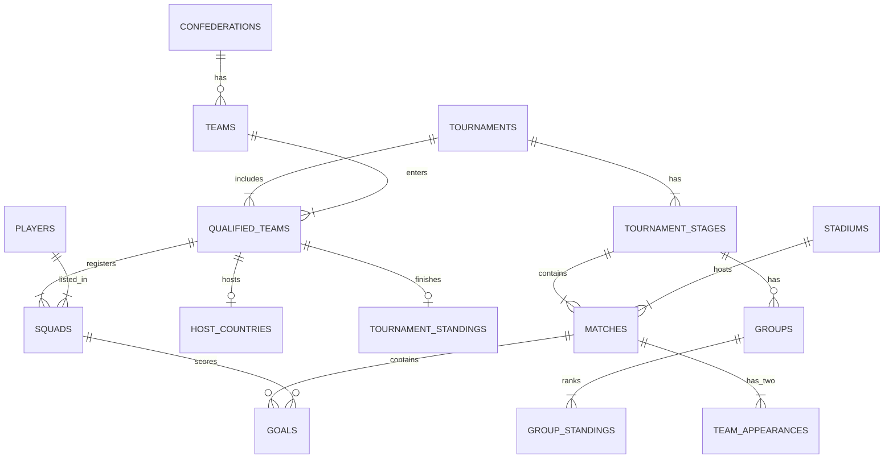

<!-- Generated by src/build_final_report.py from docs/final_report_src.md; edit the source, not this file. -->
<div class="titlepage" markdown="1">

# Pitch to Postgres: Designing and Querying a Relational Database for FIFA World Cup Data

<div class="sub">DS604 Introduction to Data Management<br>Final Report</div>

| Group member | Student ID |
|---|---|
| Devanshi Dudhatra | 202618027 |
| Pujita Sunapu | 202618003 |
| Rahul Saha | 202618037 |

<div class="meta">Submitted 15 November 2026<br>
Data: The Fjelstul World Cup Database by Joshua C. Fjelstul, licensed CC-BY-SA 4.0</div>

</div>

## Contents

1. Introduction
2. The dataset
3. Understanding the data: relationships, data quality, insights
4. Schema design
5. Loading the data
6. Analytical queries, results and validation
7. Views
8. Challenges and lessons learned
9. Limitations of the data
10. Attribution and licence
11. Appendix A: full DDL (`sql/ddl.sql`)
12. Appendix B: view definitions (`sql/views.sql`)

## 1. Introduction

**Aim.** We built a relational database in PostgreSQL for the complete history of the men's FIFA World Cup, loaded a real public dataset into it, and used SQL to answer analytical questions about teams, players, goals, discipline, venues, managers and long-term trends.

**Why this dataset.** World Cup history is familiar enough that results can be checked against well-known facts, which lets us validate our SQL. It is also rich enough to need a real relational design: 27 linked tables, composite keys, bridge tables, historical teams that no longer exist, and several data-quality problems.

**How we worked.** Every step is a script or notebook that can be rerun.

| Step | What | Files |
|---|---|---|
| 0 | Profiled all 27 files: keys, relationships, data quality, insights | `src/profile_data.py`, `docs/dataset_understanding.md` |
| 1 | Dataset description and tentative queries | `docs/milestone1.pdf` |
| 2 | Normalised schema, constraints, indexes, diagrams | `sql/ddl.sql`, `diagrams/*.png`, `docs/milestone2.pdf` |
| 3 | Cleaning and loading with `pandas.to_sql(if_exists="append")` | `src/clean.py`, `notebooks/03_load_data.ipynb` |
| 4 | 30 analytical queries with interpretation and validation | `sql/queries.sql`, `notebooks/04_queries.ipynb` |
| 5 | Seven views | `sql/views.sql`, `notebooks/05_views.ipynb`, `docs/milestone5.pdf` |

**Tools.** PostgreSQL 18 (local test database; the same code runs on the course server by changing only the `.env` file), Python 3.12 with pandas and SQLAlchemy, and Jupyter. All SQL is standard and PostgreSQL-compatible. Credentials are read from `.env` and never appear in code or outputs.

## 2. The dataset

| Item | Details |
|---|---|
| Name | The Fjelstul World Cup Database |
| Author | Joshua C. Fjelstul, Ph.D. |
| Source | <https://github.com/jfjelstul/worldcup> |
| Licence | Creative Commons Attribution-ShareAlike 4.0 (CC-BY-SA 4.0) |
| Format | 27 CSV files (UTF-8), 57,269 data rows |
| File date | July 2022 |
| **Actual coverage** | **21 men's World Cup final tournaments, 1930-2018** (13 July 1930 to 15 July 2018). The 2022 tournament, women's tournaments and qualifiers are not included. |
| Content | 900 matches, 2,548 goals (52 own goals), 84 national teams (including historical teams), 7,907 players, 380 referees, 357 managers, 185 stadiums in 17 countries |
| Event detail | Goals, managers and referees for every tournament. Line-ups, substitutions and cards from 1970 (cards were introduced that year); penalty shoot-outs from 1982. |

### 2.1 The 27 tables by theme

The *grain* is what one row represents. Each key was checked for uniqueness on the real data, and every key below is unique with no missing values.

#### Reference tables

| Table | Rows | Grain (one row is...) | Candidate key |
|---|---:|---|---|
| `confederations` | 6 | a continental confederation (UEFA, CONMEBOL, ...) | confederation_id |
| `teams` | 84 | a national team, including historical teams such as West Germany and the Soviet Union | team_id |
| `stadiums` | 185 | a stadium | stadium_id |
| `awards` | 8 | an award type (Golden Ball, Golden Boot, ...) | award_id |

#### People

| Table | Rows | Grain | Candidate key |
|---|---:|---|---|
| `players` | 7,907 | a player | player_id |
| `managers` | 357 | a manager (head coach) | manager_id |
| `referees` | 380 | a referee | referee_id |

#### Tournament structure

| Table | Rows | Grain | Candidate key |
|---|---:|---|---|
| `tournaments` | 21 | a World Cup edition | tournament_id |
| `tournament_stages` | 107 | a stage of a tournament (group stage, round of 16, final, ...) | (tournament_id, stage_number) |
| `groups` | 117 | a group within a group stage | (tournament_id, stage_number, group_name) |
| `host_countries` | 22 | a host nation of a tournament (2002 had two) | (tournament_id, team_id) |

#### Participation (who took part)

| Table | Rows | Grain | Candidate key |
|---|---:|---|---|
| `qualified_teams` | 457 | a team at a tournament | (tournament_id, team_id) |
| `squads` | 10,142 | a player in a team's squad at a tournament | (tournament_id, team_id, player_id) |
| `manager_appointments` | 469 | a manager leading a team at a tournament | (tournament_id, team_id, manager_id) |
| `referee_appointments` | 511 | a referee appointed to a tournament | (tournament_id, referee_id) |

#### Matches

| Table | Rows | Grain | Candidate key |
|---|---:|---|---|
| `matches` | 900 | a match (replays are separate matches) | match_id |
| `team_appearances` | 1,800 | one team's side of a match (two rows per match) | (match_id, team_id) |

#### Match events

| Table | Rows | Grain | Candidate key |
|---|---:|---|---|
| `goals` | 2,548 | a goal | goal_id |
| `bookings` | 2,466 | a card shown to a player (1970+) | booking_id |
| `substitutions` | 6,464 | one player going off or coming on (two rows per substitution, 1970+) | substitution_id |
| `penalty_kicks` | 279 | a kick in a penalty shoot-out (1982+) | penalty_kick_id |
| `player_appearances` | 18,623 | a player who played in a match (1970+) | (match_id, player_id) |
| `manager_appearances` | 1,842 | a manager in charge of a team in a match | (match_id, team_id, manager_id) |
| `referee_appearances` | 900 | the referee of a match (one per match) | match_id |

#### Results and standings

| Table | Rows | Grain | Candidate key |
|---|---:|---|---|
| `group_standings` | 458 | a team's final line in a group table | (tournament_id, stage_number, group_name, position) |
| `tournament_standings` | 84 | a top-four finishing position in a tournament | (tournament_id, position) |

#### Awards

| Table | Rows | Grain | Candidate key |
|---|---:|---|---|
| `award_winners` | 132 | a player winning an award at a tournament (ties give several rows) | (tournament_id, award_id, player_id) |
## 3. Understanding the data

The full profile, with every column of every table, its type, meaning, null counts and sample rows, is in `docs/dataset_understanding.md`, generated by `src/profile_data.py`. This chapter reproduces its key parts.

### 3.1 Relationships

Every relationship below was checked against the data: all of them have **zero orphan values**, meaning every referenced id exists in the parent table.

**One-to-many (1:N)**

- A confederation has many teams and many referees.
- A tournament has many stages, and a group stage has many groups. Each group has one table in `group_standings`.
- A tournament stage has many matches, and a stadium hosts many matches.
- A match has many goals, bookings, substitutions and (if decided on penalties) shoot-out kicks.
- A match has exactly one referee (`referee_appearances` is effectively 1:1 with `matches`).

**Many-to-many (M:N), resolved by bridge tables**

| Relationship | Bridge table |
|---|---|
| tournaments and teams (participation) | `qualified_teams` |
| tournaments and teams (hosting) | `host_countries` |
| tournaments and teams (top-four finish) | `tournament_standings` |
| (tournament, team) and players | `squads` |
| matches and teams | `team_appearances` (exactly 2 per match) |
| matches and players | `player_appearances` |
| (tournament, team) and managers | `manager_appointments` |
| matches, teams and managers | `manager_appearances` |
| tournaments and referees | `referee_appointments` |
| tournaments, awards and players | `award_winners` |

**Composite (multi-column) references.** Event tables can reference `squads` on (tournament_id, team_id, player_id) rather than only `players`. This is a stronger rule: a goal scorer must be in that team's squad for that tournament, and the data satisfies it for every goal, card, substitution, shoot-out kick, appearance and award.



*Figure 1: Core relationships (simplified; the full ER and relational schema diagrams come in Milestone 2).*

**Points that affect the design (found during profiling)**

1. `matches` does not store `stage_number`, so it links to `tournament_stages` through (tournament_id, stage_name). `groups` and `group_standings` use different stage names for 1950 and 1974 to 1982 (for example "first group stage" where `tournament_stages` says "group stage"). Joins must therefore use `stage_number`, not the name.
2. Germany and West Germany are separate teams with the same team code (DEU). Team code is therefore not a key.
3. On 12 occasions a team had joint managers at a tournament (42 team-matches), so the manager tables need `manager_id` in their keys.
4. Many tables repeat names copied from their parent tables (team_name, tournament_name, ...). These copies agree with the parent tables everywhere, so the normalised schema can drop them.
### 3.2 Data quality findings

Integrity checks that **passed**:

- Goal events reconcile with scores: 2548 goal rows = sum of all match scores (2548); per team-match mismatches: 0.
- Shoot-out kicks reconcile with shoot-out scores: 0 mismatches.
- Own goals: team_id differs from player_team_id in 52 of 52 own goals and in 0 normal goals.
- Exactly 2 team_appearances per match: {2: 900}.
- Stage match counts match tournament_stages.count_matches (0 mismatches); team counts match tournaments.count_teams (0 mismatches).
- Every team has exactly 11 starters in every recorded line-up: {11: 1400}.
- Substitutions are balanced (off = on) in every team-match (0 unbalanced); max 4 substitutions per team-match.
- Group tables are internally consistent: played = W+D+L (True), goal difference = GF-GA (True).
- players.count_tournaments agrees with squads (0 mismatches).
- Match city/country agree with stadiums (0 mismatches); denormalised name copies agree with masters (0 differences).
- No fully duplicated rows in any table, and all primary-key candidates are unique and non-null.

Findings that need handling:

| # | Issue | Evidence (computed) | Handling |
|---|---|---|---|
| 1 | Missing values coded as text | 'not available' / 'not applicable' are used instead of empty cells: award_winners.given_name: 21; bookings.group_name: 695; bookings.given_name: 117; goals.group_name: 766; goals.given_name: 255; manager_appearances.group_name: 485; manager_appearances.given_name: 20; manager_appointments.given_name: 5; managers.given_name: 5; matches.group_name: 236; penalty_kicks.group_name: 279; penalty_kicks.given_name: 24; player_appearances.group_name: 4271; player_appearances.given_name: 1063; players.given_name: 371; players.birth_date: 77; players.player_wikipedia_link: 7; referee_appearances.group_name: 236; referees.referee_wikipedia_link: 87; squads.given_name: 508; substitutions.group_name: 1502; substitutions.given_name: 389; team_appearances.group_name: 472. | Convert to SQL NULL on load (group_name for knockout matches, given_name for mononymous players such as Pelé, birth_date, wikipedia links). |
| 2 | A true empty cell | players.birth_date is blank for (P-03300, Sepúlveda, Guillermo) (in addition to 77 'not available'). | Load as NULL; exclude from age calculations and report the count excluded. |
| 3 | Inconsistent score text | matches.score uses an en dash except (M-1970-18, Sweden v Uruguay, 1-0); score_penalties is '0-0' (hyphen) when there was no shoot-out: 0-0: 870. | Do not store the text scores; use the integer columns. Store shoot-out scores as NULL when penalty_shootout = 0. |
| 4 | Shoot-out matches recorded as wins | In the 30 shoot-out matches the score is level (30 of 30), but `result` says home team win: 18; away team win: 12 and draw = 0. | Keep the flags but state the rule. For FIFA-style W/D/L, derive results from goals (a shoot-out counts as a draw). The shoot-out winner comes from the penalty scores. |
| 5 | Inconsistent stage labels | host_countries.performance: champions: 6; quater-finals: 4; third place: 3; runners-up: 2; round of 16: 2; fourth place: 2; quarter-final: 1; second group stage: 1; group stage: 1 ('quater-finals' and 'quarter-final' misspellings). qualified_teams.performance uses a different vocabulary: group stage: 206; round of 16: 87; quarter-finals: 64; final: 40; third-place match: 38; second group stage: 16; final round: 4; semi-finals: 2. | Map to a controlled list (lookup table or CHECK constraint). Use tournament_standings for positions 1-4, because 'final' does not distinguish winner from runner-up. |
| 6 | Historical / renamed teams | Germany and West Germany share team_code DEU and the same federation ((T-29, Germany, DEU); (T-82, West Germany, DEU)). Separate ids also exist for Soviet Union/Russia, Yugoslavia/Serbia and Montenegro/Serbia, Czechoslovakia/Czech Republic/Slovakia, Dutch East Indies (code IDN), Zaire (code COD). 34 players appear for more than one team, e.g. Argentina -> Italy, Austria -> Germany, Brazil -> Italy, Hungary -> Spain, Serbia and Montenegro -> Serbia, Soviet Union -> Russia. | Keep the source team_ids (faithful to history); team_code cannot be UNIQUE. If needed, add an optional `team_lineage` mapping for analyses that should combine West Germany with Germany (FIFA credits the successor federation). That mapping is an outside assumption and must be labelled as such. |
| 7 | Confederation is a current attribute | teams.region_name vs confederation: (Australia, Oceania, AFC); (Israel, Middle East, UEFA). Australia is listed as AFC although it played the 1974 and 2006 tournaments as an OFC member. | Treat confederation analyses by decade as 'by current confederation' and say so. |
| 8 | Non-unique names | Two stadiums are called (S-053, Olympiastadion, Berlin); (S-065, Olympiastadion, Munich); match_name has only 711 distinct values for 900 matches. | Always join on ids, never on names. |
| 9 | Replayed matches | 4 drawn ties were replayed (1934, 1938): (M-1934-12, Italy v Spain, quarter-finals, 1–1, 1, 0); (M-1934-13, Italy v Spain, quarter-finals, 1–0, 0, 1); (M-1938-01, Switzerland v Germany, round of 16, 1–1, 1, 0); (M-1938-02, Cuba v Romania, round of 16, 3–3, 1, 0); (M-1938-08, Cuba v Romania, round of 16, 2–1, 0, 1); (M-1938-09, Switzerland v Germany, round of 16, 4–2, 0, 1); (M-1938-10, Brazil v Czechoslovakia, quarter-finals, 1–1, 1, 0); (M-1938-14, Brazil v Czechoslovakia, quarter-finals, 2–1, 0, 1). | Keep both matches (both were played and their goals count). replayed = 1 marks the drawn original and replay = 1 the rematch. Use the replay to decide who advanced. |
| 10 | Walkover | 1938 round of 16: (WC-1938, round of 16, 8, 9, 2, 1) [tournament, stage, scheduled, played, replays, walkovers]. Austria withdrew, so Sweden advanced without playing; the walkover has no match row. | Note it; there are no rows to load. Counts of 'matches played' are correct as is. |
| 11 | Group play-off matches | Tie-break play-offs inside group stages: (WC-1954, group stage, 2); (WC-1958, group stage, 3). Play-offs are counted as group-stage matches but not in the group tables: rows where group_standings.played differs from the team's group-stage match count (tournament, stage, team, in table, actual): (WC-1954, group stage, West Germany, 2, 3); (WC-1954, group stage, Turkey, 2, 3); (WC-1954, group stage, Switzerland, 2, 3); (WC-1954, group stage, Italy, 2, 3); (WC-1958, group stage, Northern Ireland, 3, 4); (WC-1958, group stage, Czechoslovakia, 3, 4); (WC-1958, group stage, Wales, 3, 4); (WC-1958, group stage, Hungary, 3, 4); (WC-1958, group stage, Soviet Union, 3, 4); (WC-1958, group stage, England, 3, 4). | Use group_standings for tables and matches/team_appearances for match counts; document that they differ by design. |
| 12 | Stage names differ between tables | groups/group_standings name stage 1 differently from tournament_stages and matches for the same stage_number: (WC-1950, 1, first round, group stage); (WC-1974, 1, first group stage, group stage); (WC-1978, 1, first group stage, group stage); (WC-1982, 1, first group stage, group stage) [tournament, stage_number, name in groups, name in stages]. | Store stage_name only in tournament_stages; groups and group_standings reference (tournament_id, stage_number). Joining on stage_name would silently lose 1950 and 1974-1982 first-stage groups. |
| 13 | Group names differ between matches and groups | matches uses group names that do not exist in groups for the same stage: (WC-1982, 2, Group 4); (WC-1982, 2, Group 1); (WC-1982, 2, Group 3); (WC-1982, 2, Group 2); groups and group_standings call these groups Group A, Group B, Group C, Group D. Each group contains exactly the same three teams under both names. Also, these group-stage matches have no group name although groups records their round as a group: (M-1950-17, final round); (M-1950-18, final round); (M-1950-19, final round); (M-1950-20, final round); (M-1950-21, final round); (M-1950-22, final round) (the 1950 final round, 'Group 1' in groups). | During loading, map each match to the group containing its teams (1982: Group 1 -> A, 2 -> B, 3 -> C, 4 -> D; 1950 final round -> Group 1; computed, not assumed). The FK from matches to groups then holds. |
| 14 | 1950 had no final | 1950 ended with a final round-robin group (stage 'final round'): (M-1950-17, Brazil v Sweden, 7–1); (M-1950-18, Uruguay v Spain, 2–2); (M-1950-19, Brazil v Spain, 6–1); (M-1950-20, Uruguay v Sweden, 3–2); (M-1950-21, Sweden v Spain, 3–1); (M-1950-22, Uruguay v Brazil, 2–1). 'final' stage matches = 20 for 21 tournaments. | When counting finals, treat the 1950 decider (Uruguay v Brazil) separately or use tournament_standings positions 1-2. |
| 15 | No third-place match / 'shared' third places | No third-place match in 1930, 1950. tournament_standings still has exactly positions 1-4 for every tournament ([1, 2, 3, 4]: 21), so **no shared third places exist in this data**; for 1930 the source ranks the USA 3rd and Yugoslavia 4th. | Report positions 3-4 for 1930 as assigned by the source, not decided on the pitch. |
| 16 | Abandoned matches | There is no abandoned/forfeit flag, and every match has a final score. No World Cup final-tournament match was abandoned in this period. | Nothing to handle; note the absence of the attribute. |
| 17 | Event data starts in 1970 | Year ranges: goals: 1930-2018 (21 of 21 tournaments); bookings: 1970-2018 (13 of 21 tournaments); substitutions: 1970-2018 (13 of 21 tournaments); player_appearances: 1970-2018 (13 of 21 tournaments); penalty_kicks: 1982-2018 (10 of 21 tournaments); manager_appearances: 1930-2018 (21 of 21 tournaments); referee_appearances: 1930-2018 (21 of 21 tournaments); group_standings: 1930-2018 (19 of 21 tournaments). Bookings exist for only some matches in early tournaments (matches with at least one card per year: 1970: 19; 1974: 33; 1978: 20; 1982: 43; 1986: 47; 1990: 48; 1994: 52; 1998: 64; 2002: 62; 2006: 64; 2010: 62; 2014: 64; 2018: 62). | Restrict line-up, card and substitution analyses to 1970+ and state it. A match with no booking rows means no cards were shown, not missing data, from 1970 on. |
| 18 | Shirt number 0 = unknown | Squads with shirt 0 by year: 1930: 245; 1934: 342; 1938: 320; 1950: 281; goals with shirt 0 by year: 1930: 70; 1934: 70; 1938: 84; 1950: 88; 1954: 140; 1958: 126; 1962: 89; 1966: 89. | Load 0 as NULL (CHECK shirt_number BETWEEN 1 AND 99 where present). |
| 19 | Multiple managers | 12 team-tournaments had joint managers (42 team-matches), so manager_appearances has 1,842 rows for 1,800 team-matches. | The key must include manager_id; manager win totals double-count those team-matches across co-managers by design. |
| 20 | Line-up gaps | 9 'coming on' substitutions have no player_appearances row ((S-0276, M-1974-14, Netherlands v Sweden, Grip); (S-0332, M-1974-22, Sweden v Uruguay, Ahlström); (S-0334, M-1974-22, Sweden v Uruguay, Torstensson); (S-0336, M-1974-23, Argentina v Haiti, Leandré); (S-0339, M-1974-23, Argentina v Haiti, Balbuena); (S-0340, M-1974-23, Argentina v Haiti, Leandré); (S-0342, M-1974-23, Argentina v Haiti, Brindisi); (S-0712, M-1982-10, Chile v Austria, Baumeister); (S-0714, M-1982-10, Chile v Austria, Jurtin)). player_appearances has 3223 substitute rows vs 3232 coming_on rows. 9 team-matches have no captain flagged ((M-1974-05, Sweden); (M-1974-13, Uruguay); (M-1974-22, Uruguay); (M-1974-26, Brazil); (M-1974-29, Brazil); (M-1974-35, Brazil); (M-1974-37, Brazil); (M-1974-37, Poland); (M-1978-22, Sweden)). 16 players came on and were later taken off. | Small gaps in source data. Report them and do not 'fix' them by inventing rows. Substitute counts should come from substitutions. |
| 21 | Ambiguous booking | Booking (B-0353, Iraq v Belgium, Gorgis, Basil, 52') has both yellow_card = 1 and red_card = 1 but second_yellow_card = 0. Rows per flag pattern (yellow, red, second yellow, sending off): (1, 0, 0, 0): 2318; (0, 1, 0, 1): 88; (1, 0, 1, 1): 59; (1, 1, 0, 1): 1. | Keep as is. Use sending_off to count dismissals and note this row. |
| 22 | Position granularity | squads uses 4 position codes MF: 3097; DF: 3081; FW: 2661; GK: 1303; player_appearances uses 21 detailed codes. Players can carry several position flags in players: 1: 7720; 2: 186; 3: 1 (number of flags -> players). | Use squads.position_code for position analyses. Optionally map the 21 detailed codes to the 4 groups. |
| 23 | Points systems differ by era | 2 points per win up to 1990: True; 3 points from 1994: True. | Recompute points with a single rule when comparing eras. |
| 24 | Non-atomic / derived columns | players.list_tournaments is a comma-separated list; players.count_tournaments, tournaments.winner/host_country (text), team_appearances.*, margins and win flags are derivable. | Do not use list_tournaments for querying (derive it from squads). Decide in Milestone 2 which derived columns to keep for convenience. |
| 25 | Home/away is nominal | Outside the hosts, 'home' is only the first-named team. Hosts were flagged home in 87 of 118 of their matches. | Measure host advantage with host_countries, not home_team. |
| 26 | Not keys | team_code (Germany/West Germany), stadium_name and match_name are not unique; key_id is only a row number. | Use the *_id columns as keys. |
### 3.3 Key insights

36 findings, each computed by `src/profile_data.py`. Unless stated otherwise, wins and draws are derived from the score, so a shoot-out counts as a draw, as in FIFA records.

| # | Theme | Finding | Supporting tables / columns |
|---|---|---|---|
| 1 | Team performance | Titles by team_id: Brazil 5, Italy 4, West Germany 3, Uruguay 2, Argentina 2, France 2, England 1, Spain 1, Germany 1. 9 different team_ids have won, but Germany and West Germany share the code DEU; counted as one lineage they have 4 titles, level with Italy's 4 and behind Brazil's 5. | tournament_standings (position = 1), teams.team_code |
| 2 | Team performance | Brazil is the only team to appear in all 21 tournaments; next are Italy (18), Argentina (17), Mexico (16). 84 teams have taken part in total. | qualified_teams |
| 3 | Goals and scoring | Goals per match peaked at 5.38 in 1954 and bottomed at 2.21 in 1990; the all-time average is 2.83. Every tournament since 1962 has averaged under 3 goals per match (range 2.21-2.97). | matches.home_team_score, away_team_score |
| 4 | Goals and scoring | The biggest winning margin is 9 goals, reached 3 times: Hungary 9-0 South Korea (1954); Yugoslavia 9-0 Zaire (1974); Hungary 10-1 El Salvador (1982). | matches.home_team_score_margin |
| 5 | Goals and scoring | The highest-scoring match is Austria 7-5 Switzerland (1954, quarter-finals), 12 goals. 71 matches (7.9%) ended 0-0. | matches |
| 6 | Player performance | All-time top scorers (own goals excluded): Miroslav Klose 16, Ronaldo 15, Gerd Müller 14, Just Fontaine 13, Pelé 12. 1297 different players have scored. | goals (own_goal = 0), players |
| 7 | Player performance | Most goals in one tournament: Just Fontaine, 13 in 1958. The next best single-tournament tally is 11 (Sándor Kocsis, 1954). | goals grouped by tournament_id, player_id |
| 8 | Player performance | There have been 52 hat-tricks (3+ goals by one player in a match, own goals excluded). The most goals by one player in one match is 5 (Oleg Salenko, Russia v Cameroon, 1994). | goals grouped by match_id, player_id |
| 9 | Goals and scoring | 52 own goals in total (2.0% of all goals). 2018 had the most, 12, more than the 6 of the next highest tournament. | goals.own_goal, team_id vs player_team_id |
| 10 | Goals and scoring | 197 goals came from in-match penalties (7.7%). The record is 22 in 2018 (the first tournament with VAR); the previous high was 17. | goals.penalty |
| 11 | Goals and scoring | 30 matches were settled by a shoot-out (1982-2018); 196 of 279 kicks were scored (70.3%). Most shoot-out wins: Argentina 4/5. Unbeaten with 3+: West Germany 3/3 (with Germany's 2006 shoot-out the DEU lineage is 4/4); England won 1/4. | penalty_kicks.converted, team_appearances.penalties_for/against |
| 12 | Goals and scoring | 68 matches went to extra time and 30 of those ended in a shoot-out (44%). | matches.extra_time, penalty_shootout |
| 13 | Venues and hosting | Hosts won 6 of 21 tournaments (1930, 1934, 1966, 1974, 1978, 1998), none since 1998. Host nations won 62.7% of their 118 matches versus 37.3% for all other teams (shoot-outs counted as draws). | tournaments.host_won, host_countries, team_appearances |
| 14 | Venues and hosting | Only 1 host was eliminated in the first group stage: South Africa (2010). | host_countries.performance |
| 15 | Team performance | Only two confederations have produced champions: {'UEFA': 12, 'CONMEBOL': 9}. Top-four finishes by teams from other confederations: United States 1930 (position 3), South Korea 2002 (position 4). | tournament_standings, teams.confederation_code |
| 16 | Historical trends | The draw rate (level score, shoot-outs counted as draws) was 22.1% overall, from 0.0% in 1930 to 32.7% in 1982. | matches.home_team_score, away_team_score |
| 17 | Discipline and refereeing | Cards per match rose from 1.62 in 1970 to a peak of 5.52 in 2006, then fell to 3.52 in 2018. 2466 card events are recorded in total. | bookings, matches |
| 18 | Discipline and refereeing | The most cards in one match: Portugal v Netherlands (2006, round of 16) with 16 cards including 4 sendings-off. | bookings grouped by match_id |
| 19 | Discipline and refereeing | 148 sendings-off from 1970 to 2018 (89 straight reds, 59 after a second yellow). The most in one tournament was 27 in 2006. | bookings.sending_off, red_card, second_yellow_card |
| 20 | Discipline and refereeing | Ravshan Irmatov (Uzbekistan) refereed the most matches, 11. UEFA referees officiated 516 of 900 matches (57%). | referee_appearances, referees |
| 21 | Discipline and refereeing | Among referees with at least 5 matches since 1970, Ľuboš Micheľ (Slovakia) showed the most cards per match (8.00); the median for this group is 3.94. | bookings joined to referee_appearances on match_id |
| 22 | Venues and hosting | Estadio Azteca (Mexico City) has hosted the most matches, 19. The largest listed capacity is Estádio do Maracanã (Rio de Janeiro) at 200,000. 185 stadiums in 17 countries have been used. | matches.stadium_id, stadiums |
| 23 | Managers | Helmut Schön (West Germany) holds both manager records: most matches (25) and most wins (16, shoot-outs counted as draws). Next by wins: Luiz Felipe Scolari (14 wins in 21 matches). | manager_appearances joined to team_appearances |
| 24 | Managers | 138 of 469 manager appointments (29%) were of a manager whose nationality differs from the team's name. Every one of the 21 title-winning managers shared the nationality of their team (West German winners are listed with nationality Germany). | manager_appointments.country_name, teams.team_name, tournament_standings |
| 25 | Player performance | Most World Cup appearances (1970 onwards): Lothar Matthäus, 25 matches; then Miroslav Klose 24, Paolo Maldini 23, Diego Maradona 21. | player_appearances |
| 26 | Player performance | 4 players were in a squad at 5 tournaments: Gianluigi Buffon (1998, 2002, 2006, 2010, 2014); Antonio Carbajal (1950, 1954, 1958, 1962, 1966); Rafael Márquez (2002, 2006, 2010, 2014, 2018); Lothar Matthäus (1982, 1986, 1990, 1994, 1998). | players.count_tournaments, list_tournaments (verified against squads) |
| 27 | Player performance | Since 1970, 196 of 1749 non-own goals (11.2%) were scored by substitutes; the count rose from 5 in 1970 to a peak of 32 in 2014 (15 in 2018). | goals joined to player_appearances (substitute = 1) |
| 28 | Player performance | Oldest scorer: Roger Milla aged 42 years 39 days (Russia v Cameroon, 1994). Youngest scorer: Pelé aged 17 years 239 days (Brazil v Wales, 1958). | goals.match_date, players.birth_date |
| 29 | Player performance | From 1970 on, the oldest player to appear is Essam El Hadary (45 years 161 days, Saudi Arabia v Egypt, 2018); the youngest is Norman Whiteside (17 years 41 days, Yugoslavia v Northern Ireland, 1982). | player_appearances.match_date, players.birth_date |
| 30 | Historical trends | Average squad age at the tournament start rose from 24.9 years in 1930 (the lowest) to 27.9 in 2018 (the highest); in 1970 it was 26.2. Birth dates are missing for 79 squad rows. | squads, players.birth_date, tournaments.start_date |
| 31 | Awards | The Golden Boot has been shared in 2 tournaments; the largest tie was 6 players in 1962. Of 132 award rows, 38 are shared awards. | award_winners.shared, award_name |
| 32 | Awards | Golden Ball (best player, recorded since 1978): only 4 of 11 winners played for the champion team. | award_winners joined to tournament_standings |
| 33 | Goals and scoring | 1403 goals (55.1%) came in the second half versus 1078 (42.3%) in the first; 537 (21.1%) came in minutes 76-90 including stoppage time. | goals.match_period, minute_regulation |
| 34 | Team performance | 20 teams have never won a World Cup match (shoot-outs counted as draws); the most matches without a win is 9 by Honduras. | team_appearances |
| 35 | Team performance | 28 of 84 teams never got past the first group stage (performance always 'group stage'). | qualified_teams.performance |
| 36 | Historical trends | Group points follow 2 points per win in every tournament up to 1990 and 3 points per win from 1994, which the data reproduces exactly (checks: True / True). Points therefore cannot be compared across eras without recomputing. | group_standings.points, wins, draws |
### 3.4 Insights framework

Questions the database can answer, how to compute them, and who benefits. The SQL techniques listed here feed the Milestone 1 query list.

#### Team performance

| Question | Tables involved | How to compute (method and SQL technique) | Why it matters / who it helps |
|---|---|---|---|
| Which teams are most successful (titles, finals, semi-finals)? | tournament_standings, matches, teams | Count positions 1-4 per team; count finals via matches.stage_name = 'final' (plus 1950 final round). GROUP BY, CASE, JOIN. | Analysts, federations, broadcasters (pre-match graphics). |
| Win/draw/loss record and goal difference per team | team_appearances | Aggregate goals_for/against; derive W/D/L from goals, not from `result`, so shoot-outs count as draws. SUM(CASE ...). | Analysts, journalists, betting-odds modellers. |
| Head-to-head between two teams | team_appearances (or matches self-join) | Filter team_id = A and opponent_id = B; aggregate. Self-join/WHERE with parameters. | Coaches preparing for an opponent, broadcasters. |
| Which teams never left the group stage? | qualified_teams | Teams whose every performance = 'group stage'. GROUP BY ... HAVING, or NOT EXISTS / EXCEPT. | Federations benchmarking progress. |
| Confederation strength by decade | team_appearances, teams, confederations | Win rate per confederation per decade (year/10*10). JOIN, GROUP BY, CASE. | FIFA slot allocation debates, researchers. Caveat: confederation is current, not historical. |
| How far do teams usually go after winning/drawing/losing their first group game? | matches, team_appearances, qualified_teams | ROW_NUMBER() per team-tournament ordered by date to find match 1; join to stage reached. | Coaches, analysts, fans. |

#### Player performance

| Question | Tables involved | How to compute (method and SQL technique) | Why it matters / who it helps |
|---|---|---|---|
| All-time and per-tournament top scorers | goals, players | COUNT goals with own_goal = 0 per player; RANK() OVER (PARTITION BY tournament ORDER BY goals DESC). | Broadcasters, journalists, award committees. |
| Most appearances and minutes (1970+) | player_appearances, substitutions | COUNT appearances; approximate minutes from substitution minutes. CTE + CASE. | Researchers on player workload, sports scientists. |
| Impact of substitutes | goals, player_appearances | Join goals to the scorer's appearance; share of goals with substitute = 1, by tournament. | Coaches (bench strategy), analysts. |
| Age profile by position and tournament | squads, players, tournaments | Age = start_date - birth_date; AVG by position_code and year; exclude unknown birth dates. | Federations planning squad renewal, scouts. |
| Players who represented more than one team | squads | COUNT(DISTINCT team_id) > 1 per player. HAVING. | Historians; shows team-lineage issues. |
| Captains' records | player_appearances, team_appearances | Filter captain = 1; join results. | Media features. |

#### Goals and scoring patterns

| Question | Tables involved | How to compute (method and SQL technique) | Why it matters / who it helps |
|---|---|---|---|
| Goals per match by tournament and stage | matches | SUM(scores)/COUNT(*) GROUP BY year, stage; moving average with window frame. | Rule makers (FIFA/IFAB), broadcasters. |
| When are goals scored (by minute band)? | goals | CASE on minute_regulation into 15-minute bands; GROUP BY. | Coaches (fitness, game management), analysts. |
| Penalty and own-goal share over time | goals | AVG(penalty), SUM(own_goal) by year; compare pre/post VAR (2018). | Referees' bodies evaluating VAR. |
| Shoot-out records and conversion | penalty_kicks, team_appearances, matches | SUM(converted)/COUNT per team/player; shoot-out wins per team. | Coaches preparing shoot-outs, sports psychologists. |
| Biggest wins and highest-scoring matches | matches | ORDER BY margin / total DESC with RANK(). | Broadcasters, trivia, historians. |
| Comebacks (winning after conceding first) | goals, team_appearances | First goal per match by MIN(minute) using ROW_NUMBER(); compare with final result. | Coaches, analysts. Caveat: minute resolution only. |

#### Discipline and refereeing

| Question | Tables involved | How to compute (method and SQL technique) | Why it matters / who it helps |
|---|---|---|---|
| Strictest referees (cards per match) | bookings, referee_appearances, referees | Join bookings to the match referee; cards / matches with HAVING matches >= n. | Referees' bodies (consistency), teams preparing for a referee. |
| Card trend over time | bookings, matches | Cards per match per tournament with a 3-tournament moving average (AVG OVER ROWS BETWEEN). | IFAB/FIFA rule evaluation, researchers. |
| Most-carded teams and players | bookings | COUNT by team/player; RANK(). | Coaches, disciplinary committees. |
| Are knockout matches dirtier than group matches? | bookings, matches | Cards per match by stage_name / knockout_stage. CASE + GROUP BY. | Referees' bodies, broadcasters. |
| Referee nationality vs. match confederations | referee_appearances, team_appearances, teams | Flag matches where referee confederation equals a team's confederation. | Integrity researchers. Caveat: correlation only. |

#### Venues and hosting

| Question | Tables involved | How to compute (method and SQL technique) | Why it matters / who it helps |
|---|---|---|---|
| Busiest stadiums and cities | matches, stadiums | COUNT matches per stadium; DENSE_RANK(). | Host-bid committees, broadcasters. |
| Host-nation advantage | host_countries, team_appearances | Win rate of hosts vs non-hosts; host stage reached vs their average. | Federations bidding to host, researchers. |
| Matches played outside the host country's continent / by country | matches, stadiums | GROUP BY country_name of stadium. | Historians, tourism bodies. |

#### Managers

| Question | Tables involved | How to compute (method and SQL technique) | Why it matters / who it helps |
|---|---|---|---|
| Most matches and wins by manager | manager_appearances, team_appearances, managers | Join on (match_id, team_id); SUM wins. | Federations hiring coaches, media. |
| Do foreign managers do better or worse? | manager_appointments, teams, qualified_teams | Compare stage reached where manager nationality differs from team. CASE. | Federations deciding on foreign coaches. |
| Managers at several tournaments or with several teams | manager_appointments | COUNT(DISTINCT tournament_id/team_id) HAVING > 1. | Media, researchers. |

#### Historical trends

| Question | Tables involved | How to compute (method and SQL technique) | Why it matters / who it helps |
|---|---|---|---|
| How has the format grown (teams, matches, stages)? | tournaments, tournament_stages | Counts per year; LAG() to show change between editions. | Students, historians, FIFA planning (48-team era). |
| Cumulative titles over time | tournament_standings, tournaments | Running total SUM() OVER (PARTITION BY team ORDER BY year). | Broadcasters, infographics. |
| Draw rate and extra-time frequency over time | matches | AVG(CASE) by year; LAG to compare. | Rule makers, researchers. |
| Average age over time | squads, players | AVG(age) by year. | Federations, sports scientists. |

#### Awards

| Question | Tables involved | How to compute (method and SQL technique) | Why it matters / who it helps |
|---|---|---|---|
| Do award winners come from the champion? | award_winners, tournament_standings | LEFT JOIN on (tournament_id, team_id) where position = 1. | Award committees, media. |
| Golden Boot winners and their goal totals | award_winners, goals | Join award to goal counts; check ties (shared = 1). | Validation of award data; media. |
| Best Young Player age profile | award_winners, players, tournaments | Age at tournament start. | Scouts, youth academies. |

#### Data quality and limitations

| Question | Tables involved | How to compute (method and SQL technique) | Why it matters / who it helps |
|---|---|---|---|
| Is every goal accounted for? | goals, team_appearances | Compare COUNT(goals) per team-match with goals_for. Anti-join. | Data stewards; proves load integrity. |
| Which records are incomplete before 1970? | player_appearances, bookings, substitutions | MIN(year) per event table; NOT EXISTS for matches without line-ups. | Anyone interpreting trends; prevents false conclusions. |
| Which teams are historical predecessors? | teams | Shared team_code / federation_name; manual lineage table. | Analysts aggregating Germany/West Germany etc. |

#### What the data cannot answer

- Possession, shots, passes, expected goals, distance covered or any tracking/event data beyond goals, cards, substitutions and shoot-out kicks.
- Attendance and weather: stadiums.stadium_capacity is a single capacity figure, not match attendance.
- Assists: goals have no assist provider.
- Missed or saved in-match penalties: only scored ones appear (goals.penalty = 1). In-match penalty conversion therefore cannot be computed; penalty_kicks covers shoot-outs only.
- Line-ups, substitutions and cards before 1970: those tables start in 1970 (cards were introduced that year), so player-appearance or discipline trends cannot go back further.
- Exact time of events: minutes only, no seconds (e.g. the fastest goal cannot be timed).
- Club affiliation, height, foot, market value or caps of players.
- Qualifying matches, the women's World Cup, and the 2022 and 2026 tournaments: these files cover the 21 men's final tournaments from 1930 to 2018 only.
- Historical confederation membership: teams.confederation_id is a single current value (Australia is AFC, although it qualified through the OFC for 1974 and 2006).
- Assistant referees, VAR officials, fourth officials.
## 4. Schema design

### 4.1 Overview and testing

We designed a normalised PostgreSQL schema for all 27 tables of the Fjelstul World Cup Database, plus one small lookup table (`positions`), giving **28 tables**. The DDL is in `sql/ddl.sql` (reproduced in full in Appendix A).

| Item | Count |
|---|---:|
| Tables | 28 (27 from the dataset + 1 lookup) |
| Columns | 163 kept from 405 source columns, plus 2 in `positions` |
| Primary keys | 28 (13 of them composite) |
| Foreign keys | 49 (36 of them composite) |
| UNIQUE constraints | 14 |
| CHECK constraints | 63 |
| NOT NULL columns | 147 of 165 |
| Secondary indexes | 21 |

**How it was tested (local PostgreSQL 18):**

1. **Runs repeatably.** `ddl.sql` runs without errors, and running it again changes nothing. It contains no DROP, TRUNCATE or DELETE, so it is safe on the course server.
2. **Accepts the real data.** All 27 CSV files were trial-loaded with `pandas.to_sql(if_exists="append")`, the method required for Milestone 3. All **57,269 rows** were accepted under every key and constraint.
3. **Rejects bad data.** 14 deliberately invalid changes were each rejected by the intended constraint (listed in the Milestone 2 report, Section 6).
4. **Loses no information.** All 33 checks pass, showing that every dropped column can be recomputed exactly from the columns we keep (Section 4.2, 'What was removed').

The design work also exposed **one more inconsistency in the source**. For the 1982 second group stage, `matches` names the groups "Group 1"–"Group 4", while `groups` and `group_standings` call them "Group A"–"Group D". The foreign key from `matches` to `groups` caught it on the first trial load. The loader matches each group by its identical set of three teams (1=A, 2=B, 3=C, 4=D), and this finding has been added to the Milestone 0 report. *(Added during Milestone 3: an integrity query also found that the six 1950 final-round matches have no group name, while `groups` records that round as "Group 1". The loader assigns them to that group by their teams.)*
### 4.2 Design decisions

#### Normal form

The schema is in **third normal form (3NF)**, with one deliberate and controlled exception (Section 4.2, 'Controlled redundancy').

- **1NF:** every column holds a single value. The source column `players.list_tournaments` held a comma-separated list such as "1998, 2002, 2006", so it was removed; the same information comes from `squads`.
- **2NF:** no column depends on only part of a composite key. In the source, for example, `team_name` in `squads` depends on `team_id` alone, not on the whole key (tournament_id, team_id, player_id), so copied names like this were removed.
- **3NF:** no column depends on another non-key column. Examples removed: `teams.confederation_name` depends on `confederation_id`; `matches.home_team_score_margin` depends on the two scores; `bookings.sending_off` depends on `red_card` and `second_yellow_card`.

#### What was removed, and proof that nothing is lost

Three kinds of column were removed:

- **Copies** of attributes that belong to another table (names, codes, dates, stadium location, confederation). These cause update anomalies: renaming a team would mean updating 16 tables.
- **Same-row derived values**, such as score text, margins, result labels and win/draw flags, `minute_label`, `match_period`, `going_off`, `substitute`, `sending_off`, `played`, `goal_difference` and `points`.
- **Summary values derivable from other tables**, such as player position flags, `count_tournaments`, tournament format flags, the `winner` and `host_country` text, match and team counts, `unbalanced_groups` and `shared`.

`key_id` is only the row number of each file, so it was not kept.

Before dropping anything we proved each column redundant on the actual data. `clean.verify_dropped_columns()` runs **33 checks, and all pass**. For example, `result` is reproduced exactly from the two scores plus the shoot-out scores, and `points` is reproduced exactly from wins and draws with 2 points per win up to 1990 and 3 from 1994. Everything removed can be rebuilt with a query, and Milestone 5 provides views that do so (for example, a match results view with result labels).

| Table | Source columns | Kept | Dropped columns |
|---|---:|---:|---|
| `confederations` | 5 | 4 | key_id |
| `awards` | 5 | 4 | key_id |
| `stadiums` | 8 | 7 | key_id |
| `teams` | 11 | 8 | key_id, confederation_name, confederation_code |
| `players` | 12 | 5 | key_id, goal_keeper, defender, midfielder, forward, count_tournaments, list_tournaments |
| `managers` | 6 | 5 | key_id |
| `referees` | 9 | 6 | key_id, confederation_name, confederation_code |
| `tournaments` | 18 | 5 | key_id, host_country, winner, host_won, count_teams, group_stage, second_group_stage, final_round, round_of_16, quarter_finals, semi_finals, third_place_match, final |
| `tournament_stages` | 16 | 9 | key_id, tournament_name, group_stage, knockout_stage, unbalanced_groups, count_matches, count_replays |
| `groups` | 7 | 3 | key_id, tournament_name, stage_name, count_teams |
| `qualified_teams` | 8 | 3 | key_id, tournament_name, team_name, team_code, count_matches |
| `host_countries` | 7 | 2 | key_id, tournament_name, team_name, team_code, performance |
| `tournament_standings` | 7 | 3 | key_id, tournament_name, team_name, team_code |
| `group_standings` | 19 | 11 | key_id, tournament_name, stage_name, team_name, team_code, played, goal_difference, points |
| `squads` | 12 | 5 | key_id, tournament_name, team_name, team_code, family_name, given_name, position_name |
| `manager_appointments` | 10 | 3 | key_id, tournament_name, team_name, team_code, family_name, given_name, country_name |
| `referee_appointments` | 10 | 2 | key_id, tournament_name, family_name, given_name, country_name, confederation_id, confederation_name, confederation_code |
| `matches` | 37 | 17 | key_id, tournament_name, match_name, stage_name\*, group_stage, knockout_stage, stadium_name, city_name, country_name, home_team_name, home_team_code, away_team_name, away_team_code, score, home_team_score_margin, away_team_score_margin, score_penalties, result, home_team_win, away_team_win, draw |
| `team_appearances` | 36 | 9 | key_id, tournament_name, match_name, stage_name, group_name, group_stage, knockout_stage, replayed, replay, match_date, match_time, stadium_id, stadium_name, city_name, country_name, team_name, team_code, opponent_name, opponent_code, away_team, goal_differential, extra_time, penalty_shootout, result, win, lose, draw |
| `referee_appearances` | 15 | 3 | key_id, tournament_name, match_name, match_date, stage_name, group_name, family_name, given_name, country_name, confederation_id, confederation_name, confederation_code |
| `manager_appearances` | 17 | 4 | key_id, tournament_name, match_name, match_date, stage_name, group_name, team_name, team_code, home_team, away_team, family_name, given_name, country_name |
| `player_appearances` | 22 | 7 | key_id, tournament_name, match_name, match_date, stage_name, group_name, team_name, team_code, home_team, away_team, family_name, given_name, shirt_number, position_name, substitute |
| `goals` | 27 | 10 | key_id, tournament_name, match_name, match_date, stage_name, group_name, team_name, team_code, home_team, away_team, family_name, given_name, shirt_number, player_team_name, player_team_code, minute_label, match_period |
| `bookings` | 26 | 10 | key_id, tournament_name, match_name, match_date, stage_name, group_name, team_name, team_code, home_team, away_team, family_name, given_name, shirt_number, minute_label, match_period, sending_off |
| `substitutions` | 24 | 8 | key_id, tournament_name, match_name, match_date, stage_name, group_name, team_name, team_code, home_team, away_team, family_name, given_name, shirt_number, minute_label, match_period, going_off |
| `penalty_kicks` | 19 | 6 | key_id, tournament_name, match_name, match_date, stage_name, group_name, team_name, team_code, home_team, away_team, family_name, given_name, shirt_number |
| `award_winners` | 12 | 4 | key_id, tournament_name, award_name, shared, family_name, given_name, team_name, team_code |

\* `matches.stage_name` is replaced by `stage_number` (Section 4.2, 'Stages and groups').

#### Natural keys instead of surrogate keys

Every table keeps the source's own identifiers (`team_id` such as T-03, `player_id` such as P-04418, `match_id` such as M-1930-01) as its primary key. We did **not** add surrogate keys (auto-numbered integers).

- The ids are already **unique, never missing and stable**, which we verified for every table in Milestone 0.
- The course rule is to load each CSV with `to_sql(if_exists="append")`. With natural keys, child tables can be appended directly. With surrogate keys, every foreign key in the 20 child tables would have to be looked up and replaced during loading, which adds work and room for error.
- The ids carry meaning that helps when checking results (`WC-1930`, `M-1930-01`), and CHECK constraints enforce their format, for example `team_id ~ '^T-[0-9]{2}$'`. The match id must also contain the tournament year.
- `key_id` is **not** used as a key. It is only the row position in each file and identifies nothing in the real world.

#### Composite keys

Bridge and event tables use composite primary keys made of the foreign keys that identify one fact:

| Table | Primary key | Why |
|---|---|---|
| `qualified_teams` | (tournament_id, team_id) | A team takes part in a tournament at most once. |
| `squads` | (tournament_id, team_id, player_id) | One squad entry per player per team per tournament. A further UNIQUE (tournament_id, player_id) enforces that a player is in only one squad per tournament (true for all 10,142 rows). |
| `manager_appointments` | (tournament_id, team_id, manager_id) | Joint managers exist (12 team-tournaments), so `manager_id` must be part of the key. |
| `manager_appearances` | (match_id, team_id, manager_id) | Same reason; 42 team-matches had two managers. |
| `team_appearances` | (match_id, team_id) | Two rows per match, one per team. |
| `player_appearances` | (match_id, player_id) | A player appears at most once in a match. |
| `groups` | (tournament_id, stage_number, group_name) | Group names can repeat across stages (in 1950 "Group 1" exists in both the first round and the final round), so (tournament_id, group_name) is not unique. |
| `group_standings` | (tournament_id, stage_number, group_name, position) | One team per table position. UNIQUE (tournament_id, stage_number, team_id) adds that a team is in only one group per stage. |
| `tournament_standings` | (tournament_id, position) | Positions 1–4 are unique; UNIQUE (tournament_id, team_id) as well. There are no shared places in the data. |
| `award_winners` | (tournament_id, award_id, player_id) | Ties produce several winners (the 1962 Golden Boot had six). |

#### Controlled redundancy: tournament_id in event tables

Strictly, `tournament_id` in `goals` (and the other event tables) depends on `match_id`, so keeping it is a transitive dependency. We keep it on purpose, because it makes a much stronger integrity rule possible:

- The foreign key `(tournament_id, player_team_id, player_id) -> squads` guarantees that **every goal scorer was in their team's squad for that tournament**. The same rule applies to cards, substitutions, shoot-out kicks, appearances and awards. Without `tournament_id` this rule cannot be written as a foreign key.
- To make sure the extra column **can never disagree** with the match, each event table also has the foreign key `(match_id, tournament_id) -> matches(match_id, tournament_id)`. It points at a UNIQUE constraint on `matches`. The redundancy is therefore enforced by the database and cannot cause an update anomaly.

`team_appearances` is likewise a derived, team-centred copy of `matches`, kept because it makes per-team queries much simpler. Its consistency is enforced in two ways:

- **Opponent check:** a self-referencing foreign key, `(match_id, opponent_id) -> team_appearances(match_id, team_id)`, ensures the opponent has its own row in the same match. It is declared `DEFERRABLE INITIALLY DEFERRED`, so the two rows of a match can be inserted in either order and are checked at COMMIT.
- **Team check:** a foreign key ensures each team qualified for that tournament.

#### Stages and groups

The source stores stage names inconsistently. `groups` and `group_standings` say "first round" (1950) and "first group stage" (1974–1982) where `tournament_stages` and `matches` say "group stage". We therefore:

- store `stage_name` **only** in `tournament_stages`, with UNIQUE (tournament_id, stage_name) and a CHECK restricting it to the 8 stage names in the data;
- link `groups`, `group_standings` **and** `matches` to stages through `stage_number`. During loading, `matches.stage_number` is looked up from `tournament_stages`, since the source `matches` has only the stage name;
- give `matches` a foreign key `(tournament_id, stage_number, group_name) -> groups`. Knockout matches have `group_name` NULL, so the key is not checked for them (standard MATCH SIMPLE behaviour). This foreign key detected the 1982 "Group 1–4" / "Group A–D" inconsistency.

#### Historical teams

West Germany, East Germany, the Soviet Union, Yugoslavia, Serbia and Montenegro, Czechoslovakia, Zaire and the Dutch East Indies remain **separate rows in `teams`, with their source ids**, because that is how they played. Consequences:

- `team_code` is **NOT UNIQUE**: Germany and West Germany share DEU. It has NOT NULL and a three-capital-letters CHECK, but it is not a key; `team_id` is.
- We did **not** add a "lineage" table merging teams (for example West Germany into Germany). FIFA's credit to successor federations is outside knowledge, not something in the dataset. If a query combines teams, it says so explicitly.
- `teams.confederation_id` is the **current** confederation (Australia: AFC, although it played in 1974 and 2006 as an OFC member). This is documented in the table comment.

#### Missing values, types and the positions lookup

**Missing values.** These become SQL **NULL** instead of placeholder values:
- the text "not available" or "not applicable";
- shirt number 0, which means unknown;
- shoot-out scores of 0 or "0-0" for the 870 matches without a shoot-out. A CHECK enforces that shoot-out scores are present **if and only if** there was a shoot-out.

**Types.**
- `DATE` for dates, `TIME` for kick-off times and `BOOLEAN` for all 0/1 flags. This enables date arithmetic (ages) and readable CHECKs.
- `SMALLINT` for small counts and minutes, `INTEGER` for stadium capacity.
- `VARCHAR(n)` sized with headroom above the longest observed value (for example, the longest family name is 23 characters and the column allows 60).

**Positions lookup.** `positions` is a **lookup table** we added. In the source, `position_name` depends on `position_code`, a 3NF violation repeated in two tables. The 21 code/name pairs are inserted by the DDL, exactly as they appear in the data. `squads.position_code` is further limited by CHECK to the four squad codes (GK, DF, MF, FW).

#### CHECK and UNIQUE constraints that encode football rules

| Constraint | Rule |
|---|---|
| `ck_match_shootout` | A shoot-out implies extra time, a level score, and different, non-NULL shoot-out scores. Without a shoot-out, both shoot-out scores are NULL. |
| `ck_match_replayed_draw`, `ck_match_replay` | A replayed match was drawn, and a match cannot be both the original and the replay. |
| `ck_match_teams_differ`, `ck_ta_opponent` | A team cannot play itself. |
| `ck_goal_own_goal` | `own_goal` is TRUE exactly when the credited team differs from the scorer's team. Verified on all 2,548 goals. |
| `ck_goal_not_both` | A goal cannot be both an own goal and a penalty. |
| `ck_booking_some_card`, `ck_booking_second_yellow` | A booking shows at least one card, and a second yellow implies a yellow. |
| minute CHECKs | `minute_regulation` between 1 and 120; `minute_stoppage` ≥ 0. |
| `ck_tournament_id_year`, `ck_tournament_start_year`, `ck_match_id_year` | Ids agree with the tournament year. |
| `uq_squad_shirt` | Shirt numbers are unique within a squad (NULLs, meaning unknown, are allowed). |
| `uq_stadium_name_city` | Stadium names are unique within a city (there are two Olympiastadions, in Berlin and Munich). |

**Not enforced by the schema** (they would need triggers, which are outside this course's scope):
- a match date falls between its tournament's start and end dates;
- `group_name` is present exactly for group-stage matches;
- the goals in `goals` add up to the score in `matches`.

These are checked by queries instead; the last is query Q30 in Milestone 4.

#### Indexes

PostgreSQL automatically indexes every primary key and UNIQUE constraint. We added **21 secondary indexes** on foreign-key columns that the analytical queries join or filter on and that are *not* the first column of an existing index:

- `goals(player_id)`: top scorers (Q10, Q11).
- `goals(match_id, team_id)`, `bookings(match_id, team_id)`, `substitutions(match_id, team_id)`: per-match aggregation (Q9, Q22–Q25).
- `team_appearances(team_id, opponent_id)`: team records and head-to-head (Q2, Q7).
- `matches(stadium_id)`, `matches(tournament_id, stage_number)`, plus the home and away team columns: venues and stage analyses.
- `squads(player_id)`, `player_appearances(player_id)`, and the referee, manager and award lookups.

PostgreSQL does not index foreign keys automatically, and without these indexes it would also have to scan the child tables when a parent row is deleted or its key is updated. The dataset is small (57,269 rows), so the gain is modest, but the choices follow standard practice and the query plans in Milestone 4 can demonstrate them.
### 4.3 ER diagram

The conceptual ER diagram is split into two sheets for readability; entities that link the two themes appear on both. Crow's-foot ends show cardinality. A circle means zero is possible ("optional"), and a bar means at least one ("mandatory"). Cardinalities were **measured on the loaded data**, not assumed. Both diagrams are generated from the live database catalog by `src/make_diagrams.py`.

<div class="figure pagebreak" markdown="1">


</div>

<div class="figure pagebreak" markdown="1">


</div>
### 4.4 Relational schema diagrams

Five sheets, with columns, types, primary keys (PK), foreign keys (FK), single-column unique keys (UK) and nullable columns. Tables owned by another sheet appear only with their key columns and the columns referenced from that sheet. The labels on the lines are the foreign-key columns.

<div class="figure pagebreak" markdown="1">


</div>

<div class="figure pagebreak" markdown="1">


</div>

<div class="figure pagebreak" markdown="1">


</div>

<div class="figure pagebreak" markdown="1">


</div>

<div class="figure pagebreak" markdown="1">


</div>
### 4.5 Table dependency order

`ddl.sql` creates the tables, and Milestone 3 loads them, in this order, so every parent exists before its children:

1. confederations, positions, awards, stadiums, teams
2. players, managers, referees
3. tournaments, tournament_stages, groups
4. qualified_teams, host_countries, tournament_standings, group_standings
5. squads, manager_appointments, referee_appointments
6. matches, team_appearances, referee_appearances, manager_appearances
7. player_appearances, goals, bookings, substitutions, penalty_kicks, award_winners
The complete DDL is in Appendix A.

## 5. Loading the data

`notebooks/03_load_data.ipynb` (executed copy: `03_load_data.pdf`) loads the data exactly as the course requires: `pd.read_csv` → cleaning → `DataFrame.to_sql(name, ..., if_exists="append", index=False)` through a SQLAlchemy engine, into the tables that `sql/ddl.sql` created first.

**Steps**

1. Build the engine from `.env` and print only `user@host:port/database`.
2. Run `ddl.sql`. On the **local** database only, `sql/reset_local.sql` runs first to drop the old tables.
3. Refuse to continue if any table already holds data, because appending twice would duplicate rows.
4. Read the 27 CSVs with `keep_default_na=False`, so that text such as "NA" is not silently turned into missing values.
5. Apply the 7 cleaning steps below.
6. Load all 27 tables in dependency order **inside one transaction**: either everything is committed or nothing is.
7. Compare every row count with its CSV, then run 7 SQL integrity checks.

| # | Cleaning step | Values changed | Why |
|---|---|---:|---|
| 1 | "not available" / "not applicable" → NULL | 11,891 cells | Missing values were written as text |
| 2 | `squads.shirt_number` 0 → NULL | 1,188 cells | 0 means "unknown" (1930-1950) |
| 3 | Look up `matches.stage_number` | 900 rows | The schema links matches to stages and groups by number, because the stage names differ between tables |
| 4 | Align `matches.group_name` with `groups` | 18 matches | 1982 second stage: "Group 1-4" vs "Group A-D"; 1950 final round: no group name in `matches`. Matched by the teams involved, never assumed |
| 5 | Shoot-out scores → NULL when there was no shoot-out | 5,220 cells | The source stored 0 / "0-0" for 870 matches without a shoot-out |
| 6 | Keep only the normalised columns | 243 columns dropped | Copies, same-row derived values and row numbers; 33 checks prove each is redundant |
| 7 | Convert types | 31 columns | 0/1 → BOOLEAN, text → DATE / TIME, nullable integers |

**Result.**
- All **57,269 rows** were loaded, and every table's count matches its CSV.
- The load takes about 9 seconds locally.
- All 7 integrity checks report **0 problem rows**: goals agree with scores, two team rows per match, one referee per match, team rows agree with matches, shoot-out kicks agree with shoot-out scores, group names are present exactly for group stages, and match dates fall within tournament dates.
- No password appears in any output.

## 6. Analytical queries, results and validation

`sql/queries.sql` holds 30 queries. Each has a comment giving the business question, the SQL concepts used and the expected shape of the result. `notebooks/04_queries.ipynb` runs them with `pd.read_sql_query` and prints the first 10 rows.

The queries follow two conventions:
- Wins, draws and losses come from the score, so **a penalty shoot-out counts as a draw**, as in FIFA's records.
- Historical teams (West Germany, Soviet Union, ...) are separate from their successors unless stated otherwise.

**SQL concepts covered**

| Concept | Queries |
|---|---|
| Inner joins of 2-7 tables | Q01, Q02, Q04, Q10, Q12, Q13, Q14, Q22, Q26, Q27, and most others |
| Outer joins (LEFT JOIN) | Q03, Q22, Q23, Q24, Q28, Q29, Q30 |
| Self-join | Q07 |
| GROUP BY with HAVING | Q02, Q09, Q12, Q16, Q21, Q22, Q25 |
| Subqueries (scalar, correlated, NOT EXISTS, derived tables) | Q05, Q08, Q11, Q18, Q22, Q25, Q28, Q30 |
| Common table expressions (WITH) | Q02, Q03, Q04, Q06, Q07, Q08, Q09, Q11, Q14, Q15, Q17, Q20-Q24, Q28, Q30 |
| Window functions: RANK, DENSE_RANK, ROW_NUMBER | Q09, Q10, Q11, Q15, Q18, Q26, Q27 |
| Window functions: LAG, running totals, moving and framed averages | Q07, Q08, Q17, Q19, Q20, Q23 |
| Set operations (EXCEPT, UNION ALL) | Q03, Q06, Q11, Q30 |
| CASE and conditional aggregation | most queries, e.g. Q01, Q04, Q14, Q19, Q24 |
| Date arithmetic, STRING_AGG | Q14; Q06, Q08, Q10, Q11, Q16, Q27 |

### 6.1 Team performance

#### Q01. Most successful teams

**Business question:** Which teams are the most successful, counting titles, final appearances (top two finishes) and top-four finishes?

**SQL concepts:** INNER JOIN, GROUP BY, conditional aggregation SUM(CASE ...), multi-column ORDER BY

**Expected result:** one row per team that ever finished in the top four (25 rows): team_name, titles, runners_up, finals (top two), top_four. Brazil first with 5 titles. Note: 1950 had no final match; its top two (Uruguay, Brazil) come from the final round group.

```sql
SELECT t.team_name,
       SUM(CASE WHEN s.position = 1 THEN 1 ELSE 0 END)  AS titles,
       SUM(CASE WHEN s.position = 2 THEN 1 ELSE 0 END)  AS runners_up,
       SUM(CASE WHEN s.position <= 2 THEN 1 ELSE 0 END) AS finals,
       COUNT(*)                                         AS top_four
FROM tournament_standings s
JOIN teams t ON t.team_id = s.team_id
GROUP BY t.team_name
ORDER BY titles DESC, finals DESC, top_four DESC, t.team_name;
```

*Result (first 10 of 25 rows):*

| team_name | titles | runners_up | finals | top_four |
|---|---|---|---|---|
| Brazil | 5 | 2 | 7 | 11 |
| Italy | 4 | 2 | 6 | 8 |
| West Germany | 3 | 3 | 6 | 8 |
| Argentina | 2 | 3 | 5 | 5 |
| France | 2 | 1 | 3 | 6 |
| Uruguay | 2 | 0 | 2 | 5 |
| Germany | 1 | 1 | 2 | 5 |
| England | 1 | 0 | 1 | 3 |
| Spain | 1 | 0 | 1 | 2 |
| Netherlands | 0 | 3 | 3 | 5 |

**Interpretation.** Brazil is the most successful team, with 5 titles, 7 finals and 11 top-four finishes. Italy (4 titles) and West Germany (3) follow. Counting West Germany and Germany as one footballing nation would give 4 titles and 13 top-four finishes, so a broadcaster's 'most successful nations' graphic should state which convention it uses.

#### Q02. All-time team records

**Business question:** What is each team's all-time World Cup record (played, won, drawn, lost, goals, win percentage), for teams with at least 10 matches?

**SQL concepts:** CTE, CASE, GROUP BY with HAVING, arithmetic on aggregates

**Expected result:** one row per team with >= 10 matches (49 rows), ordered by win percentage: team_name, played, won, drawn, lost, goals_for, goals_against, goal_diff, win_pct.

```sql
WITH results AS (
    SELECT ta.team_id,
           ta.goals_for,
           ta.goals_against,
           CASE WHEN ta.goals_for > ta.goals_against THEN 1 ELSE 0 END AS won,
           CASE WHEN ta.goals_for = ta.goals_against THEN 1 ELSE 0 END AS drawn,
           CASE WHEN ta.goals_for < ta.goals_against THEN 1 ELSE 0 END AS lost
    FROM team_appearances ta
)
SELECT t.team_name,
       COUNT(*)                                   AS played,
       SUM(r.won)                                 AS won,
       SUM(r.drawn)                               AS drawn,
       SUM(r.lost)                                AS lost,
       SUM(r.goals_for)                           AS goals_for,
       SUM(r.goals_against)                       AS goals_against,
       SUM(r.goals_for) - SUM(r.goals_against)    AS goal_diff,
       ROUND(100.0 * SUM(r.won) / COUNT(*), 1)    AS win_pct
FROM results r
JOIN teams t ON t.team_id = r.team_id
GROUP BY t.team_name
HAVING COUNT(*) >= 10
ORDER BY win_pct DESC, played DESC;
```

*Result (first 10 of 49 rows):*

| team_name | played | won | drawn | lost | goals_for | goals_against | goal_diff | win_pct |
|---|---|---|---|---|---|---|---|---|
| Brazil | 109 | 73 | 18 | 18 | 229 | 105 | 124 | 67.0 |
| Germany | 47 | 31 | 6 | 10 | 95 | 48 | 47 | 66.0 |
| West Germany | 62 | 36 | 14 | 12 | 131 | 77 | 54 | 58.1 |
| Italy | 83 | 45 | 21 | 17 | 128 | 77 | 51 | 54.2 |
| Netherlands | 50 | 27 | 12 | 11 | 86 | 48 | 38 | 54.0 |
| Argentina | 81 | 43 | 15 | 23 | 137 | 93 | 44 | 53.1 |
| France | 66 | 34 | 13 | 19 | 120 | 77 | 43 | 51.5 |
| Turkey | 10 | 5 | 1 | 4 | 20 | 17 | 3 | 50.0 |
| Soviet Union | 31 | 15 | 6 | 10 | 53 | 34 | 19 | 48.4 |
| Croatia | 23 | 11 | 4 | 8 | 35 | 26 | 9 | 47.8 |

**Interpretation.** Among teams with at least 10 matches, Brazil has the best record (73 wins in 109 matches, 67.0%), followed by Germany and West Germany; Bulgaria won only 3 of 26. Because a shoot-out counts as a draw, these figures follow FIFA's convention. Analysts should keep the minimum-matches filter, since small samples such as Turkey's 10 matches inflate percentages.

#### Q03. Host-country advantage

**Business question:** Do host nations do better than other teams? Compare win, draw and loss rates and average goal difference, overall and for two eras (1930-1978, 1982-2018).

**SQL concepts:** CTE, LEFT JOIN (to flag hosts), CASE, GROUP BY, UNION ALL, AVG of 0/1 values

**Expected result:** 6 rows: (host | other teams) x (1930-1978 | 1982-2018 | all years): side, era, matches, win_pct, draw_pct, loss_pct, avg_goal_diff.

```sql
WITH flagged AS (
    SELECT CASE WHEN h.team_id IS NOT NULL THEN 'host' ELSE 'other teams' END     AS side,
           CASE WHEN tr.year < 1982 THEN '1930-1978' ELSE '1982-2018' END           AS era,
           ta.goals_for - ta.goals_against                                          AS goal_diff,
           CASE WHEN ta.goals_for > ta.goals_against THEN 1.0 ELSE 0.0 END          AS won,
           CASE WHEN ta.goals_for = ta.goals_against THEN 1.0 ELSE 0.0 END          AS drawn,
           CASE WHEN ta.goals_for < ta.goals_against THEN 1.0 ELSE 0.0 END          AS lost
    FROM team_appearances ta
    JOIN tournaments tr ON tr.tournament_id = ta.tournament_id
    LEFT JOIN host_countries h
           ON h.tournament_id = ta.tournament_id AND h.team_id = ta.team_id
)
SELECT side, era, COUNT(*) AS matches,
       ROUND(100 * AVG(won), 1)   AS win_pct,
       ROUND(100 * AVG(drawn), 1) AS draw_pct,
       ROUND(100 * AVG(lost), 1)  AS loss_pct,
       ROUND(AVG(goal_diff), 2)   AS avg_goal_diff
FROM flagged
GROUP BY side, era
UNION ALL
SELECT side, 'all years', COUNT(*),
       ROUND(100 * AVG(won), 1), ROUND(100 * AVG(drawn), 1), ROUND(100 * AVG(lost), 1),
       ROUND(AVG(goal_diff), 2)
FROM flagged
GROUP BY side
ORDER BY side, era;
```

*Result (6 rows):*

| side | era | matches | win_pct | draw_pct | loss_pct | avg_goal_diff |
|---|---|---|---|---|---|---|
| host | 1930-1978 | 57 | 71.9 | 10.5 | 17.5 | 1.3 |
| host | 1982-2018 | 61 | 54.1 | 26.2 | 19.7 | 0.56 |
| host | all years | 118 | 62.7 | 18.6 | 18.6 | 0.92 |
| other teams | 1930-1978 | 559 | 38.3 | 17.9 | 43.8 | -0.13 |
| other teams | 1982-2018 | 1123 | 36.8 | 24.6 | 38.6 | -0.03 |
| other teams | all years | 1682 | 37.3 | 22.4 | 40.4 | -0.06 |

**Interpretation.** Hosts won 62.7% of their matches against 37.3% for all other teams, with an average goal difference of +0.92 per match. The advantage has shrunk, from 71.9% before 1982 to 54.1% since, so a federation bidding to host can expect a real but smaller boost today.

#### Q04. Confederation performance by decade

**Business question:** How does each confederation perform, decade by decade (win percentage of its teams' matches)?

**SQL concepts:** 3-table JOIN, GROUP BY on an expression (decade), conditional aggregation into columns (pivot), AVG ignores NULLs

**Expected result:** one row per decade with a World Cup (8 rows: 1930s, then 1950s-2010s): decade, matches, then win_pct for UEFA, CONMEBOL, CONCACAF, CAF, AFC, OFC (NULL when the confederation had no team that decade). Caveat: confederation is each team's CURRENT one (e.g. Australia counts as AFC throughout).

```sql
WITH res AS (
    SELECT (tr.year / 10) * 10 AS decade,
           c.confederation_code AS conf,
           CASE WHEN ta.goals_for > ta.goals_against THEN 100.0 ELSE 0.0 END AS win
    FROM team_appearances ta
    JOIN tournaments tr    ON tr.tournament_id = ta.tournament_id
    JOIN teams t           ON t.team_id = ta.team_id
    JOIN confederations c  ON c.confederation_id = t.confederation_id
)
SELECT decade,
       COUNT(*) / 2 AS matches,
       ROUND(AVG(CASE WHEN conf = 'UEFA'     THEN win END), 1) AS uefa_win_pct,
       ROUND(AVG(CASE WHEN conf = 'CONMEBOL' THEN win END), 1) AS conmebol_win_pct,
       ROUND(AVG(CASE WHEN conf = 'CONCACAF' THEN win END), 1) AS concacaf_win_pct,
       ROUND(AVG(CASE WHEN conf = 'CAF'      THEN win END), 1) AS caf_win_pct,
       ROUND(AVG(CASE WHEN conf = 'AFC'      THEN win END), 1) AS afc_win_pct,
       ROUND(AVG(CASE WHEN conf = 'OFC'      THEN win END), 1) AS ofc_win_pct
FROM res
GROUP BY decade
ORDER BY decade;
```

*Result (8 rows):*

| decade | matches | uefa_win_pct | conmebol_win_pct | concacaf_win_pct | caf_win_pct | afc_win_pct | ofc_win_pct |
|---|---|---|---|---|---|---|---|
| 1930 | 53 | 46.3 | 55.6 | 30.0 | 0.0 | 0.0 |  |
| 1950 | 83 | 41.0 | 52.8 | 9.1 |  | 0.0 |  |
| 1960 | 64 | 44.6 | 42.9 | 16.7 |  | 25.0 |  |
| 1970 | 108 | 42.1 | 45.5 | 15.4 | 11.1 | 0.0 |  |
| 1980 | 104 | 37.6 | 47.2 | 21.4 | 23.1 | 0.0 | 0.0 |
| 1990 | 168 | 44.0 | 40.7 | 24.0 | 23.5 | 12.0 |  |
| 2000 | 128 | 44.5 | 54.1 | 24.0 | 21.2 | 21.2 |  |
| 2010 | 192 | 47.4 | 53.2 | 24.3 | 19.2 | 19.0 | 0.0 |

**Interpretation.** CONMEBOL teams have the highest win rate in most decades (about 41-56%), while UEFA teams are steady at 38-47%. CAF and AFC teams went from no wins in the 1930s to about 19-21% in the 2000s and 2010s, which matters in debates on allocating World Cup places. The confederation shown is each team's current one.

#### Q05. Teams that never got past the opening round

**Business question:** Which teams have never progressed beyond the opening round (stage 1) of any World Cup they played in?

**SQL concepts:** correlated NOT EXISTS subquery, JOIN, GROUP BY, MIN/MAX

**Expected result:** one row per such team (30 rows): team_name, appearances, matches, first_year, last_year; most appearances first. Stage order (stage_number) is used rather than the label 'group stage', so the knockout-only tournaments of 1934 and 1938 are handled correctly.

```sql
SELECT t.team_name,
       COUNT(DISTINCT q.tournament_id) AS appearances,
       (SELECT COUNT(*) FROM team_appearances x WHERE x.team_id = t.team_id) AS matches,
       MIN(tr.year) AS first_year,
       MAX(tr.year) AS last_year
FROM qualified_teams q
JOIN teams t        ON t.team_id = q.team_id
JOIN tournaments tr ON tr.tournament_id = q.tournament_id
WHERE NOT EXISTS (
        SELECT 1
        FROM team_appearances ta
        JOIN matches m ON m.match_id = ta.match_id
        WHERE ta.team_id = q.team_id
          AND m.stage_number > 1)
GROUP BY t.team_id, t.team_name
ORDER BY appearances DESC, matches DESC, t.team_name;
```

*Result (first 10 of 30 rows):*

| team_name | appearances | matches | first_year | last_year |
|---|---|---|---|---|
| Scotland | 8 | 23 | 1954 | 1998 |
| Iran | 5 | 15 | 1978 | 2018 |
| Tunisia | 5 | 15 | 1978 | 2018 |
| Honduras | 3 | 9 | 1982 | 2014 |
| Ivory Coast | 3 | 9 | 2006 | 2014 |
| South Africa | 3 | 9 | 1998 | 2010 |
| Egypt | 3 | 7 | 1934 | 2018 |
| Bolivia | 3 | 6 | 1930 | 1994 |
| El Salvador | 2 | 6 | 1970 | 1982 |
| New Zealand | 2 | 6 | 1982 | 2010 |

**Interpretation.** 30 teams have never progressed beyond the opening round. Scotland is the most persistent case (8 tournaments, 23 matches), followed by Iran and Tunisia (5 each). For these federations, reaching the second round would be a historic first, which makes this a clear benchmark of progress.

#### Q06. Top-four finishers that never won the title

**Business question:** Which teams have finished in the top four but never won the World Cup, and what was their best finish?

**SQL concepts:** set operation EXCEPT inside a CTE, JOIN, GROUP BY, STRING_AGG with ORDER BY

**Expected result:** one row per team (16 rows): team_name, best_finish, top_four_finishes, years; best finish first (runners-up: Netherlands, Czechoslovakia, Hungary, Sweden, Croatia).

```sql
WITH never_won AS (
    SELECT team_id FROM tournament_standings
    EXCEPT
    SELECT team_id FROM tournament_standings WHERE position = 1
)
SELECT t.team_name,
       MIN(s.position) AS best_finish,
       COUNT(*)        AS top_four_finishes,
       STRING_AGG(CAST(tr.year AS VARCHAR(4)) || ' (' || CAST(s.position AS VARCHAR(1)) || ')', ', '
                  ORDER BY tr.year) AS years_and_positions
FROM never_won n
JOIN tournament_standings s ON s.team_id = n.team_id
JOIN teams t                ON t.team_id = n.team_id
JOIN tournaments tr         ON tr.tournament_id = s.tournament_id
GROUP BY t.team_name
ORDER BY best_finish, top_four_finishes DESC, t.team_name;
```

*Result (first 10 of 16 rows):*

| team_name | best_finish | top_four_finishes | years_and_positions |
|---|---|---|---|
| Netherlands | 2 | 5 | 1974 (2), 1978 (2), 1998 (4), 2010 (2), 2014 (3) |
| Sweden | 2 | 4 | 1938 (4), 1950 (3), 1958 (2), 1994 (3) |
| Croatia | 2 | 2 | 1998 (3), 2018 (2) |
| Czechoslovakia | 2 | 2 | 1934 (2), 1962 (2) |
| Hungary | 2 | 2 | 1938 (2), 1954 (2) |
| Austria | 3 | 2 | 1934 (4), 1954 (3) |
| Belgium | 3 | 2 | 1986 (4), 2018 (3) |
| Poland | 3 | 2 | 1974 (3), 1982 (3) |
| Portugal | 3 | 2 | 1966 (3), 2006 (4) |
| Chile | 3 | 1 | 1962 (3) |

**Interpretation.** 16 teams have reached the top four without ever winning. The Netherlands stand out, with three lost finals (1974, 1978, 2010) and five top-four finishes; Sweden, Croatia, Czechoslovakia and Hungary have also lost finals.

#### Q07. Head-to-head record between two teams (example: Brazil v Sweden)

**Business question:** What is the complete World Cup head-to-head record between two chosen teams? (Change the two names in the params CTE to compare any pair.)

**SQL concepts:** SELF-JOIN of team_appearances (a team's row paired with its opponent's row in the same match), parameter CTE, CASE, running totals with window SUM() OVER

**Expected result:** one row per meeting in date order (7 rows for Brazil v Sweden): year, stage, score from team A's view, result, and running wins/draws for each side.

```sql
WITH params AS (
    SELECT 'Brazil' AS team_a, 'Sweden' AS team_b
),
h2h AS (
    SELECT m.match_date, tr.year, st.stage_name,
           a.goals_for AS a_goals, b.goals_for AS b_goals,
           CASE WHEN a.goals_for > b.goals_for THEN 1 ELSE 0 END AS a_win,
           CASE WHEN a.goals_for = b.goals_for THEN 1 ELSE 0 END AS draw,
           CASE WHEN a.goals_for < b.goals_for THEN 1 ELSE 0 END AS b_win
    FROM team_appearances a
    JOIN team_appearances b      ON b.match_id = a.match_id AND b.team_id <> a.team_id   -- self-join
    JOIN teams ta                ON ta.team_id = a.team_id
    JOIN teams tb                ON tb.team_id = b.team_id
    JOIN params p                ON ta.team_name = p.team_a AND tb.team_name = p.team_b
    JOIN matches m               ON m.match_id = a.match_id
    JOIN tournaments tr          ON tr.tournament_id = m.tournament_id
    JOIN tournament_stages st    ON st.tournament_id = m.tournament_id AND st.stage_number = m.stage_number
)
SELECT year, stage_name,
       CAST(a_goals AS VARCHAR(2)) || '-' || CAST(b_goals AS VARCHAR(2)) AS score_a_b,
       CASE WHEN a_win = 1 THEN 'team A win' WHEN draw = 1 THEN 'draw' ELSE 'team B win' END AS result,
       SUM(a_win) OVER (ORDER BY match_date) AS a_wins_so_far,
       SUM(draw)  OVER (ORDER BY match_date) AS draws_so_far,
       SUM(b_win) OVER (ORDER BY match_date) AS b_wins_so_far
FROM h2h
ORDER BY match_date;
```

*Result (7 rows):*

| year | stage_name | score_a_b | result | a_wins_so_far | draws_so_far | b_wins_so_far |
|---|---|---|---|---|---|---|
| 1938 | third-place match | 4-2 | team A win | 1 | 0 | 0 |
| 1950 | final round | 7-1 | team A win | 2 | 0 | 0 |
| 1958 | final | 5-2 | team A win | 3 | 0 | 0 |
| 1978 | group stage | 1-1 | draw | 3 | 1 | 0 |
| 1990 | group stage | 2-1 | team A win | 4 | 1 | 0 |
| 1994 | group stage | 1-1 | draw | 4 | 2 | 0 |
| 1994 | semi-finals | 1-0 | team A win | 5 | 2 | 0 |

**Interpretation.** Brazil are unbeaten against Sweden in seven World Cup meetings (5 wins, 2 draws), including the 1958 final and the 1994 semi-final. Changing the two names in `params` produces the same history for any pair, which is useful to coaches and broadcasters before a match.

#### Q08. Cumulative titles over time

**Business question:** How did each country's title count build up over time, and who led the all-time table after each tournament?

**SQL concepts:** window functions - running total COUNT(*) OVER (PARTITION BY ... ORDER BY ...), correlated subquery for the leader

**Expected result:** one row per tournament (21 rows): year, champion, champion_titles_so_far, most_titles_after (the team(s) with most titles after that tournament).

```sql
WITH champs AS (
    SELECT tr.year, s.team_id, t.team_name,
           COUNT(*) OVER (PARTITION BY s.team_id ORDER BY tr.year
                          ROWS BETWEEN UNBOUNDED PRECEDING AND CURRENT ROW) AS titles_so_far
    FROM tournament_standings s
    JOIN tournaments tr ON tr.tournament_id = s.tournament_id
    JOIN teams t        ON t.team_id = s.team_id
    WHERE s.position = 1
)
SELECT c.year,
       c.team_name     AS champion,
       c.titles_so_far AS champion_titles_so_far,
       (SELECT STRING_AGG(x.team_name || ' ' || CAST(x.n AS VARCHAR(2)), ', ' ORDER BY x.team_name)
        FROM (SELECT team_name, COUNT(*) AS n FROM champs c2 WHERE c2.year <= c.year GROUP BY team_name) x
        WHERE x.n = (SELECT MAX(n2) FROM (SELECT COUNT(*) AS n2 FROM champs c3
                                          WHERE c3.year <= c.year GROUP BY team_name) y)
       ) AS most_titles_after
FROM champs c
ORDER BY c.year;
```

*Result (first 10 of 21 rows):*

| year | champion | champion_titles_so_far | most_titles_after |
|---|---|---|---|
| 1930 | Uruguay | 1 | Uruguay 1 |
| 1934 | Italy | 1 | Italy 1, Uruguay 1 |
| 1938 | Italy | 2 | Italy 2 |
| 1950 | Uruguay | 2 | Italy 2, Uruguay 2 |
| 1954 | West Germany | 1 | Italy 2, Uruguay 2 |
| 1958 | Brazil | 1 | Italy 2, Uruguay 2 |
| 1962 | Brazil | 2 | Brazil 2, Italy 2, Uruguay 2 |
| 1966 | England | 1 | Brazil 2, Italy 2, Uruguay 2 |
| 1970 | Brazil | 3 | Brazil 3 |
| 1974 | West Germany | 2 | Brazil 3 |

**Interpretation.** Uruguay, Italy and Brazil traded the lead in the early years; after 1962 they were tied on two titles each. Brazil took the sole lead in 1970, were caught by Italy in 1982 and by Italy and West Germany in 1990, and have led alone since their fourth title in 1994.

#### Q09. Comebacks: winning after conceding the first goal

**Business question:** Which teams most often won a match after conceding the first goal, and how often do they manage it?

**SQL concepts:** CTE, window function ROW_NUMBER() OVER (PARTITION BY match ORDER BY minute) to find each match's first goal, JOIN, conditional aggregation, HAVING

**Expected result:** one row per team that conceded first at least 5 times (55 rows): team_name, conceded_first, comeback_wins, comeback_draws, comeback_win_pct; most comeback wins first.

```sql
WITH ordered_goals AS (
    SELECT g.match_id, g.team_id,
           ROW_NUMBER() OVER (PARTITION BY g.match_id
                              ORDER BY g.minute_regulation, g.minute_stoppage, g.goal_id) AS rn
    FROM goals g
),
first_goal AS (
    SELECT match_id, team_id AS first_scoring_team FROM ordered_goals WHERE rn = 1
)
SELECT t.team_name,
       COUNT(*) AS conceded_first,
       SUM(CASE WHEN ta.goals_for > ta.goals_against THEN 1 ELSE 0 END) AS comeback_wins,
       SUM(CASE WHEN ta.goals_for = ta.goals_against THEN 1 ELSE 0 END) AS comeback_draws,
       ROUND(100.0 * SUM(CASE WHEN ta.goals_for > ta.goals_against THEN 1 ELSE 0 END) / COUNT(*), 1)
           AS comeback_win_pct
FROM team_appearances ta
JOIN first_goal f ON f.match_id = ta.match_id AND f.first_scoring_team <> ta.team_id
JOIN teams t      ON t.team_id = ta.team_id
GROUP BY t.team_name
HAVING COUNT(*) >= 5
ORDER BY comeback_wins DESC, comeback_win_pct DESC, t.team_name;
```

*Result (first 10 of 55 rows):*

| team_name | conceded_first | comeback_wins | comeback_draws | comeback_win_pct |
|---|---|---|---|---|
| Brazil | 33 | 15 | 3 | 45.5 |
| West Germany | 22 | 10 | 3 | 45.5 |
| Sweden | 19 | 6 | 2 | 31.6 |
| Spain | 24 | 6 | 5 | 25.0 |
| Netherlands | 16 | 5 | 2 | 31.3 |
| Italy | 23 | 5 | 6 | 21.7 |
| Uruguay | 25 | 5 | 3 | 20.0 |
| France | 22 | 4 | 4 | 18.2 |
| Argentina | 29 | 4 | 4 | 13.8 |
| Austria | 19 | 3 | 3 | 15.8 |

**Interpretation.** Brazil (15) and West Germany (10) most often won after conceding the first goal, each turning 45.5% of such matches into wins. Most teams rarely recover; Argentina won only 4 of 29. Scoring first is therefore a strong predictor of the result, a point coaches and in-game analysts can use.

### 6.2 Player performance

#### Q10. All-time top 10 goal scorers (own goals excluded)

**Business question:** Who are the World Cup's all-time top 10 goal scorers?

**SQL concepts:** JOIN, WHERE filter, GROUP BY, window function RANK() in a derived table, filtering on the rank (so players tied for a place are all kept), STRING_AGG(DISTINCT ...)

**Expected result:** every player ranked 10th or better, ties included: rank, player, team, goals, penalties, tournaments, matches_scored_in. Miroslav Klose first with 16.

```sql
SELECT *
FROM (
SELECT RANK() OVER (ORDER BY COUNT(*) DESC)                  AS rank,
       COALESCE(p.given_name || ' ', '') || p.family_name    AS player,
       STRING_AGG(DISTINCT t.team_name, ' / ')               AS team,
       COUNT(*)                                              AS goals,
       SUM(CASE WHEN g.penalty THEN 1 ELSE 0 END)            AS penalties,
       COUNT(DISTINCT g.tournament_id)                       AS tournaments,
       COUNT(DISTINCT g.match_id)                            AS matches_scored_in
FROM goals g
JOIN players p ON p.player_id = g.player_id
JOIN teams t   ON t.team_id = g.player_team_id
WHERE NOT g.own_goal
GROUP BY p.player_id, p.given_name, p.family_name
) ranked
WHERE rank <= 10
ORDER BY rank, player;
```

*Result (first 10 of 13 rows):*

| rank | player | team | goals | penalties | tournaments | matches_scored_in |
|---|---|---|---|---|---|---|
| 1 | Miroslav Klose | Germany | 16 | 0 | 4 | 11 |
| 2 | Ronaldo | Brazil | 15 | 1 | 3 | 11 |
| 3 | Gerd Müller | West Germany | 14 | 1 | 2 | 9 |
| 4 | Just Fontaine | France | 13 | 0 | 1 | 6 |
| 5 | Pelé | Brazil | 12 | 0 | 4 | 8 |
| 6 | Jürgen Klinsmann | Germany / West Germany | 11 | 0 | 3 | 10 |
| 6 | Sándor Kocsis | Hungary | 11 | 0 | 1 | 4 |
| 8 | Gabriel Batistuta | Argentina | 10 | 4 | 3 | 6 |
| 8 | Gary Lineker | England | 10 | 2 | 2 | 6 |
| 8 | Grzegorz Lato | Poland | 10 | 0 | 3 | 8 |

**Interpretation.** Miroslav Klose is the all-time top scorer with 16 goals over four tournaments, one ahead of Ronaldo. Just Fontaine's 13 goals all came in one tournament (1958), and six players share eighth place with 10 goals (13 rows in total because ties are kept); Gabriel Batistuta scored 4 of his 10 from penalties.

#### Q11. Top scorer of each tournament vs the official Golden Boot

**Business question:** Who scored the most goals at each tournament, and does that agree with the official Golden Boot award?

**SQL concepts:** CTEs, window function RANK() OVER (PARTITION BY tournament ORDER BY goals DESC), correlated scalar subqueries, set comparison with EXCEPT inside NOT EXISTS

**Expected result:** one row per tournament (21 rows, newest first): year, top_scorers (ties listed), goals, golden_boot (official winner(s)), agreement ('same' / 'different').

```sql
WITH tally AS (
    SELECT tournament_id, player_id, COUNT(*) AS goals
    FROM goals
    WHERE NOT own_goal
    GROUP BY tournament_id, player_id
),
top_scorers AS (
    SELECT tournament_id, player_id, goals
    FROM (SELECT tally.*, RANK() OVER (PARTITION BY tournament_id ORDER BY goals DESC) AS rnk
          FROM tally) r
    WHERE rnk = 1
),
golden_boot AS (
    SELECT aw.tournament_id, aw.player_id
    FROM award_winners aw
    JOIN awards a ON a.award_id = aw.award_id
    WHERE a.award_name = 'Golden Boot'
)
SELECT tr.year,
       (SELECT STRING_AGG(COALESCE(p.given_name || ' ', '') || p.family_name, ', '
                          ORDER BY p.family_name)
        FROM top_scorers ts JOIN players p ON p.player_id = ts.player_id
        WHERE ts.tournament_id = tr.tournament_id)                        AS top_scorers,
       (SELECT MAX(goals) FROM top_scorers ts WHERE ts.tournament_id = tr.tournament_id) AS goals,
       (SELECT STRING_AGG(COALESCE(p.given_name || ' ', '') || p.family_name, ', '
                          ORDER BY p.family_name)
        FROM golden_boot gb JOIN players p ON p.player_id = gb.player_id
        WHERE gb.tournament_id = tr.tournament_id)                        AS golden_boot,
       CASE WHEN NOT EXISTS (SELECT player_id FROM top_scorers WHERE tournament_id = tr.tournament_id
                             EXCEPT
                             SELECT player_id FROM golden_boot WHERE tournament_id = tr.tournament_id)
             AND NOT EXISTS (SELECT player_id FROM golden_boot WHERE tournament_id = tr.tournament_id
                             EXCEPT
                             SELECT player_id FROM top_scorers WHERE tournament_id = tr.tournament_id)
            THEN 'same' ELSE 'different' END                               AS agreement
FROM tournaments tr
ORDER BY tr.year DESC;
```

*Result (first 10 of 21 rows):*

| year | top_scorers | goals | golden_boot | agreement |
|---|---|---|---|---|
| 2018 | Harry Kane | 6 | Harry Kane | same |
| 2014 | James Rodríguez | 6 | James Rodríguez | same |
| 2010 | Diego Forlán, Thomas Müller, Wesley Sneijder, David Villa | 5 | Thomas Müller | different |
| 2006 | Miroslav Klose | 5 | Miroslav Klose | same |
| 2002 | Ronaldo | 8 | Ronaldo | same |
| 1998 | Davor Šuker | 6 | Davor Šuker | same |
| 1994 | Oleg Salenko, Hristo Stoichkov | 6 | Oleg Salenko, Hristo Stoichkov | same |
| 1990 | Salvatore Schillaci | 6 | Salvatore Schillaci | same |
| 1986 | Gary Lineker | 6 | Gary Lineker | same |
| 1982 | Paolo Rossi | 6 | Paolo Rossi | same |

**Interpretation.** In 20 of 21 tournaments the official Golden Boot went to the player or players with the most goals; earlier ties were simply shared (six players in 1962). The exception is 2010: four players scored 5 goals, but the award went to Thomas Müller alone. FIFA broke that tie on a further criterion (assists) that the goals table alone cannot reproduce.

#### Q12. Hat-tricks

**Business question:** Which players scored three or more goals in a single match, and who holds the record for most goals in one match?

**SQL concepts:** multi-table JOIN, GROUP BY, HAVING COUNT(*) >= 3

**Expected result:** one row per hat-trick (52 rows), most goals first: year, player, team, opponent, final score, stage, goals. Oleg Salenko's 5 goals (1994) first.

```sql
SELECT tr.year,
       COALESCE(p.given_name || ' ', '') || p.family_name               AS player,
       t.team_name                                                      AS team,
       o.team_name                                                      AS opponent,
       CAST(ta.goals_for AS VARCHAR(2)) || '-' || CAST(ta.goals_against AS VARCHAR(2)) AS final_score,
       st.stage_name,
       COUNT(*)                                                         AS goals
FROM goals g
JOIN players p             ON p.player_id = g.player_id
JOIN team_appearances ta   ON ta.match_id = g.match_id AND ta.team_id = g.player_team_id
JOIN teams t               ON t.team_id = ta.team_id
JOIN teams o               ON o.team_id = ta.opponent_id
JOIN matches m             ON m.match_id = g.match_id
JOIN tournament_stages st  ON st.tournament_id = m.tournament_id AND st.stage_number = m.stage_number
JOIN tournaments tr        ON tr.tournament_id = m.tournament_id
WHERE NOT g.own_goal
GROUP BY tr.year, m.match_id, p.player_id, p.given_name, p.family_name, t.team_name, o.team_name,
         ta.goals_for, ta.goals_against, st.stage_name
HAVING COUNT(*) >= 3
ORDER BY goals DESC, tr.year, player;
```

*Result (first 10 of 52 rows):*

| year | player | team | opponent | final_score | stage_name | goals |
|---|---|---|---|---|---|---|
| 1994 | Oleg Salenko | Russia | Cameroon | 6-1 | group stage | 5 |
| 1938 | Ernst Wilimowski | Poland | Brazil | 5-6 | round of 16 | 4 |
| 1950 | Ademir | Brazil | Sweden | 7-1 | final round | 4 |
| 1954 | Sándor Kocsis | Hungary | West Germany | 8-3 | group stage | 4 |
| 1958 | Just Fontaine | France | West Germany | 6-3 | third-place match | 4 |
| 1966 | Eusébio | Portugal | North Korea | 5-3 | quarter-finals | 4 |
| 1986 | Emilio Butragueño | Spain | Denmark | 5-1 | round of 16 | 4 |
| 1930 | Bert Patenaude | United States | Paraguay | 3-0 | group stage | 3 |
| 1930 | Guillermo Stábile | Argentina | Mexico | 6-3 | group stage | 3 |
| 1930 | Pedro Cea | Uruguay | Yugoslavia | 6-1 | semi-finals | 3 |

**Interpretation.** There have been 52 hat-tricks. Oleg Salenko's five goals against Cameroon (1994) are the record for one match, and six players have scored four; Ernst Wilimowski scored four for Poland in 1938 and still lost 5-6 to Brazil.

#### Q13. Goals scored by substitutes (1970 onwards)

**Business question:** How many goals were scored by substitutes at each tournament since 1970, and what share of all goals is that?

**SQL concepts:** JOIN on a composite key (match_id, player_id), CASE, GROUP BY, ratio

**Expected result:** one row per tournament 1970-2018 (13 rows, newest first): year, goals, substitute_goals, substitute_pct. Line-ups exist only from 1970, so earlier years cannot appear.

```sql
SELECT tr.year,
       COUNT(*)                                                       AS goals,
       SUM(CASE WHEN NOT pa.starter THEN 1 ELSE 0 END)                AS substitute_goals,
       ROUND(100.0 * SUM(CASE WHEN NOT pa.starter THEN 1 ELSE 0 END) / COUNT(*), 1) AS substitute_pct
FROM goals g
JOIN player_appearances pa ON pa.match_id = g.match_id AND pa.player_id = g.player_id
JOIN tournaments tr        ON tr.tournament_id = g.tournament_id
WHERE NOT g.own_goal
GROUP BY tr.year
ORDER BY tr.year DESC;
```

*Result (first 10 of 13 rows):*

| year | goals | substitute_goals | substitute_pct |
|---|---|---|---|
| 2018 | 157 | 15 | 9.6 |
| 2014 | 166 | 32 | 19.3 |
| 2010 | 143 | 15 | 10.5 |
| 2006 | 143 | 23 | 16.1 |
| 2002 | 158 | 21 | 13.3 |
| 1998 | 165 | 14 | 8.5 |
| 1994 | 140 | 13 | 9.3 |
| 1990 | 115 | 20 | 17.4 |
| 1986 | 130 | 11 | 8.5 |
| 1982 | 145 | 16 | 11.0 |

**Interpretation.** Substitutes scored about 5% of goals in the 1970s, but between 9.6% and 19.3% in every tournament since 2006, peaking at 32 goals (19.3%) in 2014. Benches have become a real attacking weapon, which coaches can plan for.

#### Q14. Average squad age by position and tournament

**Business question:** How old are World Cup squads, by position, and how has that changed?

**SQL concepts:** date arithmetic (date - date = days), conditional aggregation pivot, AVG ignoring NULLs, COUNT(*) vs COUNT(column) to report missing birth dates

**Expected result:** one row per tournament (21 rows, newest first): year, avg age of GK, DF, MF, FW and all players at the tournament's start date, and players_without_birth_date.

```sql
WITH ages AS (
    SELECT tr.year, s.position_code,
           (tr.start_date - p.birth_date) / 365.25 AS age     -- NULL when the birth date is unknown
    FROM squads s
    JOIN players p      ON p.player_id = s.player_id
    JOIN tournaments tr ON tr.tournament_id = s.tournament_id
)
SELECT year,
       ROUND(AVG(CASE WHEN position_code = 'GK' THEN age END), 1) AS gk_avg_age,
       ROUND(AVG(CASE WHEN position_code = 'DF' THEN age END), 1) AS df_avg_age,
       ROUND(AVG(CASE WHEN position_code = 'MF' THEN age END), 1) AS mf_avg_age,
       ROUND(AVG(CASE WHEN position_code = 'FW' THEN age END), 1) AS fw_avg_age,
       ROUND(AVG(age), 1)                                         AS all_avg_age,
       COUNT(*) - COUNT(age)                                      AS players_without_birth_date
FROM ages
GROUP BY year
ORDER BY year DESC;
```

*Result (first 10 of 21 rows):*

| year | gk_avg_age | df_avg_age | mf_avg_age | fw_avg_age | all_avg_age | players_without_birth_date |
|---|---|---|---|---|---|---|
| 2018 | 29.6 | 28.1 | 27.6 | 27.0 | 27.9 | 0 |
| 2014 | 28.9 | 27.5 | 26.8 | 27.0 | 27.3 | 0 |
| 2010 | 29.0 | 27.5 | 26.7 | 27.1 | 27.3 | 0 |
| 2006 | 29.1 | 27.5 | 26.9 | 26.8 | 27.4 | 0 |
| 2002 | 29.2 | 27.5 | 27.2 | 26.7 | 27.4 | 0 |
| 1998 | 29.3 | 27.6 | 27.1 | 26.8 | 27.5 | 0 |
| 1994 | 28.8 | 27.5 | 26.9 | 27.0 | 27.4 | 0 |
| 1990 | 28.8 | 27.1 | 26.2 | 26.3 | 26.9 | 0 |
| 1986 | 28.8 | 27.3 | 26.5 | 26.5 | 27.1 | 0 |
| 1982 | 28.5 | 27.0 | 27.0 | 26.5 | 27.1 | 0 |

**Interpretation.** Squads have got older: average age rose from 24.9 in 1930 to 27.9 in 2018. Goalkeepers have been the oldest group at every tournament since 1958 (29.6 in 2018), and forwards and midfielders are usually the youngest. Birth dates are missing for 79 squad members, all from 1962 or earlier, and they are left out of the averages.

#### Q15. Most World Cup appearances for each nation (1970 onwards)

**Business question:** Who has made the most World Cup appearances for each national team?

**SQL concepts:** CTE, window function ROW_NUMBER() OVER (PARTITION BY team ORDER BY ...), filter on the row number, JOIN

**Expected result:** one row per team that played from 1970 on (81 rows), most appearances first: team_name, player, appearances, tournaments, as_starter. Miroslav Klose first (24 for Germany). Ties are broken by tournaments, then player id. Note: the overall record holder Lothar Matthaeus (25) does not appear, because his matches are split between West Germany and Germany.

```sql
WITH apps AS (
    SELECT team_id, player_id,
           COUNT(*)                                        AS appearances,
           COUNT(DISTINCT tournament_id)                   AS tournaments,
           SUM(CASE WHEN starter THEN 1 ELSE 0 END)        AS as_starter
    FROM player_appearances
    GROUP BY team_id, player_id
),
ranked AS (
    SELECT apps.*,
           ROW_NUMBER() OVER (PARTITION BY team_id
                              ORDER BY appearances DESC, tournaments DESC, player_id) AS rn
    FROM apps
)
SELECT t.team_name,
       COALESCE(p.given_name || ' ', '') || p.family_name AS player,
       r.appearances, r.tournaments, r.as_starter
FROM ranked r
JOIN teams t   ON t.team_id = r.team_id
JOIN players p ON p.player_id = r.player_id
WHERE r.rn = 1
ORDER BY r.appearances DESC, t.team_name;
```

*Result (first 10 of 81 rows):*

| team_name | player | appearances | tournaments | as_starter |
|---|---|---|---|---|
| Germany | Miroslav Klose | 24 | 4 | 22 |
| Italy | Paolo Maldini | 23 | 4 | 23 |
| Argentina | Diego Maradona | 21 | 4 | 21 |
| Poland | Władysław Żmuda | 21 | 4 | 20 |
| Brazil | Cafu | 20 | 4 | 17 |
| Mexico | Rafael Márquez | 19 | 5 | 17 |
| West Germany | Berti Vogts | 19 | 3 | 19 |
| Belgium | Enzo Scifo | 17 | 4 | 17 |
| England | Peter Shilton | 17 | 3 | 17 |
| France | Thierry Henry | 17 | 4 | 12 |

**Interpretation.** Miroslav Klose (24 for Germany) and Paolo Maldini (23 for Italy) have the most appearances for a single team. Lothar Matthäus, the overall record holder with 25, tops neither list because his appearances are split between West Germany and Germany (see validation check V12). This is a direct result of counting historical teams separately.

#### Q16. Players who represented more than one national team

**Business question:** Which players were in World Cup squads for more than one national team?

**SQL concepts:** GROUP BY, HAVING COUNT(DISTINCT ...) > 1, STRING_AGG with ORDER BY

**Expected result:** one row per player (34 rows): player, teams, squads (team (year) list). Most are "renamed state" cases (West Germany -> Germany, Yugoslavia -> Croatia, ...); a few are genuine switches of nationality from the 1930s-1960s.

```sql
SELECT COALESCE(p.given_name || ' ', '') || p.family_name                 AS player,
       COUNT(DISTINCT s.team_id)                                          AS teams,
       STRING_AGG(t.team_name || ' (' || CAST(tr.year AS VARCHAR(4)) || ')', ', ' ORDER BY tr.year) AS squads
FROM squads s
JOIN players p      ON p.player_id = s.player_id
JOIN teams t        ON t.team_id = s.team_id
JOIN tournaments tr ON tr.tournament_id = s.tournament_id
GROUP BY p.player_id, p.given_name, p.family_name
HAVING COUNT(DISTINCT s.team_id) > 1
ORDER BY teams DESC, MIN(tr.year), player;
```

*Result (first 10 of 34 rows):*

| player | teams | squads |
|---|---|---|
| Dejan Stanković | 3 | Yugoslavia (1998), Serbia and Montenegro (2006), Serbia (2010) |
| Attilio Demaría | 2 | Argentina (1930), Italy (1934) |
| Luis Monti | 2 | Argentina (1930), Italy (1934) |
| Franz Wagner | 2 | Austria (1934), Germany (1938) |
| Josef Stroh | 2 | Austria (1934), Germany (1938) |
| Rudolf Raftl | 2 | Austria (1934), Germany (1938) |
| Willibald Schmaus | 2 | Austria (1934), Germany (1938) |
| Ferenc Puskás | 2 | Hungary (1954), Spain (1962) |
| José Santamaría | 2 | Uruguay (1954), Spain (1962) |
| José Altafini | 2 | Brazil (1958), Italy (1962) |

**Interpretation.** 34 players appeared for more than one national team. Most reflect states that were renamed or split: West Germany to Germany, and Yugoslavia to Serbia and Montenegro to Serbia (Dejan Stanković played for all three). A few are genuine changes of nationality in the 1930s-1960s, such as Luis Monti (Argentina 1930, Italy 1934) and Ferenc Puskás (Hungary 1954, Spain 1962).

### 6.3 Goals and scoring patterns

#### Q17. Goals per match by tournament, with change from the previous edition

**Business question:** How many goals per match were scored at each tournament, and how did that change from the previous World Cup?

**SQL concepts:** CTE, GROUP BY, window function LAG() OVER (ORDER BY year)

**Expected result:** one row per tournament (21 rows, oldest first): year, matches, goals, goals_per_match, previous_goals_per_match, change (NULL for 1930). Peak 5.38 in 1954.

```sql
WITH per_tournament AS (
    SELECT tr.year,
           COUNT(*)                                       AS matches,
           SUM(m.home_team_score + m.away_team_score)     AS goals,
           ROUND(1.0 * SUM(m.home_team_score + m.away_team_score) / COUNT(*), 2) AS goals_per_match
    FROM matches m
    JOIN tournaments tr ON tr.tournament_id = m.tournament_id
    GROUP BY tr.year
)
SELECT year, matches, goals, goals_per_match,
       LAG(goals_per_match) OVER (ORDER BY year)                    AS previous_goals_per_match,
       goals_per_match - LAG(goals_per_match) OVER (ORDER BY year)  AS change
FROM per_tournament
ORDER BY year;
```

*Result (first 10 of 21 rows):*

| year | matches | goals | goals_per_match | previous_goals_per_match | change |
|---|---|---|---|---|---|
| 1930 | 18 | 70 | 3.89 |  |  |
| 1934 | 17 | 70 | 4.12 | 3.89 | 0.23 |
| 1938 | 18 | 84 | 4.67 | 4.12 | 0.55 |
| 1950 | 22 | 88 | 4.0 | 4.67 | -0.67 |
| 1954 | 26 | 140 | 5.38 | 4.0 | 1.38 |
| 1958 | 35 | 126 | 3.6 | 5.38 | -1.78 |
| 1962 | 32 | 89 | 2.78 | 3.6 | -0.82 |
| 1966 | 32 | 89 | 2.78 | 2.78 | 0.0 |
| 1970 | 32 | 95 | 2.97 | 2.78 | 0.19 |
| 1974 | 38 | 97 | 2.55 | 2.97 | -0.42 |

**Interpretation.** Scoring peaked at 5.38 goals per match in 1954 and has stayed below 3 since 1962. The low point was 1990 (2.21); the next tournament rose by 0.50 goals per match, the largest increase since 1954, and recent tournaments sit at about 2.6-2.7.

#### Q18. Biggest winning margins and highest-scoring matches

**Business question:** Which matches had the biggest winning margins, and which had the most goals?

**SQL concepts:** derived table, window function DENSE_RANK() (two different rankings), filtering on window results in an outer query, ABS, string concatenation

**Expected result:** every match ranked in the top 2 for margin OR total goals (9 rows): margin_rank, goals_rank, year, stage, match (home score-score away), margin, total_goals.

```sql
SELECT margin_rank, goals_rank, year, stage_name, match, margin, total_goals
FROM (
    SELECT DENSE_RANK() OVER (ORDER BY ABS(m.home_team_score - m.away_team_score) DESC) AS margin_rank,
           DENSE_RANK() OVER (ORDER BY m.home_team_score + m.away_team_score DESC)       AS goals_rank,
           tr.year, st.stage_name,
           h.team_name || ' ' || CAST(m.home_team_score AS VARCHAR(2)) || '-'
               || CAST(m.away_team_score AS VARCHAR(2)) || ' ' || a.team_name             AS match,
           ABS(m.home_team_score - m.away_team_score)                                    AS margin,
           m.home_team_score + m.away_team_score                                         AS total_goals
    FROM matches m
    JOIN teams h               ON h.team_id = m.home_team_id
    JOIN teams a               ON a.team_id = m.away_team_id
    JOIN tournaments tr        ON tr.tournament_id = m.tournament_id
    JOIN tournament_stages st  ON st.tournament_id = m.tournament_id AND st.stage_number = m.stage_number
) ranked
WHERE margin_rank <= 2 OR goals_rank <= 2
ORDER BY margin DESC, total_goals DESC, year;
```

*Result (9 rows):*

| margin_rank | goals_rank | year | stage_name | match | margin | total_goals |
|---|---|---|---|---|---|---|
| 1 | 2 | 1982 | group stage | Hungary 10-1 El Salvador | 9 | 11 |
| 1 | 4 | 1954 | group stage | Hungary 9-0 South Korea | 9 | 9 |
| 1 | 4 | 1974 | group stage | Yugoslavia 9-0 Zaire | 9 | 9 |
| 2 | 5 | 1938 | quarter-finals | Sweden 8-0 Cuba | 8 | 8 |
| 2 | 5 | 1950 | group stage | Uruguay 8-0 Bolivia | 8 | 8 |
| 2 | 5 | 2002 | group stage | Germany 8-0 Saudi Arabia | 8 | 8 |
| 5 | 2 | 1954 | group stage | Hungary 8-3 West Germany | 5 | 11 |
| 8 | 1 | 1954 | quarter-finals | Austria 7-5 Switzerland | 2 | 12 |
| 9 | 2 | 1938 | round of 16 | Brazil 6-5 Poland | 1 | 11 |

**Interpretation.** Three matches share the record winning margin of nine goals; the most emphatic was Hungary's 10-1 win over El Salvador in 1982. The highest-scoring match is Austria 7-5 Switzerland, the 1954 quarter-final (12 goals), and the 1954 tournament supplies several entries in this list.

#### Q19. When are goals scored?

**Business question:** In which periods of a match are goals scored (15-minute bands, stoppage time, extra time)?

**SQL concepts:** CASE bucketing, GROUP BY, window function SUM() OVER () for the share of the total

**Expected result:** 10 rows in match order: period, goals, pct_of_all_goals, own_goals, penalties. Stoppage-time goals are listed separately from the band they follow.

```sql
WITH banded AS (
    SELECT CASE
             WHEN minute_regulation <= 45 AND minute_stoppage > 0 THEN '04 first-half stoppage time'
             WHEN minute_regulation <= 15                         THEN '01 minutes 1-15'
             WHEN minute_regulation <= 30                         THEN '02 minutes 16-30'
             WHEN minute_regulation <= 45                         THEN '03 minutes 31-45'
             WHEN minute_regulation <= 90 AND minute_stoppage > 0 THEN '08 second-half stoppage time'
             WHEN minute_regulation <= 60                         THEN '05 minutes 46-60'
             WHEN minute_regulation <= 75                         THEN '06 minutes 61-75'
             WHEN minute_regulation <= 90                         THEN '07 minutes 76-90'
             WHEN minute_regulation <= 105                        THEN '09 extra time, first half'
             ELSE                                                      '10 extra time, second half'
           END AS period,
           own_goal, penalty
    FROM goals
)
SELECT period,
       COUNT(*)                                                    AS goals,
       ROUND(100.0 * COUNT(*) / SUM(COUNT(*)) OVER (), 1)          AS pct_of_all_goals,
       SUM(CASE WHEN own_goal THEN 1 ELSE 0 END)                   AS own_goals,
       SUM(CASE WHEN penalty THEN 1 ELSE 0 END)                    AS penalties
FROM banded
GROUP BY period
ORDER BY period;
```

*Result (10 rows):*

| period | goals | pct_of_all_goals | own_goals | penalties |
|---|---|---|---|---|
| 01 minutes 1-15 | 334 | 13.1 | 8 | 22 |
| 02 minutes 16-30 | 373 | 14.6 | 10 | 36 |
| 03 minutes 31-45 | 344 | 13.5 | 8 | 34 |
| 04 first-half stoppage time | 27 | 1.1 | 1 | 6 |
| 05 minutes 46-60 | 414 | 16.2 | 9 | 23 |
| 06 minutes 61-75 | 452 | 17.7 | 7 | 24 |
| 07 minutes 76-90 | 473 | 18.6 | 5 | 38 |
| 08 second-half stoppage time | 64 | 2.5 | 3 | 9 |
| 09 extra time, first half | 33 | 1.3 | 1 | 2 |
| 10 extra time, second half | 34 | 1.3 | 0 | 3 |

**Interpretation.** Goals become more frequent as a match goes on: 13.1% come in the first 15 minutes, but 18.6% come in minutes 76-90, plus another 2.5% in second-half stoppage time. Coaches can use this to plan fitness and late substitutions, and broadcasters should expect decisive moments late.

#### Q20. Penalty goals and own goals over time (VAR in 2018)

**Business question:** How have the shares of goals from in-match penalties and own goals changed over time, and was 2018 (the first World Cup with VAR) different?

**SQL concepts:** conditional aggregation SUM(CASE ...), GROUP BY, CASE labelling, window AVG() OVER with a frame to compare with the average of all earlier tournaments

**Expected result:** one row per tournament (21 rows, newest first): year, goals, penalty_goals, penalty_pct, own_goals, own_goal_pct, avg_penalty_pct_before (mean of all earlier editions), era.

```sql
WITH per AS (
    SELECT tr.year,
           COUNT(*)                                          AS goals,
           SUM(CASE WHEN g.penalty THEN 1 ELSE 0 END)        AS penalty_goals,
           SUM(CASE WHEN g.own_goal THEN 1 ELSE 0 END)       AS own_goals
    FROM goals g
    JOIN tournaments tr ON tr.tournament_id = g.tournament_id
    GROUP BY tr.year
)
SELECT year, goals,
       penalty_goals, ROUND(100.0 * penalty_goals / goals, 1) AS penalty_pct,
       own_goals,     ROUND(100.0 * own_goals / goals, 1)     AS own_goal_pct,
       ROUND(AVG(100.0 * penalty_goals / goals) OVER (ORDER BY year
             ROWS BETWEEN UNBOUNDED PRECEDING AND 1 PRECEDING), 1) AS avg_penalty_pct_before,
       CASE WHEN year >= 2018 THEN 'VAR' ELSE 'before VAR' END   AS era
FROM per
ORDER BY year DESC;
```

*Result (first 10 of 21 rows):*

| year | goals | penalty_goals | penalty_pct | own_goals | own_goal_pct | avg_penalty_pct_before | era |
|---|---|---|---|---|---|---|---|
| 2018 | 169 | 22 | 13.0 | 12 | 7.1 | 7.1 | VAR |
| 2014 | 171 | 12 | 7.0 | 5 | 2.9 | 7.1 | before VAR |
| 2010 | 145 | 9 | 6.2 | 2 | 1.4 | 7.1 | before VAR |
| 2006 | 147 | 13 | 8.8 | 4 | 2.7 | 7.0 | before VAR |
| 2002 | 161 | 13 | 8.1 | 3 | 1.9 | 6.9 | before VAR |
| 1998 | 171 | 17 | 9.9 | 6 | 3.5 | 6.7 | before VAR |
| 1994 | 141 | 15 | 10.6 | 1 | 0.7 | 6.5 | before VAR |
| 1990 | 115 | 13 | 11.3 | 0 | 0.0 | 6.1 | before VAR |
| 1986 | 132 | 12 | 9.1 | 2 | 1.5 | 5.8 | before VAR |
| 1982 | 146 | 8 | 5.5 | 1 | 0.7 | 5.9 | before VAR |

**Interpretation.** 2018, the first World Cup with VAR, had the highest share of goals from penalties (22, 13.0%) and of own goals (12, 7.1%). The average penalty share of all earlier tournaments was 7.1%. Referees' bodies evaluating VAR would see a clear jump in penalties, although one tournament is a small sample.

#### Q21. Penalty shoot-out records

**Business question:** Which teams win penalty shoot-outs, and how reliably do their players score their kicks?

**SQL concepts:** two CTEs (shoot-out results, kick statistics), JOIN, GROUP BY, HAVING

**Expected result:** one row per team with at least 2 shoot-outs (14 rows): team_name, shootouts, won, lost, kicks, scored, conversion_pct; most wins first. (West Germany and Germany are separate teams.)

```sql
WITH shootouts AS (
    SELECT team_id,
           COUNT(*)                                                           AS shootouts,
           SUM(CASE WHEN penalties_for > penalties_against THEN 1 ELSE 0 END) AS won
    FROM team_appearances
    WHERE penalties_for IS NOT NULL
    GROUP BY team_id
),
kicks AS (
    SELECT team_id,
           COUNT(*)                                     AS kicks,
           SUM(CASE WHEN converted THEN 1 ELSE 0 END)   AS scored
    FROM penalty_kicks
    GROUP BY team_id
)
SELECT t.team_name,
       s.shootouts, s.won, s.shootouts - s.won AS lost,
       k.kicks, k.scored,
       ROUND(100.0 * k.scored / k.kicks, 1)    AS conversion_pct
FROM shootouts s
JOIN kicks k ON k.team_id = s.team_id
JOIN teams t ON t.team_id = s.team_id
WHERE s.shootouts >= 2
ORDER BY s.won DESC, conversion_pct DESC, t.team_name;
```

*Result (first 10 of 14 rows):*

| team_name | shootouts | won | lost | kicks | scored | conversion_pct |
|---|---|---|---|---|---|---|
| Argentina | 5 | 4 | 1 | 22 | 17 | 77.3 |
| West Germany | 3 | 3 | 0 | 14 | 13 | 92.9 |
| Brazil | 4 | 3 | 1 | 18 | 13 | 72.2 |
| France | 4 | 2 | 2 | 20 | 15 | 75.0 |
| Croatia | 2 | 2 | 0 | 10 | 7 | 70.0 |
| Costa Rica | 2 | 1 | 1 | 10 | 8 | 80.0 |
| Russia | 2 | 1 | 1 | 9 | 7 | 77.8 |
| Republic of Ireland | 2 | 1 | 1 | 10 | 7 | 70.0 |
| Spain | 4 | 1 | 3 | 19 | 13 | 68.4 |
| Netherlands | 3 | 1 | 2 | 12 | 8 | 66.7 |

**Interpretation.** Argentina have won the most shoot-outs (4 of 5), and West Germany won all three of theirs, scoring 13 of 14 kicks (92.9%). Among teams with four shoot-outs, England have the lowest conversion (57.9%, one win), and Mexico lost both of theirs, scoring only 2 of 7 kicks. This is useful material for coaches and sports psychologists preparing for shoot-outs.

### 6.4 Discipline and refereeing (1970 onwards)

#### Q22. Strictest referees (1970 onwards)

**Business question:** Which referees show the most cards per match (minimum five matches), and how far above the overall average are they?

**SQL concepts:** CTE, LEFT JOIN (so card-free matches count as 0), GROUP BY, HAVING, scalar subquery for the overall average

**Expected result:** one row per referee with >= 5 matches since 1970 (34 rows), strictest first: referee, country, matches, cards, sendings_off, cards_per_match, above_average.

```sql
WITH ref_matches AS (
    SELECT ra.referee_id, ra.match_id,
           COUNT(b.booking_id)                                                    AS cards,
           SUM(CASE WHEN b.red_card OR b.second_yellow_card THEN 1 ELSE 0 END)    AS sendings_off
    FROM referee_appearances ra
    JOIN tournaments tr  ON tr.tournament_id = ra.tournament_id
    LEFT JOIN bookings b ON b.match_id = ra.match_id
    WHERE tr.year >= 1970
    GROUP BY ra.referee_id, ra.match_id
)
SELECT COALESCE(r.given_name || ' ', '') || r.family_name               AS referee,
       r.country_name                                                   AS country,
       COUNT(*)                                                         AS matches,
       CAST(SUM(rm.cards) AS INTEGER)                                   AS cards,
       CAST(COALESCE(SUM(rm.sendings_off), 0) AS INTEGER)               AS sendings_off,
       ROUND(AVG(rm.cards), 2)                                          AS cards_per_match,
       ROUND(AVG(rm.cards) - (SELECT AVG(cards) FROM ref_matches), 2)   AS above_average
FROM ref_matches rm
JOIN referees r ON r.referee_id = rm.referee_id
GROUP BY r.referee_id, r.given_name, r.family_name, r.country_name
HAVING COUNT(*) >= 5
ORDER BY cards_per_match DESC, matches DESC, referee;
```

*Result (first 10 of 34 rows):*

| referee | country | matches | cards | sendings_off | cards_per_match | above_average |
|---|---|---|---|---|---|---|
| Ľuboš Micheľ | Slovakia | 5 | 40 | 2 | 8.0 | 4.48 |
| Howard Webb | England | 6 | 40 | 1 | 6.67 | 3.14 |
| Arturo Brizio Carter | Mexico | 6 | 39 | 7 | 6.5 | 2.98 |
| Jamal Al-Sharif | Syria | 6 | 35 | 4 | 5.83 | 2.31 |
| Horacio Elizondo | Argentina | 5 | 29 | 3 | 5.8 | 2.28 |
| Carlos Alberto Batres | Guatemala | 5 | 27 | 3 | 5.4 | 1.88 |
| Carlos Eugênio Simon | Brazil | 7 | 36 | 1 | 5.14 | 1.62 |
| Frank De Bleeckere | Belgium | 7 | 35 | 1 | 5.0 | 1.48 |
| Joël Quiniou | France | 8 | 39 | 5 | 4.88 | 1.35 |
| Óscar Ruiz | Colombia | 6 | 29 | 3 | 4.83 | 1.31 |

**Interpretation.** Ľuboš Micheľ (Slovakia) showed 8.0 cards per match, 4.5 above the average for all matches since 1970, followed by Howard Webb (6.67) and Arturo Brizio Carter (6.50, with 7 sendings-off). The most lenient referees with at least five matches averaged about 2 cards. Referees' bodies can use such tables to check consistency, although a referee's average also reflects the matches they were given.

#### Q23. Cards per match over time, with a moving average

**Business question:** How has the number of cards per match changed since cards were introduced in 1970? Smooth the trend with a three-tournament moving average.

**SQL concepts:** CTE, LEFT JOIN, COUNT(DISTINCT ...), window function AVG() OVER (ORDER BY year ROWS BETWEEN 2 PRECEDING AND CURRENT ROW)

**Expected result:** one row per tournament 1970-2018 (13 rows, oldest first): year, matches, cards, sendings_off, cards_per_match, moving_avg_3. Peak in 2006.

```sql
WITH per AS (
    SELECT tr.year,
           COUNT(DISTINCT m.match_id)                                            AS matches,
           COUNT(b.booking_id)                                                   AS cards,
           SUM(CASE WHEN b.red_card OR b.second_yellow_card THEN 1 ELSE 0 END)   AS sendings_off
    FROM matches m
    JOIN tournaments tr  ON tr.tournament_id = m.tournament_id
    LEFT JOIN bookings b ON b.match_id = m.match_id
    WHERE tr.year >= 1970
    GROUP BY tr.year
)
SELECT year, matches, cards, sendings_off,
       ROUND(1.0 * cards / matches, 2) AS cards_per_match,
       ROUND(AVG(1.0 * cards / matches) OVER (ORDER BY year
             ROWS BETWEEN 2 PRECEDING AND CURRENT ROW), 2) AS moving_avg_3
FROM per
ORDER BY year;
```

*Result (first 10 of 13 rows):*

| year | matches | cards | sendings_off | cards_per_match | moving_avg_3 |
|---|---|---|---|---|---|
| 1970 | 32 | 52 | 0 | 1.63 | 1.63 |
| 1974 | 38 | 92 | 5 | 2.42 | 2.02 |
| 1978 | 38 | 49 | 3 | 1.29 | 1.78 |
| 1982 | 52 | 104 | 5 | 2.0 | 1.9 |
| 1986 | 52 | 145 | 8 | 2.79 | 2.03 |
| 1990 | 52 | 184 | 16 | 3.54 | 2.78 |
| 1994 | 52 | 243 | 15 | 4.67 | 3.67 |
| 1998 | 64 | 276 | 22 | 4.31 | 4.17 |
| 2002 | 64 | 282 | 16 | 4.41 | 4.46 |
| 2006 | 64 | 353 | 27 | 5.52 | 4.74 |

**Interpretation.** Cards per match rose from 1.63 in 1970 to a peak of 5.52 in 2006, and the moving average shows a steady climb through the 1990s. Since then the figure has fallen to 3.52 in 2018, with only 4 sendings-off. Rule makers would want to explain that drop, for example through refereeing guidance or VAR.

#### Q24. Discipline by stage: group matches vs knockout matches (1970 onwards)

**Business question:** Are knockout matches more ill-tempered than group matches? Compare cards and sendings-off per match by stage.

**SQL concepts:** CTE, LEFT JOIN (matches without cards count as 0), CASE classification, GROUP BY

**Expected result:** one row per stage played since 1970 (7 rows): phase (group/knockout), stage_name, matches, cards_per_match, sendings_off_per_match, pct_matches_with_sending_off.

```sql
WITH per_match AS (
    SELECT m.match_id, st.stage_name,
           CASE WHEN st.stage_name IN ('group stage', 'second group stage', 'final round')
                THEN 'group' ELSE 'knockout' END                                  AS phase,
           COUNT(b.booking_id)                                                   AS cards,
           SUM(CASE WHEN b.red_card OR b.second_yellow_card THEN 1 ELSE 0 END)   AS sendings_off
    FROM matches m
    JOIN tournaments tr       ON tr.tournament_id = m.tournament_id
    JOIN tournament_stages st ON st.tournament_id = m.tournament_id AND st.stage_number = m.stage_number
    LEFT JOIN bookings b      ON b.match_id = m.match_id
    WHERE tr.year >= 1970
    GROUP BY m.match_id, st.stage_name
)
SELECT phase, stage_name,
       COUNT(*)                                        AS matches,
       ROUND(AVG(cards), 2)                            AS cards_per_match,
       ROUND(AVG(COALESCE(sendings_off, 0)), 3)        AS sendings_off_per_match,
       ROUND(100.0 * SUM(CASE WHEN sendings_off > 0 THEN 1 ELSE 0 END) / COUNT(*), 1)
                                                       AS pct_matches_with_sending_off
FROM per_match
GROUP BY phase, stage_name
ORDER BY phase, cards_per_match DESC;
```

*Result (7 rows):*

| phase | stage_name | matches | cards_per_match | sendings_off_per_match | pct_matches_with_sending_off |
|---|---|---|---|---|---|
| group | group stage | 504 | 3.37 | 0.202 | 17.1 |
| group | second group stage | 36 | 2.06 | 0.111 | 11.1 |
| knockout | final | 13 | 5.0 | 0.385 | 30.8 |
| knockout | round of 16 | 72 | 4.67 | 0.306 | 22.2 |
| knockout | quarter-finals | 40 | 4.43 | 0.3 | 25.0 |
| knockout | semi-finals | 22 | 3.55 | 0.136 | 13.6 |
| knockout | third-place match | 13 | 3.0 | 0.0 | 0.0 |

**Interpretation.** Knockout matches are more heated. Finals since 1970 average 5.0 cards, and 30.8% of them had a sending-off, against 3.37 cards and 17.1% for group-stage matches. Third-place matches, with less at stake, had no sendings-off at all.

#### Q25. Most-carded teams (1970 onwards)

**Business question:** Which teams have received the most cards and sendings-off, relative to how many matches they played?

**SQL concepts:** JOIN, GROUP BY, HAVING, correlated scalar subquery for matches played since 1970

**Expected result:** one row per team with at least 30 cards (33 rows), most cards first: team_name, matches, cards, yellow_only, sendings_off, cards_per_match.

```sql
SELECT t.team_name,
       (SELECT COUNT(*) FROM team_appearances ta
        JOIN tournaments tr ON tr.tournament_id = ta.tournament_id
        WHERE ta.team_id = t.team_id AND tr.year >= 1970)                                 AS matches,
       COUNT(*)                                                                         AS cards,
       SUM(CASE WHEN NOT b.red_card AND NOT b.second_yellow_card THEN 1 ELSE 0 END)     AS yellow_only,
       SUM(CASE WHEN b.red_card OR b.second_yellow_card THEN 1 ELSE 0 END)              AS sendings_off,
       ROUND(1.0 * COUNT(*) / (SELECT COUNT(*) FROM team_appearances ta
                               JOIN tournaments tr ON tr.tournament_id = ta.tournament_id
                               WHERE ta.team_id = t.team_id AND tr.year >= 1970), 2)    AS cards_per_match
FROM bookings b
JOIN teams t ON t.team_id = b.team_id
GROUP BY t.team_id, t.team_name
HAVING COUNT(*) >= 30
ORDER BY cards DESC;
```

*Result (first 10 of 33 rows):*

| team_name | matches | cards | yellow_only | sendings_off | cards_per_match |
|---|---|---|---|---|---|
| Argentina | 65 | 123 | 117 | 6 | 1.89 |
| Brazil | 77 | 102 | 96 | 6 | 1.32 |
| Netherlands | 48 | 101 | 94 | 7 | 2.1 |
| Italy | 63 | 98 | 92 | 6 | 1.56 |
| Mexico | 40 | 85 | 79 | 6 | 2.13 |
| Germany | 41 | 79 | 75 | 4 | 1.93 |
| France | 49 | 75 | 69 | 6 | 1.53 |
| South Korea | 32 | 74 | 72 | 2 | 2.31 |
| Uruguay | 36 | 68 | 62 | 6 | 1.89 |
| Spain | 48 | 66 | 65 | 1 | 1.38 |

**Interpretation.** Argentina have received the most cards since 1970 (123 in 65 matches). Relative to matches played, Ghana (2.92 per match), Chile (2.50) and Cameroon (2.39, with 8 sendings-off) are the most carded. Disciplinary committees and coaches should compare cards per match rather than raw totals, because teams played very different numbers of matches.

### 6.5 Venues and hosting

#### Q26. Busiest stadiums

**Business question:** Which stadiums have hosted the most World Cup matches, and how many finals?

**SQL concepts:** multi-table JOIN, GROUP BY, window function RANK() in a derived table, filtering on the rank (ties kept), conditional aggregation

**Expected result:** every stadium ranked 10th or better by matches, ties included: rank, stadium, city, country, capacity, matches, tournaments, finals, first_year, last_year. Estadio Azteca first with 19 matches.

```sql
SELECT *
FROM (
SELECT RANK() OVER (ORDER BY COUNT(*) DESC)                      AS rank,
       s.stadium_name, s.city_name, s.country_name,
       s.stadium_capacity                                       AS capacity,
       COUNT(*)                                                 AS matches,
       COUNT(DISTINCT m.tournament_id)                          AS tournaments,
       SUM(CASE WHEN st.stage_name = 'final' THEN 1 ELSE 0 END) AS finals,
       MIN(tr.year)                                             AS first_year,
       MAX(tr.year)                                             AS last_year
FROM matches m
JOIN stadiums s            ON s.stadium_id = m.stadium_id
JOIN tournaments tr        ON tr.tournament_id = m.tournament_id
JOIN tournament_stages st  ON st.tournament_id = m.tournament_id AND st.stage_number = m.stage_number
GROUP BY s.stadium_id, s.stadium_name, s.city_name, s.country_name, s.stadium_capacity
) ranked
WHERE rank <= 10
ORDER BY rank, finals DESC, stadium_name;
```

*Result (first 10 of 18 rows):*

| rank | stadium_name | city_name | country_name | capacity | matches | tournaments | finals | first_year | last_year |
|---|---|---|---|---|---|---|---|---|---|
| 1 | Estadio Azteca | Mexico City | Mexico | 115000 | 19 | 2 | 2 | 1970 | 1986 |
| 2 | Estádio do Maracanã | Rio de Janeiro | Brazil | 200000 | 15 | 2 | 1 | 1950 | 2014 |
| 3 | Estadio Jalisco | Guadalajara | Mexico | 71000 | 14 | 2 | 0 | 1970 | 1986 |
| 4 | Estadio Nou Camp | León | Mexico | 31000 | 11 | 2 | 0 | 1970 | 1986 |
| 5 | Estadio Centenario | Montevideo | Uruguay | 90000 | 10 | 1 | 1 | 1930 | 1930 |
| 5 | Estadio Nacional | Santiago | Chile | 67000 | 10 | 1 | 1 | 1962 | 1962 |
| 5 | Neckarstadion | Stuttgart | Germany | 72000 | 10 | 2 | 0 | 1974 | 2006 |
| 5 | Waldstadion | Frankfurt | Germany | 62000 | 10 | 2 | 0 | 1974 | 2006 |
| 5 | Westfalenstadion | Dortmund | Germany | 65000 | 10 | 2 | 0 | 1974 | 2006 |
| 10 | Estadio Monumental | Buenos Aires | Argentina | 75000 | 9 | 1 | 1 | 1978 | 1978 |

**Interpretation.** Estadio Azteca has hosted the most World Cup matches (19), including two finals, followed by the Maracanã (15); nine stadiums share tenth place with 9 matches, so the list has 18 rows. Mexican stadiums dominate the list because Mexico hosted twice, in 1970 and 1986, which is relevant for host-bid committees planning to reuse venues.

### 6.6 Managers

#### Q27. Most experienced and most successful managers

**Business question:** Which managers have managed the most World Cup matches, and how many did they win?

**SQL concepts:** JOIN on a composite key (match_id, team_id), multi-table JOIN, GROUP BY, STRING_AGG(DISTINCT ...), conditional aggregation, RANK() in a derived table (ties kept)

**Expected result:** every manager ranked 10th or better by matches, ties included: manager, nationality, teams, tournaments, matches, won, drawn, lost, win_pct. Helmut Schoen first (25 matches, 16 wins).

```sql
SELECT manager, nationality, teams, tournaments, matches, won, drawn, lost, win_pct
FROM (
SELECT RANK() OVER (ORDER BY COUNT(*) DESC)                                 AS rank,
       COALESCE(mg.given_name || ' ', '') || mg.family_name                 AS manager,
       mg.country_name                                                      AS nationality,
       STRING_AGG(DISTINCT t.team_name, ', ')                               AS teams,
       COUNT(DISTINCT ma.tournament_id)                                     AS tournaments,
       COUNT(*)                                                             AS matches,
       SUM(CASE WHEN ta.goals_for > ta.goals_against THEN 1 ELSE 0 END)     AS won,
       SUM(CASE WHEN ta.goals_for = ta.goals_against THEN 1 ELSE 0 END)     AS drawn,
       SUM(CASE WHEN ta.goals_for < ta.goals_against THEN 1 ELSE 0 END)     AS lost,
       ROUND(100.0 * SUM(CASE WHEN ta.goals_for > ta.goals_against THEN 1 ELSE 0 END) / COUNT(*), 1)
                                                                            AS win_pct
FROM manager_appearances ma
JOIN team_appearances ta ON ta.match_id = ma.match_id AND ta.team_id = ma.team_id
JOIN managers mg         ON mg.manager_id = ma.manager_id
JOIN teams t             ON t.team_id = ma.team_id
GROUP BY mg.manager_id, mg.given_name, mg.family_name, mg.country_name
) ranked
WHERE rank <= 10
ORDER BY matches DESC, won DESC, manager;
```

*Result (10 rows):*

| manager | nationality | teams | tournaments | matches | won | drawn | lost | win_pct |
|---|---|---|---|---|---|---|---|---|
| Helmut Schön | Germany | West Germany | 4 | 25 | 16 | 5 | 4 | 64.0 |
| Carlos Alberto Parreira | Brazil | Brazil, Kuwait, Saudi Arabia, South Africa, United Arab Emirates | 6 | 24 | 10 | 5 | 9 | 41.7 |
| Luiz Felipe Scolari | Brazil | Brazil, Portugal | 3 | 21 | 14 | 3 | 4 | 66.7 |
| Mário Zagallo | Brazil | Brazil | 3 | 20 | 13 | 3 | 4 | 65.0 |
| Óscar Tabárez | Uruguay | Uruguay | 4 | 20 | 10 | 3 | 7 | 50.0 |
| Bora Milutinović | Yugoslavia | China, Costa Rica, Mexico, Nigeria, United States | 5 | 20 | 8 | 3 | 9 | 40.0 |
| Enzo Bearzot | Italy | Italy | 3 | 18 | 9 | 6 | 3 | 50.0 |
| Sepp Herberger | Germany | Germany, West Germany | 4 | 18 | 9 | 4 | 5 | 50.0 |
| Guus Hiddink | Netherlands | Australia, Netherlands, South Korea | 3 | 18 | 7 | 6 | 5 | 38.9 |
| Joachim Löw | Germany | Germany | 3 | 17 | 12 | 1 | 4 | 70.6 |

**Interpretation.** Helmut Schön (West Germany) managed the most matches (25) and won 16 of them. Bora Milutinović and Carlos Alberto Parreira each took five different countries to World Cups, and Joachim Löw has the best win rate in this list (70.6%).

#### Q28. Foreign managers vs home-nation managers

**Business question:** Do teams led by a foreign manager go further than teams led by a manager of their own nationality?

**SQL concepts:** CTEs, CASE (classification, including a historical-name rule), MIN/MAX of a flag to classify joint managers, LEFT JOIN, correlated subquery, AVG

**Expected result:** one row per manager type (2 rows on this data: home-nation, foreign): manager_type, team_tournaments, avg_matches_per_tournament, pct_reached_top_four, titles. A 'mixed' type appears only if joint managers differ in nationality; in the source every joint pair shares one nationality (even 1998 Saudi Arabia and Tunisia, where both managers are listed as Brazil / Poland). Rule: a manager counts as home-nation when nationality = team name, or for West Germany when nationality = 'Germany' (the source lists West German managers as 'Germany').

```sql
WITH appointment_flags AS (
    SELECT a.tournament_id, a.team_id,
           CASE WHEN m.country_name = t.team_name
                  OR (t.team_name = 'West Germany' AND m.country_name = 'Germany')
                THEN 0 ELSE 1 END AS is_foreign
    FROM manager_appointments a
    JOIN managers m ON m.manager_id = a.manager_id
    JOIN teams t    ON t.team_id = a.team_id
),
team_tournaments AS (
    SELECT tournament_id, team_id,
           CASE WHEN MIN(is_foreign) = 1 THEN 'foreign'
                WHEN MAX(is_foreign) = 0 THEN 'home-nation'
                ELSE 'mixed (joint managers)' END AS manager_type
    FROM appointment_flags
    GROUP BY tournament_id, team_id
)
SELECT tt.manager_type,
       COUNT(*)                                                                  AS team_tournaments,
       ROUND(AVG((SELECT COUNT(*) FROM team_appearances ta
                  WHERE ta.tournament_id = tt.tournament_id AND ta.team_id = tt.team_id)), 2)
                                                                                 AS avg_matches_per_tournament,
       ROUND(100.0 * SUM(CASE WHEN s.position IS NOT NULL THEN 1 ELSE 0 END) / COUNT(*), 1)
                                                                                 AS pct_reached_top_four,
       SUM(CASE WHEN s.position = 1 THEN 1 ELSE 0 END)                           AS titles
FROM team_tournaments tt
LEFT JOIN tournament_standings s
       ON s.tournament_id = tt.tournament_id AND s.team_id = tt.team_id
GROUP BY tt.manager_type
ORDER BY team_tournaments DESC;
```

*Result (2 rows):*

| manager_type | team_tournaments | avg_matches_per_tournament | pct_reached_top_four | titles |
|---|---|---|---|---|
| home-nation | 331 | 4.12 | 22.7 | 21 |
| foreign | 126 | 3.45 | 7.1 | 0 |

**Interpretation.** Teams with a home-nation manager reached the top four 22.7% of the time and won all 21 titles; teams with a foreign manager reached the top four only 7.1% of the time and never won. This is a correlation, not a cause: strong football nations usually appoint their own coaches, while foreign coaches are more often hired by less established teams.

### 6.7 Awards

#### Q29. Does the best player (Golden Ball) come from the champion team?

**Business question:** How often does the Golden Ball go to a player from the team that won the tournament, and how did the winners' teams finish?

**SQL concepts:** multi-table JOIN, LEFT JOIN with IS NULL handling, CASE

**Expected result:** one row per Golden Ball winner (11 rows, 1978-2018, newest first): year, player, team, team_finish ('champion', 'runner-up', '3rd', '4th' or 'outside top four').

```sql
SELECT tr.year,
       COALESCE(p.given_name || ' ', '') || p.family_name AS player,
       t.team_name                                        AS team,
       CASE s.position
            WHEN 1 THEN 'champion'
            WHEN 2 THEN 'runner-up'
            WHEN 3 THEN '3rd'
            WHEN 4 THEN '4th'
            ELSE 'outside top four'
       END                                                AS team_finish
FROM award_winners aw
JOIN awards a       ON a.award_id = aw.award_id
JOIN players p      ON p.player_id = aw.player_id
JOIN teams t        ON t.team_id = aw.team_id
JOIN tournaments tr ON tr.tournament_id = aw.tournament_id
LEFT JOIN tournament_standings s
       ON s.tournament_id = aw.tournament_id AND s.team_id = aw.team_id
WHERE a.award_name = 'Golden Ball'
ORDER BY tr.year DESC;
```

*Result (first 10 of 11 rows):*

| year | player | team | team_finish |
|---|---|---|---|
| 2018 | Luka Modrić | Croatia | runner-up |
| 2014 | Lionel Messi | Argentina | runner-up |
| 2010 | Diego Forlán | Uruguay | 4th |
| 2006 | Zinedine Zidane | France | runner-up |
| 2002 | Oliver Kahn | Germany | runner-up |
| 1998 | Ronaldo | Brazil | runner-up |
| 1994 | Romário | Brazil | champion |
| 1990 | Salvatore Schillaci | Italy | 3rd |
| 1986 | Diego Maradona | Argentina | champion |
| 1982 | Paolo Rossi | Italy | champion |

**Interpretation.** Only 4 of the 11 Golden Ball winners came from the champion team (1978, 1982, 1986, 1994). Since 1998 the award has always gone to a player from a beaten team, usually the runner-up. The award recognises individual performance more than team success.

### 6.8 Data quality and integrity

#### Q30. Data integrity: do the goal records match the scores?

**Business question:** Does every goal in the goals table agree with the match scores? (A check that the database is complete and consistent after loading.)

**SQL concepts:** CTEs, LEFT JOIN with COALESCE (team-matches without goals count 0), set comparison with EXCEPT, NOT EXISTS anti-join, scalar subqueries

**Expected result:** exactly 1 summary row: team_matches_checked (1800), goals_in_scores (2548), goal_rows (2548), mismatched_team_matches (0), goal_groups_without_match_team (0).

```sql
WITH goal_rows AS (
    SELECT match_id, team_id, COUNT(*) AS goals
    FROM goals
    GROUP BY match_id, team_id
),
compared AS (
    SELECT ta.match_id, ta.team_id,
           ta.goals_for               AS goals_in_score,
           COALESCE(g.goals, 0)       AS goals_in_goal_rows
    FROM team_appearances ta
    LEFT JOIN goal_rows g ON g.match_id = ta.match_id AND g.team_id = ta.team_id
),
mismatches AS (
    SELECT match_id, team_id, goals_in_goal_rows FROM compared
    EXCEPT
    SELECT match_id, team_id, goals_in_score     FROM compared
)
SELECT (SELECT COUNT(*) FROM compared)                       AS team_matches_checked,
       (SELECT CAST(SUM(goals_in_score) AS INTEGER) FROM compared)     AS goals_in_scores,
       (SELECT CAST(SUM(goals_in_goal_rows) AS INTEGER) FROM compared) AS goal_rows,
       (SELECT COUNT(*) FROM mismatches)                     AS mismatched_team_matches,
       (SELECT COUNT(*) FROM goal_rows g
        WHERE NOT EXISTS (SELECT 1 FROM team_appearances ta
                          WHERE ta.match_id = g.match_id AND ta.team_id = g.team_id))
                                                             AS goal_groups_without_match_team;
```

*Result (1 rows):*

| team_matches_checked | goals_in_scores | goal_rows | mismatched_team_matches | goal_groups_without_match_team |
|---|---|---|---|---|
| 1800 | 2548 | 2548 | 0 | 0 |

**Interpretation.** The 2,548 goal rows reproduce all 1,800 team-match scores exactly, with no mismatches and no goal attached to a team that was not in the match. The load was complete and consistent, so every goal-based query above can be trusted.


### 6.9 Validation

Results were cross-checked in two independent ways:
- against pandas calculations made **directly on the raw CSV files**, bypassing the database and the cleaning code;
- against well-known World Cup facts, where one exists.

| Check | Query | What is compared | SQL result | pandas on raw CSV | Known fact | Status |
|---|---|---|---|---|---|---|
| V01 | Q01 | Brazil titles | 5 | 5 | 5 | match |
| V02 | Q02 | Brazil played/won/drawn/lost/goals | 109/73/18/18/229-105 | 109/73/18/18/229-105 | 109/73/18/18/229-105 | match |
| V03 | Q03 | Host win % | 62.7 | 62.7 | | match |
| V04 | Q10 | Miroslav Klose goals | 16 | 16 | 16 | match |
| V05 | Q11 | Top scorer goals 1958 (Fontaine) | 13 | 13 | 13 | match |
| V06 | Q12 | Hat-tricks / most goals in a match | 52/5 | 52/5 | | match |
| V07 | Q12 | Oleg Salenko goals in one match | 5 | 5 | 5 | match |
| V08 | Q17 | Total goals 1930-2018 | 2548 | 2548 | 2548 | match |
| V09 | Q17 | Goals per match 1954 | 5.38 | 5.38 | 5.38 | match |
| V10 | Q18 | Biggest win | Hungary 10-1 El Salvador | same | same | match |
| V11 | Q21 | Argentina shoot-outs won/played | 4/5 | 4/5 | 4/5 | match |
| V12 | Q15 | Lothar Matthäus appearances | not top for either team | 25 (West Germany 16, Germany 9) | 25 | explained |
| V13 | Q13 | Substitute goals 2014 | 32 | 32 | 32 | match |
| V14 | Q23 | Card events 2006 | 353 | 353 | | match |
| V15 | Q26 | Estadio Azteca matches | 19 | 19 | 19 | match |
| V16 | Q27 | Helmut Schön matches/wins | 25/16 | 25/16 | 25/16 | match |
| V17 | Q30 | Goal rows = goals in scores | 2548 = 2548 | 2548 = 2548 | 2548 | match |
| V18 | Q11 | 2010 top scorers vs Golden Boot | four players on 5; boot: Thomas Müller | boot: Thomas Müller | | explained |

**Mismatches and their resolution**

- **Brazil's wins (V02), a trap avoided.** The source's own `result`/`win` columns count shoot-out wins as wins, which would give Brazil 76 wins instead of FIFA's 73. Our queries take results from the score, so they agree with the official record.
- **Matthäus (V12).** The appearance record holder (25 matches) does not top Q15, because his matches are split between West Germany (16) and Germany (9) and Q15 groups by team. This is the documented convention for historical teams, not an error. The person-level view `v_top_scorers` shows how to combine such teams when that is wanted.
- **2010 Golden Boot (V18).** Four players tied on 5 goals; FIFA chose Thomas Müller on a further criterion (assists) that is not in the dataset, so Q11 rightly reports "different".
- **A bug found while building the views.** Q10, Q26 and Q27 first used `FETCH FIRST 10 ROWS WITH TIES` together with a name tie-breaker, which silently dropped tied rows. Q10 had lost three players on 10 goals. All three queries now rank first and keep `rank <= 10`.
- **Source quirk (Q28).** The 1998 joint managers of Saudi Arabia are both listed as Brazilian, and those of Tunisia both as Polish. The local co-managers' names suggest the source copied the head coach's nationality. We report this but do not change the data, because the dataset is our only source.

## 7. Views

`sql/views.sql` defines seven views, built from the strongest Milestone 4 queries. A view stores no data: it is a named `SELECT` that PostgreSQL runs against the current tables every time it is queried. The executed notebook `notebooks/05_views.ipynb` (with `05_views.pdf`) shows `SELECT * ... LIMIT 10` and an example query for each view.

| View | Rows | One row per | Built from | What it gives the user |
|---|---:|---|---|---|
| `v_match_results` | 900 | match | joins of Q07, Q12, Q18 | Readable match list with team names, score text (with shoot-out score), result, winner including shoot-outs, and whether the match went to extra time or penalties |
| `v_top_scorers` | 1,297 | goal scorer | Q10 | All-time ranking counted **per person**, so goals for West Germany and Germany are combined |
| `v_tournament_summary` | 21 | tournament | Q01, Q11, Q17, Q23 | Fact sheet: hosts, format (stage sequence), teams, final four, whether the host won, goals, top scorer(s), extra time, shoot-outs, cards |
| `v_team_performance` | 84 | team | Q01, Q02 | Participation span, W/D/L, goals, win %, titles, finals, top-four finishes, best finish |
| `v_referee_discipline` | 380 | referee | Q22 | Matches, tournaments, and, since 1970, cards, sendings-off and cards per match |
| `v_host_performance` | 22 | host per tournament | Q03 | Each host's record and finish in its own tournament |
| `v_head_to_head` | 1,230 | (team, opponent) pair | Q07 | Any head-to-head in one `WHERE` clause |

`v_match_results` and `v_tournament_summary` also rebuild the readable columns that the normalised schema deliberately does not store (Section 4.2, 'What was removed'): score text, result labels, hosts, champion and format flags.
### 7.1 Sample output from each view (live from the database)

**`v_match_results`: Latest five matches**

`SELECT year, stage_name, home_team, score, away_team, result, winner_incl_shootout, went_to FROM v_match_results ORDER BY match_date DESC, match_id DESC LIMIT 5`

| year | stage_name | home_team | score | away_team | result | winner_incl_shootout | went_to |
|---|---|---|---|---|---|---|---|
| 2018 | final | France | 4-2 | Croatia | home win | France | 90 minutes |
| 2018 | third-place match | Belgium | 2-0 | England | home win | Belgium | 90 minutes |
| 2018 | semi-finals | Croatia | 2-1 | England | home win | Croatia | extra time |
| 2018 | semi-finals | France | 1-0 | Belgium | home win | France | 90 minutes |
| 2018 | quarter-finals | Russia | 2-2 (3-4 pens) | Croatia | draw | Croatia | penalties |

**`v_top_scorers`: Top of the all-time ranking**

`SELECT goal_rank, player, teams, goals, penalty_goals, tournaments_scored_in FROM v_top_scorers ORDER BY goal_rank, player LIMIT 5`

| goal_rank | player | teams | goals | penalty_goals | tournaments_scored_in |
|---|---|---|---|---|---|
| 1 | Miroslav Klose | Germany | 16 | 0 | 4 |
| 2 | Ronaldo | Brazil | 15 | 1 | 3 |
| 3 | Gerd Müller | West Germany | 14 | 1 | 2 |
| 4 | Just Fontaine | France | 13 | 0 | 1 |
| 5 | Pelé | Brazil | 12 | 0 | 4 |

**`v_tournament_summary`: Five most recent tournaments**

`SELECT year, hosts, champion, runner_up, teams, matches, goals_per_match, top_scorers, top_scorer_goals, cards_per_match FROM v_tournament_summary ORDER BY year DESC LIMIT 5`

| year | hosts | champion | runner_up | teams | matches | goals_per_match | top_scorers | top_scorer_goals | cards_per_match |
|---|---|---|---|---|---|---|---|---|---|
| 2018 | Russia | France | Croatia | 32 | 64 | 2.64 | Harry Kane | 6 | 3.52 |
| 2014 | Brazil | Germany | Argentina | 32 | 64 | 2.67 | James Rodríguez | 6 | 2.98 |
| 2010 | South Africa | Spain | Netherlands | 32 | 64 | 2.27 | Diego Forlán, Thomas Müller, Wesley Sneijder, David Villa | 5 | 4.22 |
| 2006 | Germany | Italy | France | 32 | 64 | 2.3 | Miroslav Klose | 5 | 5.52 |
| 2002 | Japan & South Korea | Brazil | Germany | 32 | 64 | 2.52 | Ronaldo | 8 | 4.41 |

**`v_team_performance`: Most successful teams**

`SELECT team_name, tournaments, matches, won, drawn, lost, win_pct, titles, finals, best_finish FROM v_team_performance ORDER BY titles DESC, win_pct DESC LIMIT 5`

| team_name | tournaments | matches | won | drawn | lost | win_pct | titles | finals | best_finish |
|---|---|---|---|---|---|---|---|---|---|
| Brazil | 21 | 109 | 73 | 18 | 18 | 67.0 | 5 | 7 | champion |
| Italy | 18 | 83 | 45 | 21 | 17 | 54.2 | 4 | 6 | champion |
| West Germany | 10 | 62 | 36 | 14 | 12 | 58.1 | 3 | 6 | champion |
| Argentina | 17 | 81 | 43 | 15 | 23 | 53.1 | 2 | 5 | champion |
| France | 15 | 66 | 34 | 13 | 19 | 51.5 | 2 | 3 | champion |

**`v_referee_discipline`: Strictest referees with at least five matches since 1970**

`SELECT referee, country, matches_since_1970, cards, sendings_off, cards_per_match FROM v_referee_discipline WHERE matches_since_1970 >= 5 ORDER BY cards_per_match DESC, referee LIMIT 5`

| referee | country | matches_since_1970 | cards | sendings_off | cards_per_match |
|---|---|---|---|---|---|
| Ľuboš Micheľ | Slovakia | 5 | 40 | 2 | 8.0 |
| Howard Webb | England | 6 | 40 | 1 | 6.67 |
| Arturo Brizio Carter | Mexico | 6 | 39 | 7 | 6.5 |
| Jamal Al-Sharif | Syria | 6 | 35 | 4 | 5.83 |
| Horacio Elizondo | Argentina | 5 | 29 | 3 | 5.8 |

**`v_host_performance`: Five most recent hosts**

`SELECT year, host, matches, won, drawn, lost, stage_reached, finish FROM v_host_performance ORDER BY year DESC, host LIMIT 5`

| year | host | matches | won | drawn | lost | stage_reached | finish |
|---|---|---|---|---|---|---|---|
| 2018 | Russia | 5 | 2 | 2 | 1 | quarter-finals | outside top four |
| 2014 | Brazil | 7 | 3 | 2 | 2 | third-place match | fourth |
| 2010 | South Africa | 3 | 1 | 1 | 1 | group stage | outside top four |
| 2006 | Germany | 7 | 5 | 1 | 1 | third-place match | third |
| 2002 | Japan | 4 | 2 | 1 | 1 | round of 16 | outside top four |

**`v_head_to_head`: England against West Germany and Germany**

`SELECT team, opponent, matches, wins, draws, losses, goals_for, goals_against, first_meeting, last_meeting FROM v_head_to_head WHERE team = 'England' AND opponent IN ('West Germany', 'Germany') ORDER BY opponent`

| team | opponent | matches | wins | draws | losses | goals_for | goals_against | first_meeting | last_meeting |
|---|---|---|---|---|---|---|---|---|---|
| England | Germany | 1 | 0 | 0 | 1 | 1 | 4 | 2010 | 2010 |
| England | West Germany | 4 | 1 | 2 | 1 | 7 | 6 | 1966 | 1990 |


### 7.2 Testing

| Test | Result |
|---|---|
| `views.sql` runs without errors, and running it again changes nothing | Yes (`CREATE OR REPLACE VIEW`, no DROP) |
| Row counts as expected | 900 / 1,297 / 21 / 84 / 380 / 22 / 1,230 |
| Each view agrees with the query it was built from | 8 / 8 checks pass. Examples: `v_team_performance` = Q02 for all 49 teams, `v_referee_discipline` = Q22, `v_tournament_summary` goals = Q17 for every year, `v_head_to_head` Brazil v Sweden = Q07 |

**A bug found by testing the views.** Comparing `v_top_scorers` with Q10 exposed an error in three Milestone 4 queries (Q10, Q26, Q27). `FETCH FIRST 10 ROWS WITH TIES` only keeps rows tied on the *entire* ORDER BY, and we had added a name as a tie-breaker, so tied rows were cut off. Q10 had dropped three players who also scored 10 goals (Helmut Rahn, Teófilo Cubillas, Thomas Müller), and Q26 had dropped eight stadiums with 9 matches. The queries now rank in a derived table and filter on `rank <= 10`, which keeps all ties. The Milestone 4 notebook was re-run with the corrected queries.

**A practical note.** `CREATE OR REPLACE VIEW` can add columns to a view but cannot change an existing column's data type. If a view definition is later changed in that way, the old view must be dropped first. That needs the right permissions on the course server, so agree it in the group first.
### 7.3 Views or tables?

- **One definition, many users.** Analysts, broadcasters and the final report can query `v_team_performance` instead of copying a 40-line query, and everyone gets the same conventions (for example, a shoot-out counts as a draw).
- **Normalised storage, readable results.** Facts are stored once in the tables; the views present them joined and labelled.
- **Never out of date.** A view is recomputed on every query. A summary *table* would have to be rebuilt after every data change, and could silently disagree with the tables if someone forgot.
- **When a table is better.** If a summary were expensive and read very often on a large database, a `MATERIALIZED VIEW` (results stored and refreshed on demand) or a summary table would be faster. With 57,269 rows every view here answers in milliseconds, so plain views are the right choice.
## 8. Challenges and lessons learned

**Challenges**

1. **Missing values written as text.** "not available" and "not applicable" appeared in 11,891 cells, shirt number 0 meant unknown, and shoot-out scores of 0 were placeholders. Reading the CSVs with `keep_default_na=False` and converting every case explicitly kept unknowns as NULL instead of silent wrong values.
2. **The same thing named differently in different tables.** Stage names differ between `groups` and `matches` (1950, 1974-1982), group names differ for the 1982 second stage, and the 1950 final-round matches have no group name at all. We only found the last two because our foreign keys and integrity checks rejected the data. We then fixed them by matching on the teams involved, never by assumption.
3. **Result labels that disagree with the score.** The source records shoot-out winners as winners. Deriving results from goals reproduces FIFA's official records (Brazil 73 wins, not 76).
4. **Historical teams.** West Germany and Germany share a team code, and players appear for successive states. We kept teams as recorded, made team code non-unique, and stated the convention in every query that it affects.
5. **Normalisation versus integrity.** Strict 3NF would drop `tournament_id` from the event tables. We kept it on purpose, enforced its consistency with a composite foreign key, and gained the rule "every scorer was in that squad".
6. **Loading with append on a shared server.** Because `to_sql` appends, the DDL must run first, and a second run would duplicate data. The notebook refuses to load into non-empty tables and loads everything in one transaction. A deferred self-referencing foreign key on `team_appearances` lets each match's two rows be inserted in either order.
7. **Subtle SQL behaviour.**
   - `FETCH ... WITH TIES` ignored ties because of a tie-breaker in the ORDER BY.
   - `SUM` of a count returns `numeric` in PostgreSQL, so we cast it to an integer.
   - `CREATE OR REPLACE VIEW` cannot change a column's type.
   - `LEFT JOIN` is needed so that matches without cards count as 0 rather than disappearing.
8. **Tooling without LaTeX or Graphviz.** We produced PDFs with headless Chrome, and drew diagrams with Mermaid from the live database catalog, so they cannot drift from the DDL.

**Lessons learned**

- **Profile before you design.** Every key and relationship in our schema was first verified on the data (Milestone 0); none was assumed.
- **Let the database find errors.** Foreign keys, CHECK constraints and integrity queries found real inconsistencies in a carefully curated public dataset.
- **Validate SQL independently.** Comparing with pandas on the raw files and with known facts found one real bug (the tie handling) and confirmed the conventions.
- **Write conventions down.** Many "wrong" answers (Brazil's wins, Matthäus) are really questions of definition.
- **Make everything rerunnable.** Scripts and notebooks rebuild the database, results, diagrams and documents from the CSV files, and moving to the course server needs only a new `.env`.

## 9. Limitations of the data

- **Coverage.**
  - Only the 21 men's final tournaments from 1930 to 2018; no 2022, no women's tournaments, no qualifiers.
  - Line-ups, substitutions and cards exist only from 1970, and shoot-outs from 1982, so trends in those areas cannot go further back.
- **What is not recorded at all.**
  - Possession, shots, passes, assists, expected goals and distance run.
  - Attendance: only stadium capacity is recorded.
  - Missed or saved in-match penalties, so in-match penalty conversion cannot be computed.
  - Exact times (minutes only, no seconds), player clubs, assistant referees and VAR officials.
- **Attributes as of today.** `teams.confederation_id` is each team's current confederation; for example, Australia counts as AFC even for 1974 and 2006, when it qualified through the OFC. Comparisons by confederation over time carry this caveat.
- **Historical teams.** West Germany/Germany, Soviet Union/Russia, Yugoslavia/Serbia and Montenegro/Serbia, and Czechoslovakia/Czech Republic are separate teams. Combining them is a choice the user must make and state.
- **Source gaps and quirks** (reported, not changed):
  - birth dates missing for 78 players;
  - 9 substitutes without a line-up row and 9 team-matches without a captain;
  - one booking with both yellow and straight red set;
  - joint managers in 1998 recorded with the same foreign nationality;
  - 1938 Austria's walkover has no match row.
- **Interpretation.**
  - Several findings are correlations, not causes: host advantage, and foreign managers doing worse.
  - Some samples are small: shoot-outs, referees with five matches, the single VAR tournament.
  - Points changed from 2 to 3 per win in 1994, so raw points cannot be compared across eras.

## 10. Attribution and licence

This project uses **The Fjelstul World Cup Database** by **Joshua C. Fjelstul, Ph.D.**, available at <https://github.com/jfjelstul/worldcup> under the **Creative Commons Attribution-ShareAlike 4.0 International licence (CC-BY-SA 4.0)**, <https://creativecommons.org/licenses/by-sa/4.0/>.

**Modifications we made:**
- the 27 tables were normalised (copied, derived and row-number columns are not stored; see Section 4.2);
- the text markers "not available" and "not applicable", shirt number 0, and placeholder shoot-out scores were converted to NULL;
- types were converted (BOOLEAN, DATE, TIME);
- a `positions` lookup table was added;
- the group names of 18 matches were aligned with the `groups` table (1982 second stage, 1950 final round).

No data values were changed. All results, tables, diagrams and documents in this project are derived works and are shared under the same CC-BY-SA 4.0 licence.

<div class="pagebreak"></div>

## Appendix A: Full DDL (`sql/ddl.sql`)

```sql
-- =============================================================================
-- Pitch to Postgres: Designing and Querying a Relational Database for FIFA World Cup Data
-- DS604 Introduction to Data Management - Milestone 2: Schema (DDL)
-- Group: Devanshi Dudhatra (202618027), Pujita Sunapu (202618003), Rahul Saha (202618037)
--
-- Data: Joshua C. Fjelstul, The Fjelstul World Cup Database,
--       https://github.com/jfjelstul/worldcup, CC-BY-SA 4.0.
--       Modifications: the source tables are normalised (copied columns, row numbers and
--       same-row derived columns are removed). Text markers such as 'not available' become NULL.
--       One lookup table (positions) is added. No data values are changed.
--
-- Target: PostgreSQL 12 or later. Standard SQL only, apart from the ~ regex operator in CHECKs.
-- Safe to run more than once: CREATE ... IF NOT EXISTS, and no DROP, TRUNCATE or DELETE.
-- Tables are created in dependency order (parents before children).
-- Tables are created in the current schema (set DB_SCHEMA in .env to choose one).
-- =============================================================================

-- -----------------------------------------------------------------------------
-- 1. Reference tables
-- -----------------------------------------------------------------------------

CREATE TABLE IF NOT EXISTS confederations (
    confederation_id             VARCHAR(5)   PRIMARY KEY CHECK (confederation_id ~ '^CF-[0-9]+$'),
    confederation_name           VARCHAR(100) NOT NULL UNIQUE,
    confederation_code           VARCHAR(10)  NOT NULL UNIQUE,
    confederation_wikipedia_link VARCHAR(255)
);
COMMENT ON TABLE confederations IS 'One row per continental confederation (AFC, CAF, CONCACAF, CONMEBOL, OFC, UEFA).';

-- Lookup added by the group: position codes used in squads and player_appearances.
-- Values are exactly the code/name pairs that occur in the source files.
CREATE TABLE IF NOT EXISTS positions (
    position_code VARCHAR(3)  PRIMARY KEY,
    position_name VARCHAR(30) NOT NULL UNIQUE
);
COMMENT ON TABLE positions IS 'Lookup of playing positions (codes and names exactly as in the source files).';

INSERT INTO positions (position_code, position_name) VALUES
    ('GK', 'goal keeper'), ('DF', 'defender'), ('MF', 'midfielder'), ('FW', 'forward'),
    ('SW', 'sweeper'), ('CB', 'center back'), ('LB', 'left back'), ('RB', 'right back'),
    ('LWB', 'left wing back'), ('RWB', 'right wing back'), ('DM', 'defensive midfielder'),
    ('CM', 'center midfielder'), ('LM', 'left midfielder'), ('RM', 'right midfielder'),
    ('AM', 'attacking midfielder'), ('LW', 'left winger'), ('RW', 'right winger'),
    ('SS', 'second striker'), ('CF', 'center forward'), ('LF', 'left forward'), ('RF', 'right forward')
ON CONFLICT (position_code) DO NOTHING;

CREATE TABLE IF NOT EXISTS awards (
    award_id          VARCHAR(5)   PRIMARY KEY CHECK (award_id ~ '^A-[0-9]+$'),
    award_name        VARCHAR(50)  NOT NULL UNIQUE,
    award_description VARCHAR(100) NOT NULL,
    year_introduced   SMALLINT     NOT NULL CHECK (year_introduced BETWEEN 1930 AND 2100)
);
COMMENT ON TABLE awards IS 'One row per individual award type (Golden Ball, Golden Boot, ...).';

CREATE TABLE IF NOT EXISTS stadiums (
    stadium_id             VARCHAR(5)   PRIMARY KEY CHECK (stadium_id ~ '^S-[0-9]{3}$'),
    stadium_name           VARCHAR(100) NOT NULL,
    city_name              VARCHAR(60)  NOT NULL,
    country_name           VARCHAR(60)  NOT NULL,
    stadium_capacity       INTEGER      NOT NULL CHECK (stadium_capacity > 0),
    stadium_wikipedia_link VARCHAR(255),
    city_wikipedia_link    VARCHAR(255),
    CONSTRAINT uq_stadium_name_city UNIQUE (stadium_name, city_name)   -- two 'Olympiastadion's exist (Berlin, Munich)
);
COMMENT ON TABLE stadiums IS 'One row per stadium that hosted a World Cup match.';

CREATE TABLE IF NOT EXISTS teams (
    team_id                   VARCHAR(4)   PRIMARY KEY CHECK (team_id ~ '^T-[0-9]{2}$'),
    team_name                 VARCHAR(60)  NOT NULL UNIQUE,
    team_code                 CHAR(3)      NOT NULL CHECK (team_code ~ '^[A-Z]{3}$'),  -- NOT unique: Germany and West Germany share DEU
    federation_name           VARCHAR(100) NOT NULL,
    region_name               VARCHAR(40)  NOT NULL,
    confederation_id          VARCHAR(5)   NOT NULL REFERENCES confederations (confederation_id),
    team_wikipedia_link       VARCHAR(255),
    federation_wikipedia_link VARCHAR(255)
);
COMMENT ON TABLE teams IS 'One row per national team, including historical teams (West Germany, Soviet Union, ...). confederation_id is the current confederation.';

-- -----------------------------------------------------------------------------
-- 2. People
-- -----------------------------------------------------------------------------

CREATE TABLE IF NOT EXISTS players (
    player_id             VARCHAR(7)   PRIMARY KEY CHECK (player_id ~ '^P-[0-9]{5}$'),
    family_name           VARCHAR(60)  NOT NULL,
    given_name            VARCHAR(60),                    -- NULL for players known by one name (e.g. Pele)
    birth_date            DATE CHECK (birth_date >= DATE '1880-01-01'),   -- NULL when unknown (78 players)
    player_wikipedia_link VARCHAR(255)
);
COMMENT ON TABLE players IS 'One row per player named in any World Cup squad.';

CREATE TABLE IF NOT EXISTS managers (
    manager_id             VARCHAR(5)  PRIMARY KEY CHECK (manager_id ~ '^M-[0-9]{3}$'),
    family_name            VARCHAR(60) NOT NULL,
    given_name             VARCHAR(60),
    country_name           VARCHAR(60) NOT NULL,          -- nationality
    manager_wikipedia_link VARCHAR(255)
);
COMMENT ON TABLE managers IS 'One row per manager (head coach).';

CREATE TABLE IF NOT EXISTS referees (
    referee_id             VARCHAR(5)  PRIMARY KEY CHECK (referee_id ~ '^R-[0-9]{3}$'),
    family_name            VARCHAR(60) NOT NULL,
    given_name             VARCHAR(60),
    country_name           VARCHAR(60) NOT NULL,          -- nationality
    confederation_id       VARCHAR(5)  NOT NULL REFERENCES confederations (confederation_id),
    referee_wikipedia_link VARCHAR(255)
);
COMMENT ON TABLE referees IS 'One row per referee appointed to a World Cup.';

-- -----------------------------------------------------------------------------
-- 3. Tournament structure
-- -----------------------------------------------------------------------------

CREATE TABLE IF NOT EXISTS tournaments (
    tournament_id   VARCHAR(7)  PRIMARY KEY CHECK (tournament_id ~ '^WC-[0-9]{4}$'),
    tournament_name VARCHAR(40) NOT NULL UNIQUE,
    year            SMALLINT    NOT NULL UNIQUE CHECK (year BETWEEN 1930 AND 2100),
    start_date      DATE        NOT NULL,
    end_date        DATE        NOT NULL,
    CONSTRAINT ck_tournament_dates CHECK (end_date >= start_date),
    CONSTRAINT ck_tournament_id_year CHECK (tournament_id = 'WC-' || CAST(year AS VARCHAR(4))),
    CONSTRAINT ck_tournament_start_year CHECK (EXTRACT(YEAR FROM start_date) = year)
);
COMMENT ON TABLE tournaments IS 'One row per men''s World Cup final tournament. Host, winner and format flags are derived (see views).';

CREATE TABLE IF NOT EXISTS tournament_stages (
    tournament_id   VARCHAR(7)  NOT NULL REFERENCES tournaments (tournament_id),
    stage_number    SMALLINT    NOT NULL CHECK (stage_number >= 1),
    stage_name      VARCHAR(20) NOT NULL CHECK (stage_name IN (
                        'group stage', 'second group stage', 'final round', 'round of 16',
                        'quarter-finals', 'semi-finals', 'third-place match', 'final')),
    start_date      DATE        NOT NULL,
    end_date        DATE        NOT NULL,
    count_teams     SMALLINT    NOT NULL CHECK (count_teams > 0),     -- kept: not derivable (1938 walkover)
    count_scheduled SMALLINT    NOT NULL CHECK (count_scheduled >= 0),
    count_playoffs  SMALLINT    NOT NULL CHECK (count_playoffs >= 0),
    count_walkovers SMALLINT    NOT NULL CHECK (count_walkovers >= 0),
    PRIMARY KEY (tournament_id, stage_number),
    CONSTRAINT uq_stage_name UNIQUE (tournament_id, stage_name),
    CONSTRAINT ck_stage_dates CHECK (end_date >= start_date)
);
COMMENT ON TABLE tournament_stages IS 'One row per stage of a tournament. stage_name is stored only here.';

CREATE TABLE IF NOT EXISTS groups (
    tournament_id VARCHAR(7)  NOT NULL,
    stage_number  SMALLINT    NOT NULL,
    group_name    VARCHAR(10) NOT NULL,
    PRIMARY KEY (tournament_id, stage_number, group_name),
    FOREIGN KEY (tournament_id, stage_number) REFERENCES tournament_stages (tournament_id, stage_number)
);
COMMENT ON TABLE groups IS 'One row per group within a group stage. Group names repeat across stages, so stage_number is part of the key.';

-- -----------------------------------------------------------------------------
-- 4. Participation
-- -----------------------------------------------------------------------------

CREATE TABLE IF NOT EXISTS qualified_teams (
    tournament_id VARCHAR(7)  NOT NULL REFERENCES tournaments (tournament_id),
    team_id       VARCHAR(4)  NOT NULL REFERENCES teams (team_id),
    performance   VARCHAR(20) NOT NULL CHECK (performance IN (
                      'group stage', 'second group stage', 'final round', 'round of 16',
                      'quarter-finals', 'semi-finals', 'third-place match', 'final')),
    PRIMARY KEY (tournament_id, team_id)
);
COMMENT ON TABLE qualified_teams IS 'Bridge tournaments M:N teams. performance = furthest stage reached (final = winner or runner-up).';

CREATE TABLE IF NOT EXISTS host_countries (
    tournament_id VARCHAR(7) NOT NULL,
    team_id       VARCHAR(4) NOT NULL,
    PRIMARY KEY (tournament_id, team_id),
    FOREIGN KEY (tournament_id, team_id) REFERENCES qualified_teams (tournament_id, team_id)
);
COMMENT ON TABLE host_countries IS 'Host team(s) of each tournament (2002 has two). The host''s finish is in qualified_teams/tournament_standings.';

CREATE TABLE IF NOT EXISTS tournament_standings (
    tournament_id VARCHAR(7) NOT NULL,
    position      SMALLINT   NOT NULL CHECK (position BETWEEN 1 AND 4),
    team_id       VARCHAR(4) NOT NULL,
    PRIMARY KEY (tournament_id, position),
    CONSTRAINT uq_standing_team UNIQUE (tournament_id, team_id),
    FOREIGN KEY (tournament_id, team_id) REFERENCES qualified_teams (tournament_id, team_id)
);
COMMENT ON TABLE tournament_standings IS 'Final top-four positions of each tournament (1 = champion).';

CREATE TABLE IF NOT EXISTS group_standings (
    tournament_id VARCHAR(7)  NOT NULL,
    stage_number  SMALLINT    NOT NULL,
    group_name    VARCHAR(10) NOT NULL,
    position      SMALLINT    NOT NULL CHECK (position >= 1),
    team_id       VARCHAR(4)  NOT NULL,
    wins          SMALLINT    NOT NULL CHECK (wins >= 0),
    draws         SMALLINT    NOT NULL CHECK (draws >= 0),
    losses        SMALLINT    NOT NULL CHECK (losses >= 0),
    goals_for     SMALLINT    NOT NULL CHECK (goals_for >= 0),
    goals_against SMALLINT    NOT NULL CHECK (goals_against >= 0),
    advanced      BOOLEAN     NOT NULL,
    PRIMARY KEY (tournament_id, stage_number, group_name, position),
    CONSTRAINT uq_group_team UNIQUE (tournament_id, stage_number, team_id),
    FOREIGN KEY (tournament_id, stage_number, group_name) REFERENCES groups (tournament_id, stage_number, group_name),
    FOREIGN KEY (tournament_id, team_id) REFERENCES qualified_teams (tournament_id, team_id)
);
COMMENT ON TABLE group_standings IS 'Final group tables. played, goal difference and points are derived (points rule changed in 1994).';

CREATE TABLE IF NOT EXISTS squads (
    tournament_id VARCHAR(7) NOT NULL,
    team_id       VARCHAR(4) NOT NULL,
    player_id     VARCHAR(7) NOT NULL REFERENCES players (player_id),
    shirt_number  SMALLINT   CHECK (shirt_number BETWEEN 1 AND 99),     -- NULL = unknown (source used 0)
    position_code VARCHAR(3) NOT NULL REFERENCES positions (position_code)
                             CHECK (position_code IN ('GK', 'DF', 'MF', 'FW')),
    PRIMARY KEY (tournament_id, team_id, player_id),
    CONSTRAINT uq_squad_player UNIQUE (tournament_id, player_id),        -- a player is in one squad per tournament
    CONSTRAINT uq_squad_shirt UNIQUE (tournament_id, team_id, shirt_number),
    FOREIGN KEY (tournament_id, team_id) REFERENCES qualified_teams (tournament_id, team_id)
);
COMMENT ON TABLE squads IS 'Bridge (tournament, team) M:N players. Event tables reference this composite key.';

CREATE TABLE IF NOT EXISTS manager_appointments (
    tournament_id VARCHAR(7) NOT NULL,
    team_id       VARCHAR(4) NOT NULL,
    manager_id    VARCHAR(5) NOT NULL REFERENCES managers (manager_id),
    PRIMARY KEY (tournament_id, team_id, manager_id),                    -- joint managers exist
    FOREIGN KEY (tournament_id, team_id) REFERENCES qualified_teams (tournament_id, team_id)
);
COMMENT ON TABLE manager_appointments IS 'Bridge (tournament, team) M:N managers.';

CREATE TABLE IF NOT EXISTS referee_appointments (
    tournament_id VARCHAR(7) NOT NULL REFERENCES tournaments (tournament_id),
    referee_id    VARCHAR(5) NOT NULL REFERENCES referees (referee_id),
    PRIMARY KEY (tournament_id, referee_id)
);
COMMENT ON TABLE referee_appointments IS 'Bridge tournaments M:N referees.';

-- -----------------------------------------------------------------------------
-- 5. Matches
-- -----------------------------------------------------------------------------

CREATE TABLE IF NOT EXISTS matches (
    match_id                  VARCHAR(10) PRIMARY KEY CHECK (match_id ~ '^M-[0-9]{4}-[0-9]{2}$'),
    tournament_id             VARCHAR(7)  NOT NULL,
    stage_number              SMALLINT    NOT NULL,
    group_name                VARCHAR(10),                                 -- NULL outside group stages
    replayed                  BOOLEAN     NOT NULL,                        -- drawn and replayed later
    replay                    BOOLEAN     NOT NULL,                        -- this match is the replay
    match_date                DATE        NOT NULL,
    match_time                TIME        NOT NULL,                        -- local kick-off time
    stadium_id                VARCHAR(5)  NOT NULL REFERENCES stadiums (stadium_id),
    home_team_id              VARCHAR(4)  NOT NULL,
    away_team_id              VARCHAR(4)  NOT NULL,
    home_team_score           SMALLINT    NOT NULL CHECK (home_team_score >= 0),
    away_team_score           SMALLINT    NOT NULL CHECK (away_team_score >= 0),
    extra_time                BOOLEAN     NOT NULL,
    penalty_shootout          BOOLEAN     NOT NULL,
    home_team_score_penalties SMALLINT    CHECK (home_team_score_penalties >= 0),   -- NULL when no shoot-out
    away_team_score_penalties SMALLINT    CHECK (away_team_score_penalties >= 0),
    CONSTRAINT uq_match_tournament UNIQUE (match_id, tournament_id),     -- target for composite FKs below
    CONSTRAINT ck_match_id_year CHECK (SUBSTRING(match_id FROM 3 FOR 4) = SUBSTRING(tournament_id FROM 4 FOR 4)),
    CONSTRAINT ck_match_teams_differ CHECK (home_team_id <> away_team_id),
    CONSTRAINT ck_match_replay CHECK (NOT (replayed AND replay)),
    CONSTRAINT ck_match_replayed_draw CHECK (NOT replayed OR home_team_score = away_team_score),
    CONSTRAINT ck_match_shootout CHECK (
        (penalty_shootout AND extra_time
             AND home_team_score = away_team_score
             AND home_team_score_penalties IS NOT NULL AND away_team_score_penalties IS NOT NULL
             AND home_team_score_penalties <> away_team_score_penalties)
        OR (NOT penalty_shootout AND home_team_score_penalties IS NULL AND away_team_score_penalties IS NULL)),
    FOREIGN KEY (tournament_id, stage_number) REFERENCES tournament_stages (tournament_id, stage_number),
    FOREIGN KEY (tournament_id, stage_number, group_name) REFERENCES groups (tournament_id, stage_number, group_name),
    FOREIGN KEY (tournament_id, home_team_id) REFERENCES qualified_teams (tournament_id, team_id),
    FOREIGN KEY (tournament_id, away_team_id) REFERENCES qualified_teams (tournament_id, team_id)
);
COMMENT ON TABLE matches IS 'One row per match (replays are separate matches). Result, margins and score text are derived.';

CREATE TABLE IF NOT EXISTS team_appearances (
    match_id          VARCHAR(10) NOT NULL,
    team_id           VARCHAR(4)  NOT NULL,
    tournament_id     VARCHAR(7)  NOT NULL,
    opponent_id       VARCHAR(4)  NOT NULL,
    home_team         BOOLEAN     NOT NULL,
    goals_for         SMALLINT    NOT NULL CHECK (goals_for >= 0),
    goals_against     SMALLINT    NOT NULL CHECK (goals_against >= 0),
    penalties_for     SMALLINT    CHECK (penalties_for >= 0),             -- NULL when no shoot-out
    penalties_against SMALLINT    CHECK (penalties_against >= 0),
    PRIMARY KEY (match_id, team_id),
    CONSTRAINT ck_ta_opponent CHECK (team_id <> opponent_id),
    CONSTRAINT ck_ta_penalties CHECK ((penalties_for IS NULL) = (penalties_against IS NULL)),
    FOREIGN KEY (match_id, tournament_id) REFERENCES matches (match_id, tournament_id),
    FOREIGN KEY (tournament_id, team_id) REFERENCES qualified_teams (tournament_id, team_id),
    -- the opponent must have its own row for the same match; checked at COMMIT so both rows can be inserted together
    CONSTRAINT fk_ta_opponent FOREIGN KEY (match_id, opponent_id) REFERENCES team_appearances (match_id, team_id)
        DEFERRABLE INITIALLY DEFERRED
);
COMMENT ON TABLE team_appearances IS 'Each match seen from one team (2 rows per match). Kept as a team-centred view of matches for simpler queries.';

CREATE TABLE IF NOT EXISTS referee_appearances (
    match_id      VARCHAR(10) PRIMARY KEY,                                 -- one referee per match
    tournament_id VARCHAR(7)  NOT NULL,
    referee_id    VARCHAR(5)  NOT NULL,
    FOREIGN KEY (match_id, tournament_id) REFERENCES matches (match_id, tournament_id),
    FOREIGN KEY (tournament_id, referee_id) REFERENCES referee_appointments (tournament_id, referee_id)
);
COMMENT ON TABLE referee_appearances IS 'The referee of each match (1:1 with matches).';

CREATE TABLE IF NOT EXISTS manager_appearances (
    match_id      VARCHAR(10) NOT NULL,
    team_id       VARCHAR(4)  NOT NULL,
    manager_id    VARCHAR(5)  NOT NULL,
    tournament_id VARCHAR(7)  NOT NULL,
    PRIMARY KEY (match_id, team_id, manager_id),
    FOREIGN KEY (match_id, tournament_id) REFERENCES matches (match_id, tournament_id),
    FOREIGN KEY (match_id, team_id) REFERENCES team_appearances (match_id, team_id),
    FOREIGN KEY (tournament_id, team_id, manager_id) REFERENCES manager_appointments (tournament_id, team_id, manager_id)
);
COMMENT ON TABLE manager_appearances IS 'Manager(s) in charge of a team in a match.';

-- -----------------------------------------------------------------------------
-- 6. Match events
-- tournament_id is kept in event tables on purpose: it lets the composite FK to squads check that
-- the player was in that team's squad for that tournament. The FK (match_id, tournament_id) -> matches
-- guarantees it always agrees with the match, so the extra column cannot become inconsistent.
-- -----------------------------------------------------------------------------

CREATE TABLE IF NOT EXISTS player_appearances (
    match_id      VARCHAR(10) NOT NULL,
    player_id     VARCHAR(7)  NOT NULL,
    tournament_id VARCHAR(7)  NOT NULL,
    team_id       VARCHAR(4)  NOT NULL,
    position_code VARCHAR(3)  NOT NULL REFERENCES positions (position_code),
    starter       BOOLEAN     NOT NULL,                                    -- FALSE = came on as a substitute
    captain       BOOLEAN     NOT NULL,
    PRIMARY KEY (match_id, player_id),
    FOREIGN KEY (match_id, tournament_id) REFERENCES matches (match_id, tournament_id),
    FOREIGN KEY (match_id, team_id) REFERENCES team_appearances (match_id, team_id),
    FOREIGN KEY (tournament_id, team_id, player_id) REFERENCES squads (tournament_id, team_id, player_id)
);
COMMENT ON TABLE player_appearances IS 'Line-ups from 1970: one row per player who played in a match.';

CREATE TABLE IF NOT EXISTS goals (
    goal_id           VARCHAR(6)  PRIMARY KEY CHECK (goal_id ~ '^G-[0-9]{4}$'),
    match_id          VARCHAR(10) NOT NULL,
    tournament_id     VARCHAR(7)  NOT NULL,
    team_id           VARCHAR(4)  NOT NULL,                                -- team credited with the goal
    player_id         VARCHAR(7)  NOT NULL,
    player_team_id    VARCHAR(4)  NOT NULL,                                -- scorer's own team
    minute_regulation SMALLINT    NOT NULL CHECK (minute_regulation BETWEEN 1 AND 120),
    minute_stoppage   SMALLINT    NOT NULL DEFAULT 0 CHECK (minute_stoppage >= 0),
    own_goal          BOOLEAN     NOT NULL,
    penalty           BOOLEAN     NOT NULL,                                -- in-match penalty (not shoot-out)
    CONSTRAINT ck_goal_own_goal CHECK (own_goal = (team_id <> player_team_id)),
    CONSTRAINT ck_goal_not_both CHECK (NOT (own_goal AND penalty)),
    FOREIGN KEY (match_id, tournament_id) REFERENCES matches (match_id, tournament_id),
    FOREIGN KEY (match_id, team_id) REFERENCES team_appearances (match_id, team_id),
    FOREIGN KEY (match_id, player_team_id) REFERENCES team_appearances (match_id, team_id),
    FOREIGN KEY (tournament_id, player_team_id, player_id) REFERENCES squads (tournament_id, team_id, player_id)
);
COMMENT ON TABLE goals IS 'One row per goal. Own goals: credited to team_id, scored by a player of player_team_id.';

CREATE TABLE IF NOT EXISTS bookings (
    booking_id         VARCHAR(6)  PRIMARY KEY CHECK (booking_id ~ '^B-[0-9]{4}$'),
    match_id           VARCHAR(10) NOT NULL,
    tournament_id      VARCHAR(7)  NOT NULL,
    team_id            VARCHAR(4)  NOT NULL,
    player_id          VARCHAR(7)  NOT NULL,
    minute_regulation  SMALLINT    NOT NULL CHECK (minute_regulation BETWEEN 1 AND 120),
    minute_stoppage    SMALLINT    NOT NULL DEFAULT 0 CHECK (minute_stoppage >= 0),
    yellow_card        BOOLEAN     NOT NULL,
    red_card           BOOLEAN     NOT NULL,                               -- straight red
    second_yellow_card BOOLEAN     NOT NULL,                               -- second yellow -> sent off
    CONSTRAINT ck_booking_some_card CHECK (yellow_card OR red_card),
    CONSTRAINT ck_booking_second_yellow CHECK (NOT second_yellow_card OR yellow_card),
    FOREIGN KEY (match_id, tournament_id) REFERENCES matches (match_id, tournament_id),
    FOREIGN KEY (match_id, team_id) REFERENCES team_appearances (match_id, team_id),
    FOREIGN KEY (tournament_id, team_id, player_id) REFERENCES squads (tournament_id, team_id, player_id)
);
COMMENT ON TABLE bookings IS 'Cards from 1970. Sent off = red_card OR second_yellow_card.';

CREATE TABLE IF NOT EXISTS substitutions (
    substitution_id   VARCHAR(6)  PRIMARY KEY CHECK (substitution_id ~ '^S-[0-9]{4}$'),
    match_id          VARCHAR(10) NOT NULL,
    tournament_id     VARCHAR(7)  NOT NULL,
    team_id           VARCHAR(4)  NOT NULL,
    player_id         VARCHAR(7)  NOT NULL,
    minute_regulation SMALLINT    NOT NULL CHECK (minute_regulation BETWEEN 1 AND 120),
    minute_stoppage   SMALLINT    NOT NULL DEFAULT 0 CHECK (minute_stoppage >= 0),
    coming_on         BOOLEAN     NOT NULL,                                -- FALSE = going off
    FOREIGN KEY (match_id, tournament_id) REFERENCES matches (match_id, tournament_id),
    FOREIGN KEY (match_id, team_id) REFERENCES team_appearances (match_id, team_id),
    FOREIGN KEY (tournament_id, team_id, player_id) REFERENCES squads (tournament_id, team_id, player_id)
);
COMMENT ON TABLE substitutions IS 'Substitutions from 1970: two rows per substitution (one going off, one coming on).';

CREATE TABLE IF NOT EXISTS penalty_kicks (
    penalty_kick_id VARCHAR(6)  PRIMARY KEY CHECK (penalty_kick_id ~ '^PK-[0-9]{3}$'),
    match_id        VARCHAR(10) NOT NULL,
    tournament_id   VARCHAR(7)  NOT NULL,
    team_id         VARCHAR(4)  NOT NULL,
    player_id       VARCHAR(7)  NOT NULL,
    converted       BOOLEAN     NOT NULL,
    FOREIGN KEY (match_id, tournament_id) REFERENCES matches (match_id, tournament_id),
    FOREIGN KEY (match_id, team_id) REFERENCES team_appearances (match_id, team_id),
    FOREIGN KEY (tournament_id, team_id, player_id) REFERENCES squads (tournament_id, team_id, player_id)
);
COMMENT ON TABLE penalty_kicks IS 'Penalty shoot-out kicks (1982+). In-match penalties are in goals (penalty = TRUE).';

-- -----------------------------------------------------------------------------
-- 7. Awards
-- -----------------------------------------------------------------------------

CREATE TABLE IF NOT EXISTS award_winners (
    tournament_id VARCHAR(7) NOT NULL,
    award_id      VARCHAR(5) NOT NULL REFERENCES awards (award_id),
    player_id     VARCHAR(7) NOT NULL,
    team_id       VARCHAR(4) NOT NULL,
    PRIMARY KEY (tournament_id, award_id, player_id),                    -- ties give several winners
    FOREIGN KEY (tournament_id, team_id, player_id) REFERENCES squads (tournament_id, team_id, player_id)
);
COMMENT ON TABLE award_winners IS 'Award winners per tournament. Shared = more than one winner for the same award and tournament.';

-- -----------------------------------------------------------------------------
-- 8. Indexes
-- Primary keys and UNIQUE constraints are indexed automatically. These extra indexes cover
-- foreign-key columns that are not the leading column of an existing index and that the
-- analytical queries join or filter on.
-- -----------------------------------------------------------------------------

CREATE INDEX IF NOT EXISTS ix_teams_confederation        ON teams (confederation_id);
CREATE INDEX IF NOT EXISTS ix_referees_confederation     ON referees (confederation_id);
CREATE INDEX IF NOT EXISTS ix_qualified_teams_team       ON qualified_teams (team_id);
CREATE INDEX IF NOT EXISTS ix_squads_player              ON squads (player_id);
CREATE INDEX IF NOT EXISTS ix_manager_appointments_mgr   ON manager_appointments (manager_id);
CREATE INDEX IF NOT EXISTS ix_referee_appointments_ref   ON referee_appointments (referee_id);
CREATE INDEX IF NOT EXISTS ix_matches_stage              ON matches (tournament_id, stage_number);
CREATE INDEX IF NOT EXISTS ix_matches_stadium            ON matches (stadium_id);
CREATE INDEX IF NOT EXISTS ix_matches_home_team          ON matches (home_team_id);
CREATE INDEX IF NOT EXISTS ix_matches_away_team          ON matches (away_team_id);
CREATE INDEX IF NOT EXISTS ix_team_appearances_team      ON team_appearances (team_id, opponent_id);
CREATE INDEX IF NOT EXISTS ix_referee_appearances_ref    ON referee_appearances (referee_id);
CREATE INDEX IF NOT EXISTS ix_manager_appearances_mgr    ON manager_appearances (manager_id);
CREATE INDEX IF NOT EXISTS ix_player_appearances_player  ON player_appearances (player_id);
CREATE INDEX IF NOT EXISTS ix_goals_match_team           ON goals (match_id, team_id);
CREATE INDEX IF NOT EXISTS ix_goals_player               ON goals (player_id);
CREATE INDEX IF NOT EXISTS ix_bookings_match             ON bookings (match_id, team_id);
CREATE INDEX IF NOT EXISTS ix_bookings_player            ON bookings (player_id);
CREATE INDEX IF NOT EXISTS ix_substitutions_match        ON substitutions (match_id, team_id);
CREATE INDEX IF NOT EXISTS ix_penalty_kicks_match        ON penalty_kicks (match_id, team_id);
CREATE INDEX IF NOT EXISTS ix_award_winners_player       ON award_winners (player_id);

-- End of DDL: 28 tables (27 from the dataset + positions lookup), 21 secondary indexes.
```
<div class="pagebreak"></div>

## Appendix B: View definitions (`sql/views.sql`)

```sql
-- =============================================================================
-- Pitch to Postgres: Designing and Querying a Relational Database for FIFA World Cup Data
-- DS604 Introduction to Data Management - Milestone 5: Views
-- Group: Devanshi Dudhatra (202618027), Pujita Sunapu (202618003), Rahul Saha (202618037)
--
-- Data: Joshua C. Fjelstul, The Fjelstul World Cup Database, https://github.com/jfjelstul/worldcup,
--       CC-BY-SA 4.0. Coverage: the 21 men's World Cups 1930-2018.
--
-- Seven views built from the strongest queries of Milestone 4. Views store no data: each is a saved
-- SELECT that runs against the current tables whenever it is queried, so it is always up to date.
-- Conventions are the same as in sql/queries.sql (results come from the score, so a shoot-out is a
-- draw; historical teams are separate teams).
-- Safe to run more than once and on the course server: CREATE OR REPLACE VIEW, no DROP or DELETE.
-- Views have no ORDER BY; ordering is chosen by whoever queries them.
-- =============================================================================


-- =============================================================================
-- V1. v_match_results - every match with names and result labels
-- Purpose: One readable row per match: tournament, stage, venue, team names, score text, result,
--   winner (including shoot-out winners) and how far the match went. It rebuilds the derived columns
--   (score text, result labels) that the normalised schema does not store.
-- Based on: matches, with the joins used in Q07, Q12, Q18
-- SQL concepts: 6-table JOIN (teams joined twice under different aliases), CASE, string concatenation
-- Expected result: 900 rows (one per match).
-- =============================================================================
CREATE OR REPLACE VIEW v_match_results AS
SELECT m.match_id,
       tr.year,
       st.stage_number,
       st.stage_name,
       m.group_name,
       m.match_date,
       m.match_time,
       s.stadium_name,
       s.city_name,
       s.country_name                                                   AS stadium_country,
       h.team_name                                                      AS home_team,
       a.team_name                                                      AS away_team,
       m.home_team_score,
       m.away_team_score,
       CAST(m.home_team_score AS VARCHAR(2)) || '-' || CAST(m.away_team_score AS VARCHAR(2))
         || CASE WHEN m.penalty_shootout
                 THEN ' (' || CAST(m.home_team_score_penalties AS VARCHAR(2)) || '-'
                           || CAST(m.away_team_score_penalties AS VARCHAR(2)) || ' pens)'
                 ELSE '' END                                            AS score,
       CASE WHEN m.home_team_score > m.away_team_score THEN 'home win'
            WHEN m.home_team_score < m.away_team_score THEN 'away win'
            ELSE 'draw' END                                             AS result,
       CASE WHEN m.home_team_score > m.away_team_score
              OR m.home_team_score_penalties > m.away_team_score_penalties THEN h.team_name
            WHEN m.home_team_score < m.away_team_score
              OR m.home_team_score_penalties < m.away_team_score_penalties THEN a.team_name
       END                                                              AS winner_incl_shootout,  -- NULL = drawn, no shoot-out
       CASE WHEN m.penalty_shootout THEN 'penalties'
            WHEN m.extra_time THEN 'extra time'
            ELSE '90 minutes' END                                       AS went_to,
       m.replayed,
       m.replay
FROM matches m
JOIN tournaments tr       ON tr.tournament_id = m.tournament_id
JOIN tournament_stages st ON st.tournament_id = m.tournament_id AND st.stage_number = m.stage_number
JOIN stadiums s           ON s.stadium_id = m.stadium_id
JOIN teams h              ON h.team_id = m.home_team_id
JOIN teams a              ON a.team_id = m.away_team_id;


-- =============================================================================
-- V2. v_top_scorers - all-time goal scorers
-- Purpose: One row per player who scored at least one goal (own goals excluded), with an all-time
--   rank. Counted per PERSON, so a player who played for two teams (e.g. West Germany and Germany)
--   gets one combined row.
-- Based on: Q10 (all-time top scorers)
-- SQL concepts: JOIN, WHERE, GROUP BY, window function RANK(), STRING_AGG(DISTINCT ...)
-- Expected result: 1,297 rows (one per scorer); goal_rank 1 = Miroslav Klose (16).
-- =============================================================================
CREATE OR REPLACE VIEW v_top_scorers AS
SELECT RANK() OVER (ORDER BY COUNT(*) DESC)                  AS goal_rank,
       p.player_id,
       COALESCE(p.given_name || ' ', '') || p.family_name    AS player,
       STRING_AGG(DISTINCT t.team_name, ' / ')               AS teams,
       COUNT(*)                                              AS goals,
       SUM(CASE WHEN g.penalty THEN 1 ELSE 0 END)            AS penalty_goals,
       COUNT(DISTINCT g.tournament_id)                       AS tournaments_scored_in,
       COUNT(DISTINCT g.match_id)                            AS matches_scored_in,
       MIN(tr.year)                                          AS first_goal_year,
       MAX(tr.year)                                          AS last_goal_year
FROM goals g
JOIN players p      ON p.player_id = g.player_id
JOIN teams t        ON t.team_id = g.player_team_id
JOIN tournaments tr ON tr.tournament_id = g.tournament_id
WHERE NOT g.own_goal
GROUP BY p.player_id, p.given_name, p.family_name;


-- =============================================================================
-- V3. v_tournament_summary - one row per World Cup
-- Purpose: A fact sheet for each tournament: hosts, format, number of teams and matches, the final
--   four, goals, top scorer(s), cards and shoot-outs. It rebuilds the host, winner and format
--   information that the normalised tournaments table does not store.
-- Based on: Q01 (standings), Q11 (top scorer), Q17 (goals per match), Q23 (cards)
-- SQL concepts: several CTEs, window function RANK(), LEFT JOINs (no cards before 1970 gives NULL,
--   not 0), correlated scalar subqueries, STRING_AGG with ORDER BY, EXISTS
-- Expected result: 21 rows (1930-2018).
-- =============================================================================
CREATE OR REPLACE VIEW v_tournament_summary AS
WITH match_stats AS (
    SELECT tournament_id,
           COUNT(*)                                                   AS matches,
           SUM(home_team_score + away_team_score)                     AS goals,
           SUM(CASE WHEN extra_time THEN 1 ELSE 0 END)                AS extra_time_matches,
           SUM(CASE WHEN penalty_shootout THEN 1 ELSE 0 END)          AS shootouts
    FROM matches
    GROUP BY tournament_id
),
card_stats AS (
    SELECT tournament_id,
           COUNT(*)                                                             AS cards,
           SUM(CASE WHEN red_card OR second_yellow_card THEN 1 ELSE 0 END)      AS sendings_off
    FROM bookings
    GROUP BY tournament_id
),
scorer_tally AS (
    SELECT tournament_id, player_id, COUNT(*) AS goals,
           RANK() OVER (PARTITION BY tournament_id ORDER BY COUNT(*) DESC) AS rnk
    FROM goals
    WHERE NOT own_goal
    GROUP BY tournament_id, player_id
),
top_scorers AS (
    SELECT st.tournament_id,
           STRING_AGG(COALESCE(p.given_name || ' ', '') || p.family_name, ', ' ORDER BY p.family_name) AS top_scorers,
           MAX(st.goals) AS top_scorer_goals
    FROM scorer_tally st
    JOIN players p ON p.player_id = st.player_id
    WHERE st.rnk = 1
    GROUP BY st.tournament_id
)
SELECT tr.year,
       tr.tournament_name,
       tr.start_date,
       tr.end_date,
       (SELECT STRING_AGG(t.team_name, ' & ' ORDER BY t.team_name)
        FROM host_countries h JOIN teams t ON t.team_id = h.team_id
        WHERE h.tournament_id = tr.tournament_id)                               AS hosts,
       (SELECT STRING_AGG(s.stage_name, ' > ' ORDER BY s.stage_number)
        FROM tournament_stages s WHERE s.tournament_id = tr.tournament_id)      AS format,
       (SELECT COUNT(*) FROM qualified_teams q WHERE q.tournament_id = tr.tournament_id) AS teams,
       ms.matches,
       (SELECT t.team_name FROM tournament_standings s JOIN teams t ON t.team_id = s.team_id
        WHERE s.tournament_id = tr.tournament_id AND s.position = 1)            AS champion,
       (SELECT t.team_name FROM tournament_standings s JOIN teams t ON t.team_id = s.team_id
        WHERE s.tournament_id = tr.tournament_id AND s.position = 2)            AS runner_up,
       (SELECT t.team_name FROM tournament_standings s JOIN teams t ON t.team_id = s.team_id
        WHERE s.tournament_id = tr.tournament_id AND s.position = 3)            AS third_place,
       (SELECT t.team_name FROM tournament_standings s JOIN teams t ON t.team_id = s.team_id
        WHERE s.tournament_id = tr.tournament_id AND s.position = 4)            AS fourth_place,
       CASE WHEN EXISTS (SELECT 1 FROM host_countries h
                         JOIN tournament_standings s ON s.tournament_id = h.tournament_id AND s.team_id = h.team_id
                         WHERE h.tournament_id = tr.tournament_id AND s.position = 1)
            THEN TRUE ELSE FALSE END                                            AS host_won,
       ms.goals,
       ROUND(1.0 * ms.goals / ms.matches, 2)                                   AS goals_per_match,
       ts.top_scorers,
       ts.top_scorer_goals,
       ms.extra_time_matches,
       ms.shootouts,
       cs.cards,                                                               -- NULL before 1970 (no cards)
       cs.sendings_off,
       ROUND(1.0 * cs.cards / ms.matches, 2)                                   AS cards_per_match
FROM tournaments tr
JOIN match_stats ms      ON ms.tournament_id = tr.tournament_id
LEFT JOIN card_stats cs  ON cs.tournament_id = tr.tournament_id
LEFT JOIN top_scorers ts ON ts.tournament_id = tr.tournament_id;


-- =============================================================================
-- V4. v_team_performance - all-time summary for every team
-- Purpose: One row per national team: participation span, match record (shoot-out = draw), goals,
--   win percentage, titles, finals, top-four finishes and best finish.
-- Based on: Q01 (titles, finals, top four) and Q02 (all-time records)
-- SQL concepts: three aggregating CTEs combined with JOIN and LEFT JOIN, COALESCE for teams that never
--   reached the top four, CASE to label the best finish
-- Expected result: 84 rows (one per team); Brazil: 109 matches, 73 won, 5 titles.
-- =============================================================================
CREATE OR REPLACE VIEW v_team_performance AS
WITH record AS (
    SELECT team_id,
           COUNT(*)                                                         AS matches,
           SUM(CASE WHEN goals_for > goals_against THEN 1 ELSE 0 END)       AS won,
           SUM(CASE WHEN goals_for = goals_against THEN 1 ELSE 0 END)       AS drawn,
           SUM(CASE WHEN goals_for < goals_against THEN 1 ELSE 0 END)       AS lost,
           SUM(goals_for)                                                   AS goals_for,
           SUM(goals_against)                                               AS goals_against
    FROM team_appearances
    GROUP BY team_id
),
participation AS (
    SELECT q.team_id,
           COUNT(*)     AS tournaments,
           MIN(tr.year) AS first_year,
           MAX(tr.year) AS last_year
    FROM qualified_teams q
    JOIN tournaments tr ON tr.tournament_id = q.tournament_id
    GROUP BY q.team_id
),
finishes AS (
    SELECT team_id,
           SUM(CASE WHEN position = 1 THEN 1 ELSE 0 END)  AS titles,
           SUM(CASE WHEN position <= 2 THEN 1 ELSE 0 END) AS finals,
           COUNT(*)                                       AS top_four,
           MIN(position)                                  AS best_position
    FROM tournament_standings
    GROUP BY team_id
)
SELECT t.team_id,
       t.team_name,
       t.team_code,
       c.confederation_code,
       p.tournaments,
       p.first_year,
       p.last_year,
       r.matches, r.won, r.drawn, r.lost,
       r.goals_for, r.goals_against,
       r.goals_for - r.goals_against                    AS goal_diff,
       ROUND(100.0 * r.won / r.matches, 1)              AS win_pct,
       COALESCE(f.titles, 0)                            AS titles,
       COALESCE(f.finals, 0)                            AS finals,
       COALESCE(f.top_four, 0)                          AS top_four,
       CASE f.best_position WHEN 1 THEN 'champion' WHEN 2 THEN 'runner-up'
                            WHEN 3 THEN 'third' WHEN 4 THEN 'fourth'
                            ELSE 'outside top four' END AS best_finish
FROM teams t
JOIN confederations c   ON c.confederation_id = t.confederation_id
JOIN participation p    ON p.team_id = t.team_id
JOIN record r           ON r.team_id = t.team_id
LEFT JOIN finishes f    ON f.team_id = t.team_id;


-- =============================================================================
-- V5. v_referee_discipline - cards shown by each referee
-- Purpose: One row per referee: matches refereed, tournaments, and (for matches since 1970, when cards
--   were introduced) cards, sendings-off and cards per match.
-- Based on: Q22 (strictest referees)
-- SQL concepts: CTE with LEFT JOIN (card-free matches count 0), GROUP BY, conditional aggregation,
--   NULLIF to avoid division by zero (referees who worked only before 1970 get NULL)
-- Expected result: 380 rows (one per referee); with at least 5 matches since 1970, the highest
--   cards_per_match is Lubos Michel (8.00), as in Q22.
-- =============================================================================
CREATE OR REPLACE VIEW v_referee_discipline AS
WITH per_match AS (
    SELECT ra.referee_id, ra.match_id, tr.year,
           COUNT(b.booking_id)                                                    AS cards,
           SUM(CASE WHEN b.red_card OR b.second_yellow_card THEN 1 ELSE 0 END)    AS sendings_off
    FROM referee_appearances ra
    JOIN tournaments tr  ON tr.tournament_id = ra.tournament_id
    LEFT JOIN bookings b ON b.match_id = ra.match_id
    GROUP BY ra.referee_id, ra.match_id, tr.year
)
SELECT r.referee_id,
       COALESCE(r.given_name || ' ', '') || r.family_name                AS referee,
       r.country_name                                                   AS country,
       c.confederation_code,
       COUNT(*)                                                         AS matches,
       COUNT(DISTINCT pm.year)                                          AS tournaments,
       MIN(pm.year)                                                     AS first_year,
       MAX(pm.year)                                                     AS last_year,
       SUM(CASE WHEN pm.year >= 1970 THEN 1 ELSE 0 END)                 AS matches_since_1970,
       CAST(SUM(pm.cards) AS INTEGER)                                   AS cards,
       CAST(COALESCE(SUM(pm.sendings_off), 0) AS INTEGER)               AS sendings_off,
       ROUND(1.0 * SUM(pm.cards) / NULLIF(SUM(CASE WHEN pm.year >= 1970 THEN 1 ELSE 0 END), 0), 2)
                                                                        AS cards_per_match
FROM per_match pm
JOIN referees r       ON r.referee_id = pm.referee_id
JOIN confederations c ON c.confederation_id = r.confederation_id
GROUP BY r.referee_id, r.given_name, r.family_name, r.country_name, c.confederation_code;


-- =============================================================================
-- V6. v_host_performance - how each host nation did
-- Purpose: One row per host nation per tournament: matches, wins, draws, losses, goals, stage reached,
--   final position and whether it won the title. Measures host advantage tournament by tournament.
-- Based on: Q03 (host-country advantage)
-- SQL concepts: JOIN through the composite key (tournament_id, team_id), LEFT JOIN to standings
--   (most hosts did not finish in the top four), aggregating subquery in FROM, CASE
-- Expected result: 22 rows (21 tournaments; 2002 had two hosts); 6 hosts won the title.
-- =============================================================================
CREATE OR REPLACE VIEW v_host_performance AS
SELECT tr.year,
       t.team_name                                                AS host,
       rec.matches, rec.won, rec.drawn, rec.lost,
       rec.goals_for, rec.goals_against,
       q.performance                                              AS stage_reached,
       s.position                                                 AS final_position,  -- NULL outside top four
       CASE s.position WHEN 1 THEN 'champion' WHEN 2 THEN 'runner-up'
                       WHEN 3 THEN 'third' WHEN 4 THEN 'fourth'
                       ELSE 'outside top four' END                AS finish,
       CASE WHEN s.position = 1 THEN TRUE ELSE FALSE END          AS won_title
FROM host_countries h
JOIN tournaments tr       ON tr.tournament_id = h.tournament_id
JOIN teams t              ON t.team_id = h.team_id
JOIN qualified_teams q    ON q.tournament_id = h.tournament_id AND q.team_id = h.team_id
JOIN (SELECT tournament_id, team_id,
             COUNT(*)                                                   AS matches,
             SUM(CASE WHEN goals_for > goals_against THEN 1 ELSE 0 END) AS won,
             SUM(CASE WHEN goals_for = goals_against THEN 1 ELSE 0 END) AS drawn,
             SUM(CASE WHEN goals_for < goals_against THEN 1 ELSE 0 END) AS lost,
             SUM(goals_for)                                             AS goals_for,
             SUM(goals_against)                                         AS goals_against
      FROM team_appearances
      GROUP BY tournament_id, team_id) rec
                          ON rec.tournament_id = h.tournament_id AND rec.team_id = h.team_id
LEFT JOIN tournament_standings s
                          ON s.tournament_id = h.tournament_id AND s.team_id = h.team_id;


-- =============================================================================
-- V7. v_head_to_head - record of every team against every opponent
-- Purpose: One row per (team, opponent) pair that has met at a World Cup, from the first team's point
--   of view: matches, wins, draws, losses, goals and first/last meeting. Filter by two team names to
--   get any head-to-head instantly (each pair appears twice, once from each side).
-- Based on: Q07 (head-to-head, self-join)
-- SQL concepts: JOIN of team_appearances to teams twice (team and opponent), GROUP BY on the pair,
--   conditional aggregation
-- Expected result: one row per ordered pair (1,230 rows = 615 pairs x 2); Brazil v Sweden: 7 matches,
--   5 wins, 2 draws.
-- =============================================================================
CREATE OR REPLACE VIEW v_head_to_head AS
SELECT ta.team_id,
       t.team_name                                                     AS team,
       ta.opponent_id,
       o.team_name                                                     AS opponent,
       COUNT(*)                                                        AS matches,
       SUM(CASE WHEN ta.goals_for > ta.goals_against THEN 1 ELSE 0 END) AS wins,
       SUM(CASE WHEN ta.goals_for = ta.goals_against THEN 1 ELSE 0 END) AS draws,
       SUM(CASE WHEN ta.goals_for < ta.goals_against THEN 1 ELSE 0 END) AS losses,
       SUM(ta.goals_for)                                               AS goals_for,
       SUM(ta.goals_against)                                           AS goals_against,
       MIN(tr.year)                                                    AS first_meeting,
       MAX(tr.year)                                                    AS last_meeting
FROM team_appearances ta
JOIN teams t        ON t.team_id = ta.team_id
JOIN teams o        ON o.team_id = ta.opponent_id
JOIN tournaments tr ON tr.tournament_id = ta.tournament_id
GROUP BY ta.team_id, t.team_name, ta.opponent_id, o.team_name;
```