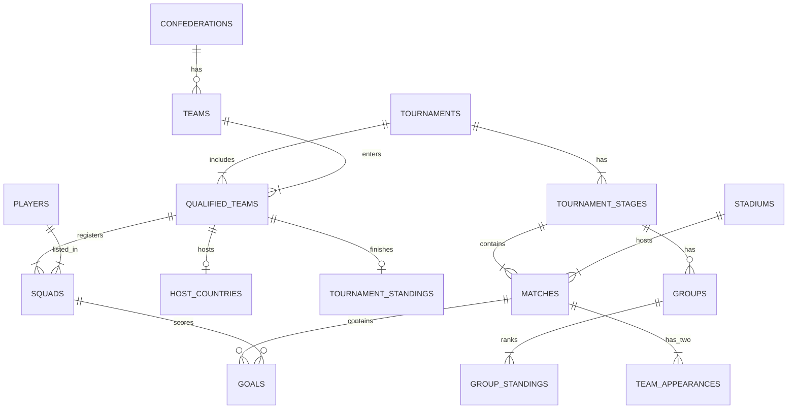

# Pitch to Postgres: Designing and Querying a Relational Database for FIFA World Cup Data

DS604 Introduction to Data Management Milestone 1: Dataset and Tentative Queries

| Group member | Student ID |
|---|---|
| Devanshi Dudhatra | 202618027 |
| Pujita Sunapu | 202618003 |
| Rahul Saha | 202618037 |

Submitted 3 October 2026 
Data: The Fjelstul World Cup Database by Joshua C. Fjelstul (CC-BY-SA 4.0)

## 1. Project overview

**Aim.** Build a relational database for the complete history of the men's FIFA World Cup in PostgreSQL, load a real public dataset into it, and use SQL to answer analytical questions about teams, players, goals, discipline, venues, managers and long-term trends.

**Why this dataset.** World Cup data is familiar enough that results can be checked against well-known facts, which lets us validate our SQL. It is also rich enough to need a real relational design: 27 linked tables, composite keys, bridge tables, historical teams that no longer exist, and several data-quality issues to handle.

**What we will deliver**

| Milestone | Due | Deliverable |
|---|---|---|
| 1. Dataset and tentative queries | 03-Oct-2026 | This document |
| 2. Schema | 15-Oct-2026 | Normalised schema, `sql/ddl.sql`, ER and relational schema diagrams |
| 3. Load notebook | 17-Oct-2026 | `notebooks/03_load_data.ipynb`: loads all 27 CSV files with `pandas.to_sql` |
| 4. Analytical queries | 06-Nov-2026 | `sql/queries.sql` and `notebooks/04_queries.ipynb` with results and interpretation |
| 5. Views | 06-Nov-2026 | `sql/views.sql`, with at least five views |
| Final package | 15-Nov-2026 | Final report, README, viva notes |

**Tools.** PostgreSQL (the course server, with a local PostgreSQL 18 installation for testing), Python with pandas and SQLAlchemy for loading and querying, and Jupyter notebooks. All SQL is standard and PostgreSQL-compatible. Credentials are read from a `.env` file and never written in code.

**Approach.** Before choosing queries we profiled every file (`src/profile_data.py`, report in `docs/dataset_understanding.md`). We checked each candidate key and relationship against the data and recorded every inconsistency. The query list below reflects what the data can actually support.

## 2. Dataset description

| Item | Details |
|---|---|
| Name | The Fjelstul World Cup Database |
| Author | Joshua C. Fjelstul, Ph.D. |
| Source | <https://github.com/jfjelstul/worldcup> |
| Licence | Creative Commons Attribution-ShareAlike 4.0 (CC-BY-SA 4.0) |
| Format | 27 CSV files (UTF-8), 57,269 data rows in total |
| File date | July 2022 |
| **Actual coverage** | **21 men's World Cup final tournaments, 1930 to 2018** (13 July 1930 to 15 July 2018). The 2022 tournament is not included. Women's tournaments and qualifying matches are not included. |
| Content | 900 matches, 2,548 goals (52 own goals), 84 national teams (including historical teams), 7,907 players, 380 referees, 357 managers, 185 stadiums in 17 countries |
| Event detail | Goals, managers and referees for every tournament. Line-ups, substitutions and cards from 1970 (cards were introduced that year). Penalty shoot-outs from 1982 (the first shoot-out). |
| Our modifications | No data values have been changed. The files were placed unchanged in `data/`. Cleaning applied during loading (for example turning the text "not available" into SQL NULL) will be listed in Milestone 3. |

**Attribution.** This project uses *The Fjelstul World Cup Database* by Joshua C. Fjelstul (<https://github.com/jfjelstul/worldcup>), licensed under CC-BY-SA 4.0. Our derived outputs are shared under the same licence.

## 3. The 27 tables, grouped by theme

The *grain* is what one row represents. Each key was checked for uniqueness on the real data, and every key below is unique with no missing values.

### 3.1 Reference tables

| Table | Rows | Grain (one row is...) | Candidate key |
|---|---:|---|---|
| `confederations` | 6 | a continental confederation (UEFA, CONMEBOL, ...) | confederation_id |
| `teams` | 84 | a national team, including historical teams such as West Germany and the Soviet Union | team_id |
| `stadiums` | 185 | a stadium | stadium_id |
| `awards` | 8 | an award type (Golden Ball, Golden Boot, ...) | award_id |

### 3.2 People

| Table | Rows | Grain | Candidate key |
|---|---:|---|---|
| `players` | 7,907 | a player | player_id |
| `managers` | 357 | a manager (head coach) | manager_id |
| `referees` | 380 | a referee | referee_id |

### 3.3 Tournament structure

| Table | Rows | Grain | Candidate key |
|---|---:|---|---|
| `tournaments` | 21 | a World Cup edition | tournament_id |
| `tournament_stages` | 107 | a stage of a tournament (group stage, round of 16, final, ...) | (tournament_id, stage_number) |
| `groups` | 117 | a group within a group stage | (tournament_id, stage_number, group_name) |
| `host_countries` | 22 | a host nation of a tournament (2002 had two) | (tournament_id, team_id) |

### 3.4 Participation (who took part)

| Table | Rows | Grain | Candidate key |
|---|---:|---|---|
| `qualified_teams` | 457 | a team at a tournament | (tournament_id, team_id) |
| `squads` | 10,142 | a player in a team's squad at a tournament | (tournament_id, team_id, player_id) |
| `manager_appointments` | 469 | a manager leading a team at a tournament | (tournament_id, team_id, manager_id) |
| `referee_appointments` | 511 | a referee appointed to a tournament | (tournament_id, referee_id) |

### 3.5 Matches

| Table | Rows | Grain | Candidate key |
|---|---:|---|---|
| `matches` | 900 | a match (replays are separate matches) | match_id |
| `team_appearances` | 1,800 | one team's side of a match (two rows per match) | (match_id, team_id) |

### 3.6 Match events

| Table | Rows | Grain | Candidate key |
|---|---:|---|---|
| `goals` | 2,548 | a goal | goal_id |
| `bookings` | 2,466 | a card shown to a player (1970+) | booking_id |
| `substitutions` | 6,464 | one player going off or coming on (two rows per substitution, 1970+) | substitution_id |
| `penalty_kicks` | 279 | a kick in a penalty shoot-out (1982+) | penalty_kick_id |
| `player_appearances` | 18,623 | a player who played in a match (1970+) | (match_id, player_id) |
| `manager_appearances` | 1,842 | a manager in charge of a team in a match | (match_id, team_id, manager_id) |
| `referee_appearances` | 900 | the referee of a match (one per match) | match_id |

### 3.7 Results and standings

| Table | Rows | Grain | Candidate key |
|---|---:|---|---|
| `group_standings` | 458 | a team's final line in a group table | (tournament_id, stage_number, group_name, position) |
| `tournament_standings` | 84 | a top-four finishing position in a tournament | (tournament_id, position) |

### 3.8 Awards

| Table | Rows | Grain | Candidate key |
|---|---:|---|---|
| `award_winners` | 132 | a player winning an award at a tournament (ties give several rows) | (tournament_id, award_id, player_id) |

## 4. Expected relationships

Every relationship below was checked against the data: all of them have **zero orphan values**, meaning every referenced id exists in the parent table.

**One-to-many (1:N)**

- A confederation has many teams and many referees.
- A tournament has many stages, and a group stage has many groups. Each group has one table in `group_standings`.
- A tournament stage has many matches, and a stadium hosts many matches.
- A match has many goals, bookings, substitutions and (if decided on penalties) shoot-out kicks.
- A match has exactly one referee (`referee_appearances` is effectively 1:1 with `matches`).

**Many-to-many (M:N), resolved by bridge tables**

| Relationship | Bridge table |
|---|---|
| tournaments and teams (participation) | `qualified_teams` |
| tournaments and teams (hosting) | `host_countries` |
| tournaments and teams (top-four finish) | `tournament_standings` |
| (tournament, team) and players | `squads` |
| matches and teams | `team_appearances` (exactly 2 per match) |
| matches and players | `player_appearances` |
| (tournament, team) and managers | `manager_appointments` |
| matches, teams and managers | `manager_appearances` |
| tournaments and referees | `referee_appointments` |
| tournaments, awards and players | `award_winners` |

**Composite (multi-column) references.** Event tables can reference `squads` on (tournament_id, team_id, player_id) rather than only `players`. This is a stronger rule: a goal scorer must be in that team's squad for that tournament, and the data satisfies it for every goal, card, substitution, shoot-out kick, appearance and award.

*Figure 1: Core relationships (simplified; the full ER and relational schema diagrams come in Milestone 2).*

**Points that affect the design (found during profiling)**

1. `matches` does not store `stage_number`, so it links to `tournament_stages` through (tournament_id, stage_name). `groups` and `group_standings` use different stage names for 1950 and 1974 to 1982 (for example "first group stage" where `tournament_stages` says "group stage"). Joins must therefore use `stage_number`, not the name.
2. Germany and West Germany are separate teams with the same team code (DEU). Team code is therefore not a key.
3. On 12 occasions a team had joint managers at a tournament (42 team-matches), so the manager tables need `manager_id` in their keys.
4. Many tables repeat names copied from their parent tables (team_name, tournament_name, ...). These copies agree with the parent tables everywhere, so the normalised schema can drop them.

## 5. Tentative analytical queries

Thirty queries, grouped by theme. "Concepts" lists the main SQL techniques each query will demonstrate. Unless stated otherwise, wins, draws and losses are worked out from the score. A match settled on penalties counts as a draw, which is how FIFA records it; the dataset's own `result` column records it as a win.

### 5.1 Team performance

| # | Business question | Concepts | Main tables |
|---|---|---|---|
| Q1 | Which teams are the most successful, counting titles, final appearances (top two) and top-four finishes? | JOIN, GROUP BY, SUM(CASE ...), ORDER BY | tournament_standings, teams |
| Q2 | What is each team's all-time record (played, won, drawn, lost, goals, win %), for teams with at least 10 matches? | GROUP BY, HAVING, CASE, ratio arithmetic | team_appearances, teams |
| Q3 | Do host nations do better than everyone else? Compare their win rate and how far they go. | CTE, LEFT JOIN, CASE, UNION ALL | host_countries, team_appearances, tournament_standings |
| Q4 | How does each confederation perform, decade by decade (win rate and top-four finishes)? | Multi-table JOIN, GROUP BY on an expression (decade), CASE | team_appearances, teams, confederations, tournaments |
| Q5 | Which teams have never got past the opening round of any tournament they played in? | CTE, MAX(stage_number), GROUP BY / HAVING, NOT EXISTS | team_appearances, tournament_stages, teams |
| Q6 | Which teams have finished in the top four but never won the title? | Set operation (EXCEPT) | tournament_standings, teams |
| Q7 | What is the head-to-head record between two chosen teams (for example Brazil and Sweden)? | Self-join on team_appearances, parameters, aggregation | team_appearances |
| Q8 | How did each country's title count build up over time? | Window function: running total, SUM() OVER (PARTITION BY ... ORDER BY ...) | tournament_standings, tournaments |
| Q9 | Which teams most often came back to win after conceding the first goal? | CTE, ROW_NUMBER() to find each match's first goal, JOIN | goals, team_appearances |

### 5.2 Player performance

| # | Business question | Concepts | Main tables |
|---|---|---|---|
| Q10 | Who are the all-time top 10 goal scorers (excluding own goals)? | JOIN, WHERE, GROUP BY, ORDER BY / LIMIT, RANK() | goals, players |
| Q11 | Who was the top scorer at each tournament, and does that match the official Golden Boot winner? | CTE, RANK() OVER (PARTITION BY tournament), LEFT JOIN | goals, players, award_winners |
| Q12 | Which players scored hat-tricks, and who scored the most goals in one match? | GROUP BY, HAVING COUNT(*) >= 3, JOIN | goals, players, matches |
| Q13 | How many goals were scored by substitutes in each tournament since 1970, and what share is that? | JOIN on (match_id, player_id), CASE, GROUP BY | goals, player_appearances |
| Q14 | What is the average player age by position and tournament? | Date arithmetic (AGE, EXTRACT), AVG, NULL handling | squads, players, tournaments |
| Q15 | Who has made the most World Cup appearances for each nation (1970+)? | ROW_NUMBER() OVER (PARTITION BY team), CTE | player_appearances, players, teams |
| Q16 | Which players have played for more than one national team, and which teams? | GROUP BY, HAVING COUNT(DISTINCT ...), STRING_AGG | squads, players, teams |

### 5.3 Goals and scoring patterns

| # | Business question | Concepts | Main tables |
|---|---|---|---|
| Q17 | How many goals per match were scored at each tournament, and how did that change from the previous edition? | GROUP BY, window function LAG() | matches, tournaments |
| Q18 | What are the biggest winning margins and the highest-scoring matches? | Derived columns, DENSE_RANK(), ORDER BY | matches |
| Q19 | When are goals scored? Count goals by 15-minute period, plus extra time and stoppage time. | CASE bucketing, GROUP BY | goals |
| Q20 | How have the shares of penalty goals and own goals changed over time, especially in 2018 (the first World Cup with VAR)? | Conditional aggregation (SUM(CASE ...)), GROUP BY | goals, tournaments |
| Q21 | What are the penalty shoot-out records: shoot-outs won and lost per team, and kick conversion rates? | CTE, JOIN, GROUP BY, HAVING | penalty_kicks, team_appearances |

### 5.4 Discipline and refereeing (1970 onwards)

| # | Business question | Concepts | Main tables |
|---|---|---|---|
| Q22 | Which referees are the strictest (cards per match, minimum five matches)? | JOIN, GROUP BY, HAVING, subquery for the overall average | bookings, referee_appearances, referees |
| Q23 | How have cards per match changed over time? Show a three-tournament moving average. | Window function AVG() OVER (ROWS BETWEEN 2 PRECEDING AND CURRENT ROW) | bookings, matches |
| Q24 | Are knockout matches more ill-tempered than group matches (cards and sendings-off per match by stage)? | CASE, GROUP BY, LEFT JOIN so that matches with no cards still count | bookings, matches |
| Q25 | Which teams have received the most cards and sendings-off? | GROUP BY, HAVING, ORDER BY | bookings, teams |

### 5.5 Venues and hosting

| # | Business question | Concepts | Main tables |
|---|---|---|---|
| Q26 | Which stadiums and cities have hosted the most World Cup matches? | JOIN, COUNT, DENSE_RANK() | matches, stadiums |

### 5.6 Managers

| # | Business question | Concepts | Main tables |
|---|---|---|---|
| Q27 | Which managers have managed the most matches and won the most? | Three-table JOIN on a composite key (match_id, team_id), GROUP BY | manager_appearances, team_appearances, managers |
| Q28 | Do teams with a foreign manager go further than teams with a manager of their own nationality? | CASE, correlated subquery or CTE, AVG | manager_appointments, teams, team_appearances, tournament_stages |

### 5.7 Awards

| # | Business question | Concepts | Main tables |
|---|---|---|---|
| Q29 | How often does the Golden Ball (best player) go to a player from the champion team? | LEFT JOIN, CASE, IS NULL test | award_winners, tournament_standings |

### 5.8 Data quality and integrity

| # | Business question | Concepts | Main tables |
|---|---|---|---|
| Q30 | Does every goal in the goals table match the scores in the matches table? List any team-match where they differ. | CTE, LEFT JOIN, COALESCE, set comparison (EXCEPT) | goals, team_appearances |

### 5.9 SQL concepts covered

| Concept | Queries |
|---|---|
| Inner joins (2 or more tables) | Q1, Q2, Q4, Q10, Q12, Q13, Q14, Q22, Q26, Q27 |
| Outer joins (LEFT JOIN) | Q3, Q11, Q24, Q29, Q30 |
| Self-join | Q7 |
| GROUP BY with HAVING | Q2, Q5, Q12, Q16, Q21, Q22, Q25 |
| Subqueries (scalar, correlated, NOT EXISTS) | Q5, Q22, Q28 |
| Common table expressions (WITH) | Q3, Q5, Q9, Q11, Q15, Q21, Q28, Q30 |
| Window: RANK / DENSE_RANK | Q10, Q11, Q18, Q26 |
| Window: ROW_NUMBER | Q9, Q15 |
| Window: LAG | Q17 |
| Window: running total | Q8 |
| Window: moving average | Q23 |
| Set operations (EXCEPT, UNION ALL) | Q3, Q6, Q30 |
| CASE logic and conditional aggregation | Q1, Q2, Q3, Q4, Q13, Q19, Q20, Q24, Q28, Q29 |
| Date functions | Q14 |
| String aggregation | Q16 |

## 6. Changes to the starting list, and why

We kept all 16 starting queries. They map to our numbering as follows:

| Starting list | 1 | 2 | 3 | 4 | 5 | 6 | 7 | 8 | 9 | 10 | 11 | 12 | 13 | 14 | 15 | 16 |
|---|---|---|---|---|---|---|---|---|---|---|---|---|---|---|---|---|
| Our query | Q1 | Q17 | Q3 | Q4 | Q5 | Q10 | Q11 | Q20 + Q21 | Q13 | Q14 | Q22 | Q23 | Q26 | Q7 | Q8 | Q18 |

After profiling the data we made these adjustments:

| Starting query | Change | Reason (from the data) |
|---|---|---|
| 1. Most successful teams | Finals are counted as finishing positions 1-2 in `tournament_standings`, not as matches labelled "final". | The 1950 World Cup had no final match. It ended with a four-team final round, so a "final" label would miss Uruguay and Brazil in 1950. |
| 5. Never left the group stage | Redefined as "never got past the opening round", based on the stage order (`stage_number`). | The 1934 and 1938 tournaments had no group stage; teams went out in an opening round of 16. Using the "group stage" label leaves out Egypt and the Dutch East Indies (30 teams with the new rule against 28). |
| 8. Penalty conversion and shoot-out records | Split into Q20 (share of goals from in-match penalties) and Q21 (shoot-out records and kick conversion). | Missed in-match penalties are not in the data, only scored ones, so in-match conversion cannot be calculated. Shoot-out kicks (1982+) include misses, so shoot-out conversion can. |
| 9. Goals by substitutes | Limited to 1970 onwards. | Line-ups and substitutions exist only from 1970. |
| 11, 12. Referees and bookings | Limited to 1970 onwards. | Cards were introduced in 1970, and the bookings table starts then. |
| 3, 4, 14 (and Q2, Q27) | Wins and draws are taken from the score, not the `result` column. | In all 30 shoot-out matches the score is level, but `result` records a home or away win. |
| 14. Head-to-head | Implemented as a self-join of `team_appearances`. | Each match appears from both sides, so pairing a team's row with its opponent's row is a natural self-join. |
| 4. Confederation by decade | Kept, with a stated caveat. | The confederation in `teams` is the current one. Australia is listed in the AFC, although it qualified as an Oceania (OFC) member in 1974 and 2006. |

**Queries we added** (Q2, Q6, Q9, Q12, Q15, Q16, Q19, Q24, Q25, Q27, Q28, Q29, Q30) come from the insights framework in `docs/dataset_understanding.md`. They fill gaps in themes and SQL concepts: an overall team record (Q2), set operations (Q6, Q30), ROW_NUMBER (Q9, Q15), managers (Q27, Q28), awards (Q29) and an integrity check (Q30) that tests the loaded database.

**Ideas we considered and dropped**, because the data cannot support them: in-match penalty conversion (missed penalties not recorded), assists (not recorded), attendance (only stadium capacity is recorded), fastest goals in seconds (minutes only), and possession or shots (not recorded).

## 7. Data caveats the queries must respect

- **Coverage:** 1930-2018 only. Line-ups, cards and substitutions from 1970; shoot-outs from 1982.
- **Missing values:** the text values "not available" and "not applicable", and shirt number 0, mean missing. They will become SQL NULL during loading. Birth dates are missing for 78 players, who are left out of age calculations.
- **Historical teams:** West Germany and Germany, the Soviet Union and Russia, Yugoslavia, Serbia and Montenegro and Serbia, and Czechoslovakia and the Czech Republic are separate teams. Where we combine them we will say so; for example, Germany's four titles include West Germany's three.
- **Special cases:** four drawn matches were replayed (1934, 1938), one 1938 tie was a walkover, there were group play-off matches in 1954 and 1958, and there was no third-place match in 1930 or 1950. There are no shared third places and no abandoned matches.
- **Points systems:** 2 points per win up to 1990 and 3 points from 1994, so raw points cannot be compared across eras.

Full details of all of these are in `docs/dataset_understanding.md`.

## 8. Next steps

- **Milestone 2:** turn the verified keys into a normalised PostgreSQL schema with primary and foreign keys and constraints, then draw the ER and schema diagrams.
- **Milestone 3:** load all 27 files with `pandas.to_sql(if_exists="append")` into the tables created by the DDL, then check the row counts.
- **Milestone 4:** write the 30 queries and check at least 10 results against known World Cup facts.

---

*Data: Joshua C. Fjelstul, The Fjelstul World Cup Database, <https://github.com/jfjelstul/worldcup>, CC-BY-SA 4.0. No data values were modified. This document is a derived work under the same licence.*
