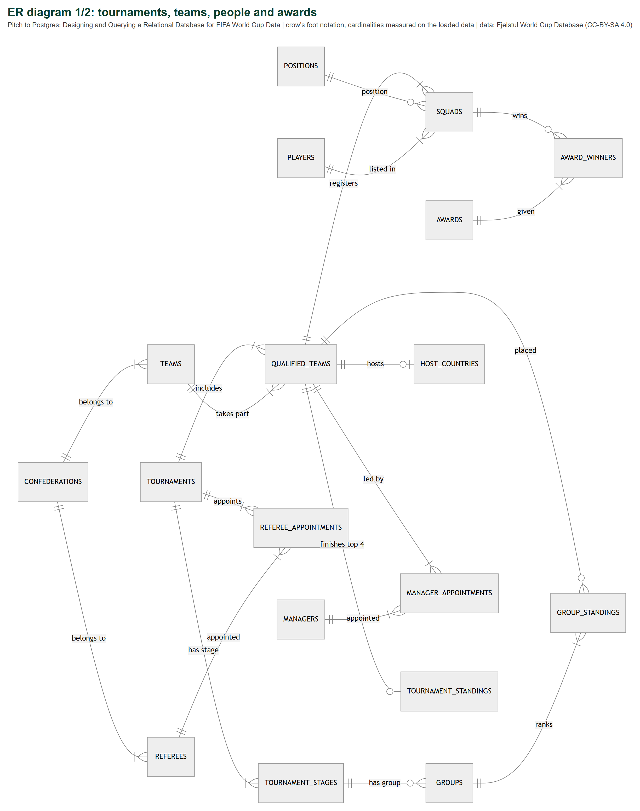
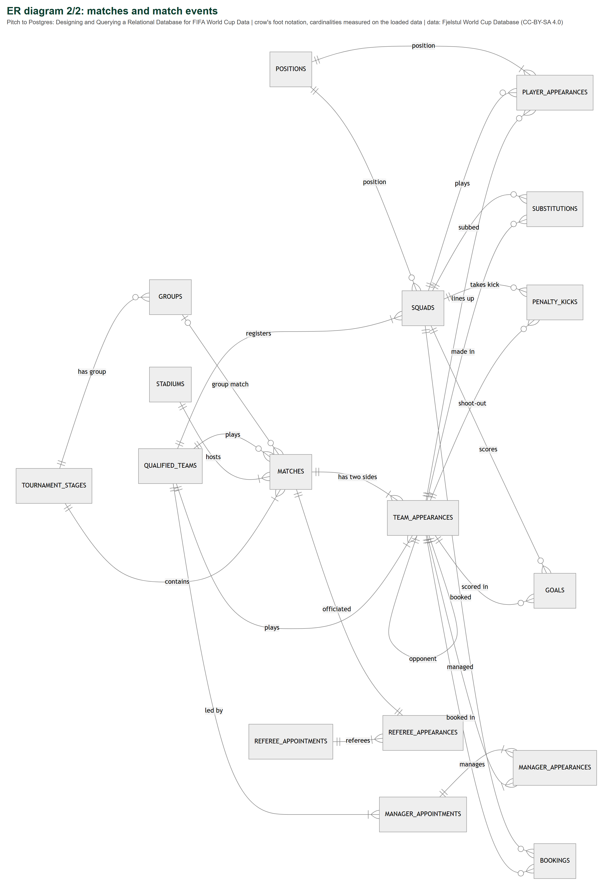
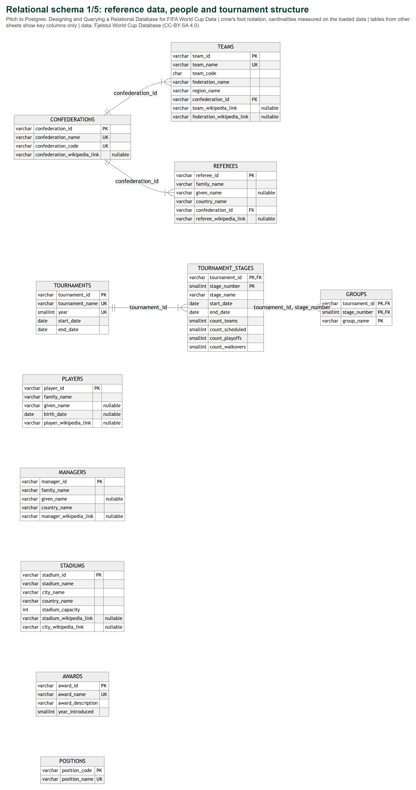
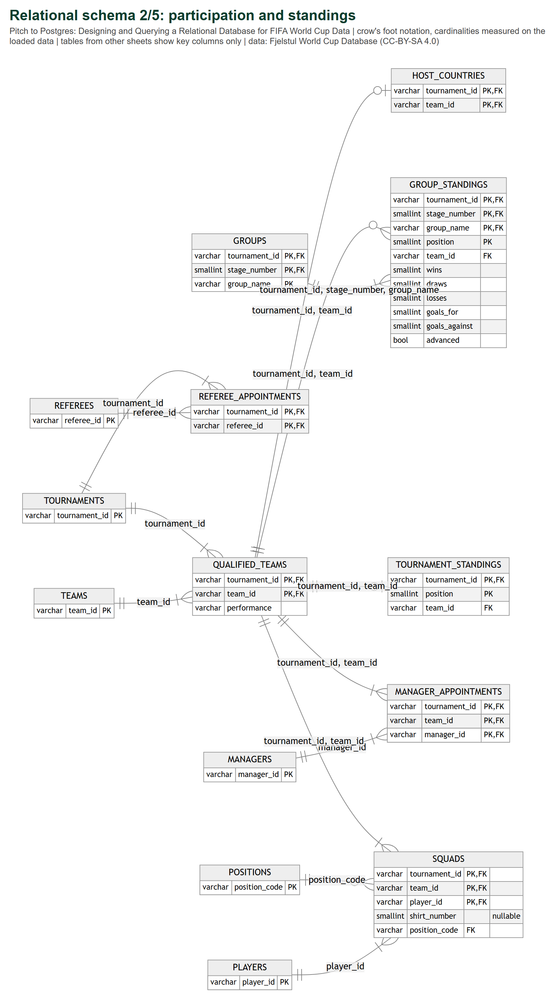
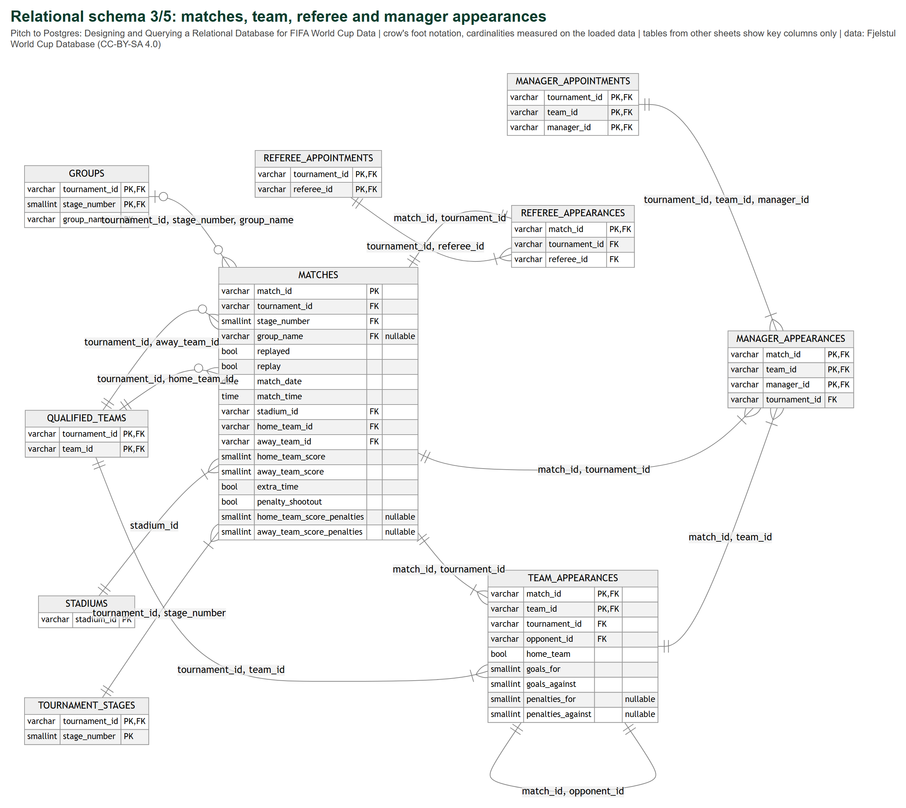
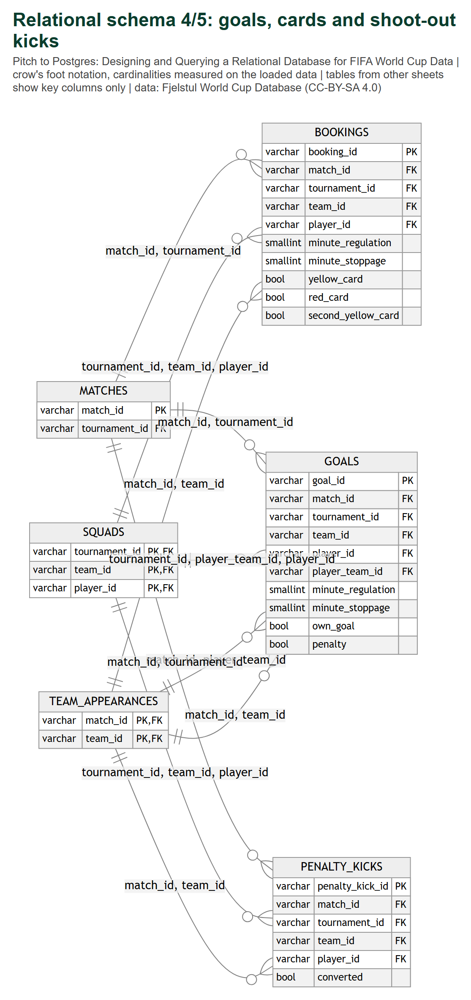
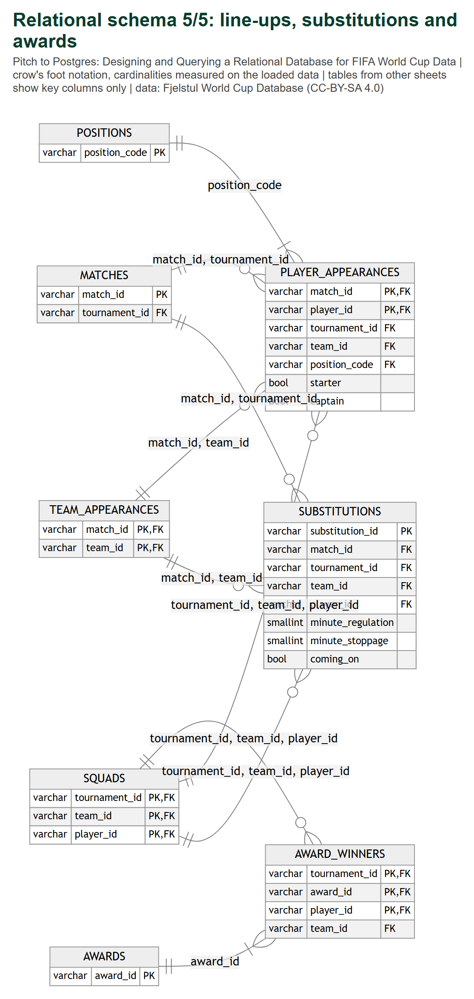

# Pitch to Postgres: Designing and Querying a Relational Database for FIFA World Cup Data

DS604 Introduction to Data Management Milestone 2: Schema

| Group member | Student ID |
|---|---|
| Devanshi Dudhatra | 202618027 |
| Pujita Sunapu | 202618003 |
| Rahul Saha | 202618037 |

Due 15 October 2026 
Data: The Fjelstul World Cup Database by Joshua C. Fjelstul (CC-BY-SA 4.0)

## 1. Summary

We designed a normalised PostgreSQL schema for all 27 tables of the Fjelstul World Cup Database, plus one small lookup table (`positions`), giving **28 tables**. The DDL is in `sql/ddl.sql` (reproduced in full in Section 7).

| Item | Count |
|---|---:|
| Tables | 28 (27 from the dataset + 1 lookup) |
| Columns | 163 kept from 405 source columns, plus 2 in `positions` |
| Primary keys | 28 (13 of them composite) |
| Foreign keys | 49 (36 of them composite) |
| UNIQUE constraints | 14 |
| CHECK constraints | 63 |
| NOT NULL columns | 147 of 165 |
| Secondary indexes | 21 |

**How it was tested (local PostgreSQL 18):**

1. **Runs repeatably.** `ddl.sql` runs without errors, and running it again changes nothing. It contains no DROP, TRUNCATE or DELETE, so it is safe on the course server.
2. **Accepts the real data.** All 27 CSV files were trial-loaded with `pandas.to_sql(if_exists="append")`, the method required for Milestone 3. All **57,269 rows** were accepted under every key and constraint.
3. **Rejects bad data.** 14 deliberately invalid changes were each rejected by the intended constraint (Section 6).
4. **Loses no information.** All 33 checks pass, showing that every dropped column can be recomputed exactly from the columns we keep (Section 3.2).

The design work also exposed **one more inconsistency in the source**. For the 1982 second group stage, `matches` names the groups "Group 1"–"Group 4", while `groups` and `group_standings` call them "Group A"–"Group D". The foreign key from `matches` to `groups` caught it on the first trial load. The loader matches each group by its identical set of three teams (1=A, 2=B, 3=C, 4=D), and this finding has been added to the Milestone 0 report. *(Added during Milestone 3: an integrity query also found that the six 1950 final-round matches have no group name, while `groups` records that round as "Group 1". The loader assigns them to that group by their teams.)*

## 2. ER diagram

The conceptual ER diagram is split into two sheets for readability; entities that link the two themes appear on both. Crow's-foot ends show cardinality. A circle means zero is possible ("optional"), and a bar means at least one ("mandatory"). Cardinalities were **measured on the loaded data**, not assumed. Both diagrams are generated from the live database catalog by `src/make_diagrams.py`.

## 3. Design explanation

### 3.1 Normal form

The schema is in **third normal form (3NF)**, with one deliberate and controlled exception (Section 3.5).

- **1NF:** every column holds a single value. The source column `players.list_tournaments` held a comma-separated list such as "1998, 2002, 2006", so it was removed; the same information comes from `squads`.
- **2NF:** no column depends on only part of a composite key. In the source, for example, `team_name` in `squads` depends on `team_id` alone, not on the whole key (tournament_id, team_id, player_id), so copied names like this were removed.
- **3NF:** no column depends on another non-key column. Examples removed: `teams.confederation_name` depends on `confederation_id`; `matches.home_team_score_margin` depends on the two scores; `bookings.sending_off` depends on `red_card` and `second_yellow_card`.

### 3.2 What was removed, and proof that nothing is lost

Three kinds of column were removed:

- **Copies** of attributes that belong to another table (names, codes, dates, stadium location, confederation). These cause update anomalies: renaming a team would mean updating 16 tables.
- **Same-row derived values**, such as score text, margins, result labels and win/draw flags, `minute_label`, `match_period`, `going_off`, `substitute`, `sending_off`, `played`, `goal_difference` and `points`.
- **Summary values derivable from other tables**, such as player position flags, `count_tournaments`, tournament format flags, the `winner` and `host_country` text, match and team counts, `unbalanced_groups` and `shared`.

`key_id` is only the row number of each file, so it was not kept.

Before dropping anything we proved each column redundant on the actual data. `clean.verify_dropped_columns()` runs **33 checks, and all pass**. For example, `result` is reproduced exactly from the two scores plus the shoot-out scores, and `points` is reproduced exactly from wins and draws with 2 points per win up to 1990 and 3 from 1994. Everything removed can be rebuilt with a query, and Milestone 5 provides views that do so (for example, a match results view with result labels).

| Table | Source columns | Kept | Dropped columns |
|---|---:|---:|---|
| `confederations` | 5 | 4 | key_id |
| `awards` | 5 | 4 | key_id |
| `stadiums` | 8 | 7 | key_id |
| `teams` | 11 | 8 | key_id, confederation_name, confederation_code |
| `players` | 12 | 5 | key_id, goal_keeper, defender, midfielder, forward, count_tournaments, list_tournaments |
| `managers` | 6 | 5 | key_id |
| `referees` | 9 | 6 | key_id, confederation_name, confederation_code |
| `tournaments` | 18 | 5 | key_id, host_country, winner, host_won, count_teams, group_stage, second_group_stage, final_round, round_of_16, quarter_finals, semi_finals, third_place_match, final |
| `tournament_stages` | 16 | 9 | key_id, tournament_name, group_stage, knockout_stage, unbalanced_groups, count_matches, count_replays |
| `groups` | 7 | 3 | key_id, tournament_name, stage_name, count_teams |
| `qualified_teams` | 8 | 3 | key_id, tournament_name, team_name, team_code, count_matches |
| `host_countries` | 7 | 2 | key_id, tournament_name, team_name, team_code, performance |
| `tournament_standings` | 7 | 3 | key_id, tournament_name, team_name, team_code |
| `group_standings` | 19 | 11 | key_id, tournament_name, stage_name, team_name, team_code, played, goal_difference, points |
| `squads` | 12 | 5 | key_id, tournament_name, team_name, team_code, family_name, given_name, position_name |
| `manager_appointments` | 10 | 3 | key_id, tournament_name, team_name, team_code, family_name, given_name, country_name |
| `referee_appointments` | 10 | 2 | key_id, tournament_name, family_name, given_name, country_name, confederation_id, confederation_name, confederation_code |
| `matches` | 37 | 17 | key_id, tournament_name, match_name, stage_name\*, group_stage, knockout_stage, stadium_name, city_name, country_name, home_team_name, home_team_code, away_team_name, away_team_code, score, home_team_score_margin, away_team_score_margin, score_penalties, result, home_team_win, away_team_win, draw |
| `team_appearances` | 36 | 9 | key_id, tournament_name, match_name, stage_name, group_name, group_stage, knockout_stage, replayed, replay, match_date, match_time, stadium_id, stadium_name, city_name, country_name, team_name, team_code, opponent_name, opponent_code, away_team, goal_differential, extra_time, penalty_shootout, result, win, lose, draw |
| `referee_appearances` | 15 | 3 | key_id, tournament_name, match_name, match_date, stage_name, group_name, family_name, given_name, country_name, confederation_id, confederation_name, confederation_code |
| `manager_appearances` | 17 | 4 | key_id, tournament_name, match_name, match_date, stage_name, group_name, team_name, team_code, home_team, away_team, family_name, given_name, country_name |
| `player_appearances` | 22 | 7 | key_id, tournament_name, match_name, match_date, stage_name, group_name, team_name, team_code, home_team, away_team, family_name, given_name, shirt_number, position_name, substitute |
| `goals` | 27 | 10 | key_id, tournament_name, match_name, match_date, stage_name, group_name, team_name, team_code, home_team, away_team, family_name, given_name, shirt_number, player_team_name, player_team_code, minute_label, match_period |
| `bookings` | 26 | 10 | key_id, tournament_name, match_name, match_date, stage_name, group_name, team_name, team_code, home_team, away_team, family_name, given_name, shirt_number, minute_label, match_period, sending_off |
| `substitutions` | 24 | 8 | key_id, tournament_name, match_name, match_date, stage_name, group_name, team_name, team_code, home_team, away_team, family_name, given_name, shirt_number, minute_label, match_period, going_off |
| `penalty_kicks` | 19 | 6 | key_id, tournament_name, match_name, match_date, stage_name, group_name, team_name, team_code, home_team, away_team, family_name, given_name, shirt_number |
| `award_winners` | 12 | 4 | key_id, tournament_name, award_name, shared, family_name, given_name, team_name, team_code |

\* `matches.stage_name` is replaced by `stage_number` (Section 3.6).

### 3.3 Natural keys instead of surrogate keys

Every table keeps the source's own identifiers (`team_id` such as T-03, `player_id` such as P-04418, `match_id` such as M-1930-01) as its primary key. We did **not** add surrogate keys (auto-numbered integers).

- The ids are already **unique, never missing and stable**, which we verified for every table in Milestone 0.
- The course rule is to load each CSV with `to_sql(if_exists="append")`. With natural keys, child tables can be appended directly. With surrogate keys, every foreign key in the 20 child tables would have to be looked up and replaced during loading, which adds work and room for error.
- The ids carry meaning that helps when checking results (`WC-1930`, `M-1930-01`), and CHECK constraints enforce their format, for example `team_id ~ '^T-[0-9]{2}$'`. The match id must also contain the tournament year.
- `key_id` is **not** used as a key. It is only the row position in each file and identifies nothing in the real world.

### 3.4 Composite keys

Bridge and event tables use composite primary keys made of the foreign keys that identify one fact:

| Table | Primary key | Why |
|---|---|---|
| `qualified_teams` | (tournament_id, team_id) | A team takes part in a tournament at most once. |
| `squads` | (tournament_id, team_id, player_id) | One squad entry per player per team per tournament. A further UNIQUE (tournament_id, player_id) enforces that a player is in only one squad per tournament (true for all 10,142 rows). |
| `manager_appointments` | (tournament_id, team_id, manager_id) | Joint managers exist (12 team-tournaments), so `manager_id` must be part of the key. |
| `manager_appearances` | (match_id, team_id, manager_id) | Same reason; 42 team-matches had two managers. |
| `team_appearances` | (match_id, team_id) | Two rows per match, one per team. |
| `player_appearances` | (match_id, player_id) | A player appears at most once in a match. |
| `groups` | (tournament_id, stage_number, group_name) | Group names can repeat across stages (in 1950 "Group 1" exists in both the first round and the final round), so (tournament_id, group_name) is not unique. |
| `group_standings` | (tournament_id, stage_number, group_name, position) | One team per table position. UNIQUE (tournament_id, stage_number, team_id) adds that a team is in only one group per stage. |
| `tournament_standings` | (tournament_id, position) | Positions 1–4 are unique; UNIQUE (tournament_id, team_id) as well. There are no shared places in the data. |
| `award_winners` | (tournament_id, award_id, player_id) | Ties produce several winners (the 1962 Golden Boot had six). |

### 3.5 Controlled redundancy: tournament_id in event tables

Strictly, `tournament_id` in `goals` (and the other event tables) depends on `match_id`, so keeping it is a transitive dependency. We keep it on purpose, because it makes a much stronger integrity rule possible:

- The foreign key `(tournament_id, player_team_id, player_id) -> squads` guarantees that **every goal scorer was in their team's squad for that tournament**. The same rule applies to cards, substitutions, shoot-out kicks, appearances and awards. Without `tournament_id` this rule cannot be written as a foreign key.
- To make sure the extra column **can never disagree** with the match, each event table also has the foreign key `(match_id, tournament_id) -> matches(match_id, tournament_id)`. It points at a UNIQUE constraint on `matches`. The redundancy is therefore enforced by the database and cannot cause an update anomaly.

`team_appearances` is likewise a derived, team-centred copy of `matches`, kept because it makes per-team queries much simpler. Its consistency is enforced in two ways:

- **Opponent check:** a self-referencing foreign key, `(match_id, opponent_id) -> team_appearances(match_id, team_id)`, ensures the opponent has its own row in the same match. It is declared `DEFERRABLE INITIALLY DEFERRED`, so the two rows of a match can be inserted in either order and are checked at COMMIT.
- **Team check:** a foreign key ensures each team qualified for that tournament.

### 3.6 Stages and groups

The source stores stage names inconsistently. `groups` and `group_standings` say "first round" (1950) and "first group stage" (1974–1982) where `tournament_stages` and `matches` say "group stage". We therefore:

- store `stage_name` **only** in `tournament_stages`, with UNIQUE (tournament_id, stage_name) and a CHECK restricting it to the 8 stage names in the data;
- link `groups`, `group_standings` **and** `matches` to stages through `stage_number`. During loading, `matches.stage_number` is looked up from `tournament_stages`, since the source `matches` has only the stage name;
- give `matches` a foreign key `(tournament_id, stage_number, group_name) -> groups`. Knockout matches have `group_name` NULL, so the key is not checked for them (standard MATCH SIMPLE behaviour). This foreign key detected the 1982 "Group 1–4" / "Group A–D" inconsistency.

### 3.7 Historical teams

West Germany, East Germany, the Soviet Union, Yugoslavia, Serbia and Montenegro, Czechoslovakia, Zaire and the Dutch East Indies remain **separate rows in `teams`, with their source ids**, because that is how they played. Consequences:

- `team_code` is **NOT UNIQUE**: Germany and West Germany share DEU. It has NOT NULL and a three-capital-letters CHECK, but it is not a key; `team_id` is.
- We did **not** add a "lineage" table merging teams (for example West Germany into Germany). FIFA's credit to successor federations is outside knowledge, not something in the dataset. If a query combines teams, it says so explicitly.
- `teams.confederation_id` is the **current** confederation (Australia: AFC, although it played in 1974 and 2006 as an OFC member). This is documented in the table comment.

### 3.8 Missing values, types and the positions lookup

**Missing values.** These become SQL **NULL** instead of placeholder values:
- the text "not available" or "not applicable";
- shirt number 0, which means unknown;
- shoot-out scores of 0 or "0-0" for the 870 matches without a shoot-out. A CHECK enforces that shoot-out scores are present **if and only if** there was a shoot-out.

**Types.**
- `DATE` for dates, `TIME` for kick-off times and `BOOLEAN` for all 0/1 flags. This enables date arithmetic (ages) and readable CHECKs.
- `SMALLINT` for small counts and minutes, `INTEGER` for stadium capacity.
- `VARCHAR(n)` sized with headroom above the longest observed value (for example, the longest family name is 23 characters and the column allows 60).

**Positions lookup.** `positions` is a **lookup table** we added. In the source, `position_name` depends on `position_code`, a 3NF violation repeated in two tables. The 21 code/name pairs are inserted by the DDL, exactly as they appear in the data. `squads.position_code` is further limited by CHECK to the four squad codes (GK, DF, MF, FW).

### 3.9 CHECK and UNIQUE constraints that encode football rules

| Constraint | Rule |
|---|---|
| `ck_match_shootout` | A shoot-out implies extra time, a level score, and different, non-NULL shoot-out scores. Without a shoot-out, both shoot-out scores are NULL. |
| `ck_match_replayed_draw`, `ck_match_replay` | A replayed match was drawn, and a match cannot be both the original and the replay. |
| `ck_match_teams_differ`, `ck_ta_opponent` | A team cannot play itself. |
| `ck_goal_own_goal` | `own_goal` is TRUE exactly when the credited team differs from the scorer's team. Verified on all 2,548 goals. |
| `ck_goal_not_both` | A goal cannot be both an own goal and a penalty. |
| `ck_booking_some_card`, `ck_booking_second_yellow` | A booking shows at least one card, and a second yellow implies a yellow. |
| minute CHECKs | `minute_regulation` between 1 and 120; `minute_stoppage` ≥ 0. |
| `ck_tournament_id_year`, `ck_tournament_start_year`, `ck_match_id_year` | Ids agree with the tournament year. |
| `uq_squad_shirt` | Shirt numbers are unique within a squad (NULLs, meaning unknown, are allowed). |
| `uq_stadium_name_city` | Stadium names are unique within a city (there are two Olympiastadions, in Berlin and Munich). |

**Not enforced by the schema** (they would need triggers, which are outside this course's scope):
- a match date falls between its tournament's start and end dates;
- `group_name` is present exactly for group-stage matches;
- the goals in `goals` add up to the score in `matches`.

These are checked by queries instead; the last is query Q30 in Milestone 4.

### 3.10 Indexes

PostgreSQL automatically indexes every primary key and UNIQUE constraint. We added **21 secondary indexes** on foreign-key columns that the analytical queries join or filter on and that are *not* the first column of an existing index:

- `goals(player_id)`: top scorers (Q10, Q11).
- `goals(match_id, team_id)`, `bookings(match_id, team_id)`, `substitutions(match_id, team_id)`: per-match aggregation (Q9, Q22–Q25).
- `team_appearances(team_id, opponent_id)`: team records and head-to-head (Q2, Q7).
- `matches(stadium_id)`, `matches(tournament_id, stage_number)`, plus the home and away team columns: venues and stage analyses.
- `squads(player_id)`, `player_appearances(player_id)`, and the referee, manager and award lookups.

PostgreSQL does not index foreign keys automatically, and without these indexes it would also have to scan the child tables when a parent row is deleted or its key is updated. The dataset is small (57,269 rows), so the gain is modest, but the choices follow standard practice and the query plans in Milestone 4 can demonstrate them.

## 4. Relational schema diagrams

Five sheets, with columns, types, primary keys (PK), foreign keys (FK), single-column unique keys (UK) and nullable columns. Tables owned by another sheet appear only with their key columns and the columns referenced from that sheet. The labels on the lines are the foreign-key columns.

## 5. Table dependency order

`ddl.sql` creates the tables, and Milestone 3 loads them, in this order, so every parent exists before its children:

1. confederations, positions, awards, stadiums, teams
2. players, managers, referees
3. tournaments, tournament_stages, groups
4. qualified_teams, host_countries, tournament_standings, group_standings
5. squads, manager_appointments, referee_appointments
6. matches, team_appearances, referee_appearances, manager_appearances
7. player_appearances, goals, bookings, substitutions, penalty_kicks, award_winners

## 6. Testing on the local database

| Test | Result |
|---|---|
| Run `ddl.sql` on an empty database | 28 tables created |
| Run `ddl.sql` a second time | No errors, no changes (IF NOT EXISTS; the `positions` seed uses ON CONFLICT DO NOTHING) |
| Trial load of all 27 tables with `to_sql(if_exists="append")` | 57,269 / 57,269 rows accepted; every row count matches its CSV |
| Redundancy proofs for dropped columns | 33 / 33 pass |
| Negative tests (each inside a transaction that was rolled back) | 14 / 14 rejected by the intended constraint |

The 14 rejected changes:

1. An own-goal flag that contradicts the teams.
2. A match with the same team on both sides.
3. A shoot-out match with an unequal score.
4. Shoot-out scores on a match without a shoot-out.
5. A booking for a player who is not in that team's squad.
6. A duplicate shirt number in a squad.
7. A detailed position code (CB) in a squad.
8. A tournament id that disagrees with its year.
9. A match id that disagrees with its tournament.
10. A goal credited to a team that did not play in the match.
11. A team appearance without its opponent's row (rejected at COMMIT by the deferred foreign key).
12. Deleting a team that has matches.
13. A booking row with no card.
14. A goal in minute 130.

**Tools:** `src/apply_ddl.py` runs the DDL. Its `--reset-local` option drops everything first, and it refuses to do so unless the host is local. `src/make_diagrams.py` regenerates the diagrams from the database catalog.

## 7. Full DDL (`sql/ddl.sql`)

<!-- include: ../sql/ddl.sql -->

---

*Data: Joshua C. Fjelstul, The Fjelstul World Cup Database, <https://github.com/jfjelstul/worldcup>, CC-BY-SA 4.0. Modifications: tables normalised (columns removed as listed in Section 3.2), text markers converted to NULL, one lookup table added, and the group names of 18 matches (1982 second stage, 1950 final round) aligned with `groups`. No data values were changed. This document is a derived work under the same licence.*
